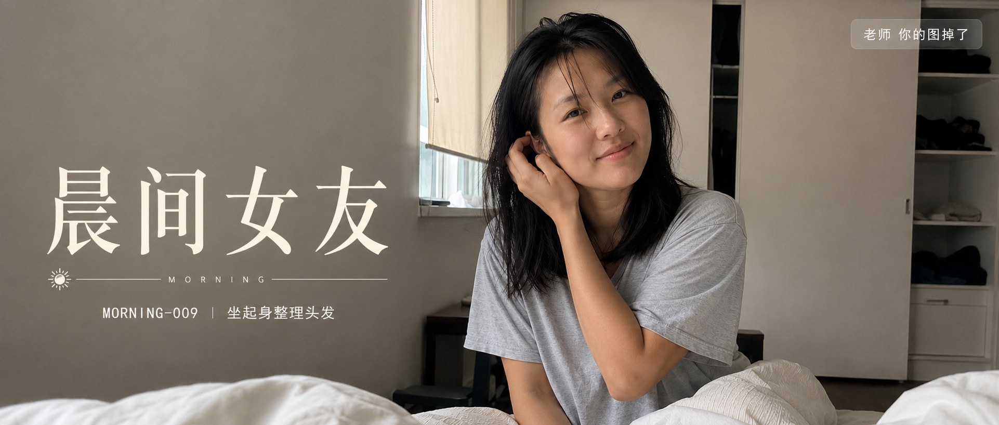
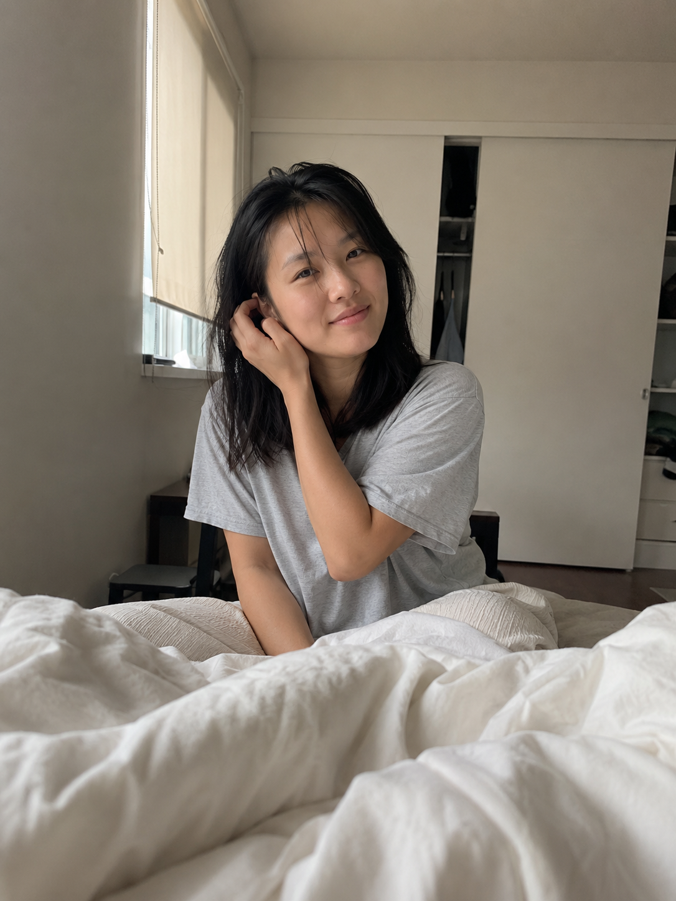
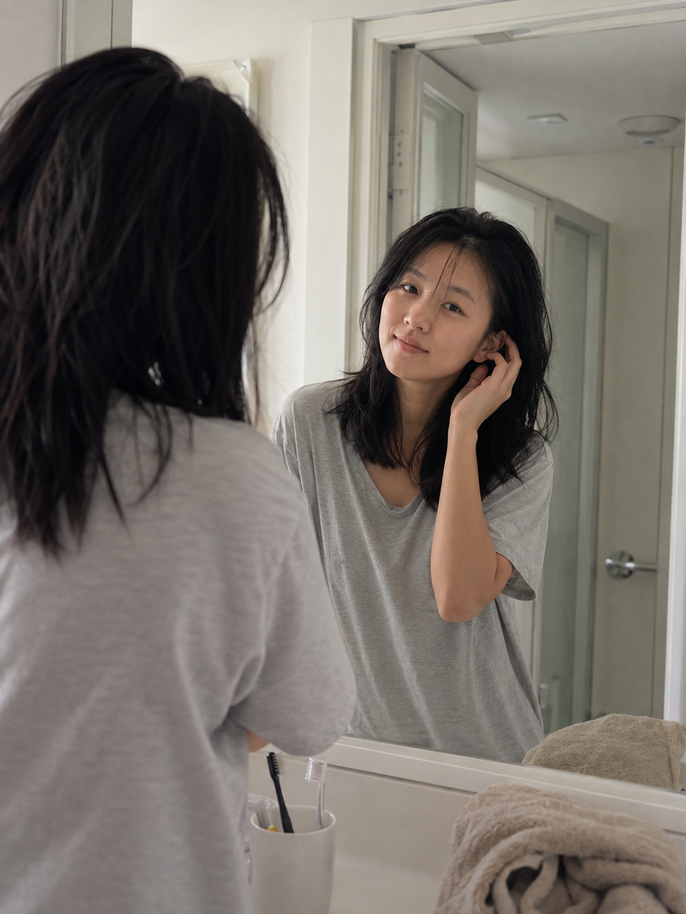
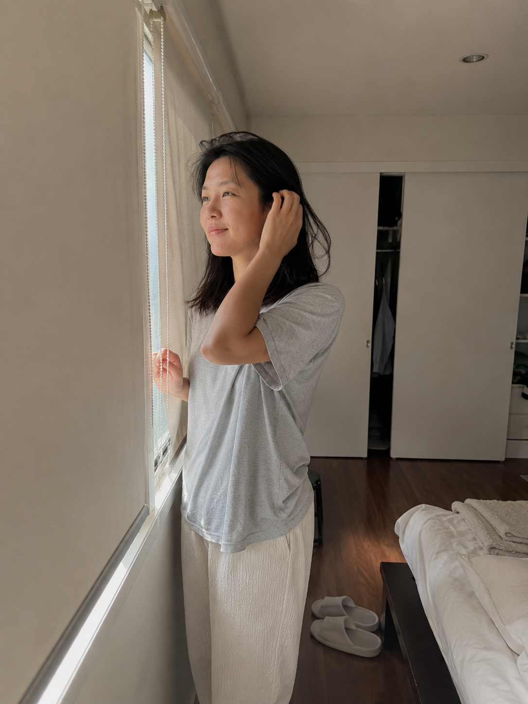

# MORNING-009｜坐起身整理头发

# GPT Image2 提示词｜晨间女友系列 MORNING.009：坐起身整理头发，iPhone 生活抓拍

作者：老师 你的图掉了

这是「晨间女友系列」第 MORNING-009 期。

今天这组是「坐起身整理头发」，从醒来到离开床边的过渡瞬间开始拍。它不再只停留在被窝里，而是把床边、镜前、窗边三个清晨动作拆开，画面会更像一组真实生活抓拍。

这组提示词主要按 GPT Image 2 的中文自然语言写法整理，也可以在豆包、千问及其他支持中文提示词的生图工具上尝试。不同工具出图会有差异，可以微调画幅、镜头、光线和生活细节。

## 场景说明

本期重点是“起身之后还没完全清醒”的状态：她坐在床边整理头发，走到镜前看一眼自己，又被窗边晨光照到。人物设定、服装和气质保持一致，但空间、机位和动作明显分开，避免三张图看起来像同一张的变体。

## 提示词 1

男友第一人称视角，24岁亚洲女生清晨坐在床边整理睡乱的头发，单手把头发别到耳后，宽松浅灰色居家 T 恤和浅色睡裤，未整理的白色床单在前景，柔和窗光从侧面照进真实卧室，35mm 自然抓拍，iPhone 原相机质感，真实皮肤纹理，避免 AI 美女脸、写真感、网红感、过度精修。

[配图1：见下方图片 img1.png]

## 提示词 2

男友第一人称视角，24岁亚洲女生刚起床站在浴室门口的小镜子前整理头发，镜中能看到她半侧脸和抬手动作，浅灰色居家 T 恤，牙杯和毛巾在台面边缘，清晨冷白自然光混合室内柔光，50mm 半身浅景深，真实生活摄影，避免摆拍和商业写真感。

[配图2：见下方图片 img2.png]

## 提示词 3

男友第一人称视角，24岁亚洲女生清晨走到窗边侧身整理头发，另一只手轻扶窗框，浅灰色居家 T 恤和浅色睡裤，窗帘半开，晨光从背后勾出发丝轮廓，房间地面有拖鞋和叠起的薄毯，24mm 广角生活场景，iPhone 随手抓拍，真实皮肤质感，避免网红感和过度精修。

[配图3：见下方图片 img3.png]

## 封面图提示词

亚洲女生清晨起身整理头发，真实卧室与窗边晨光，浅灰色居家 T 恤，睡醒后的自然状态，iPhone 生活摄影质感，2.35:1 电影横构图。画面左侧垂直居中偏下叠加文字排版：超大号衬线字体米白色主文案「晨间女友」，主文案正下方一条细横线左端带太阳图标☀横线中央有透明英文水印 MORNING，横线下方等宽白色字体副文案「MORNING-009 ｜ 坐起身整理头发」；右上角浅色半透明圆角底衬配小号文字「老师 你的图掉了」；无整体蒙层，文字直接压图。

[封面图：见下方图片 cover.png]

## 使用建议

1. 想让画面更真实，保留“iPhone 原相机”“真实皮肤纹理”“生活痕迹”这类词，不要把人物写成商业写真。
2. 想让三张图差异更明显，可以替换空间和机位，例如床边近景、镜前反射、窗边广角，但人物年龄、服装和发型状态尽量保持一致。
3. 在 GPT Image 2、豆包、千问及其他工具里尝试时，如果画面太像棚拍，可以弱化“精致”“电影感”，增加牙杯、拖鞋、床单、晨光方向等生活细节。

感兴趣的朋友们，欢迎收藏、关注，也可以在评论区留言你喜欢的系列或话题，我会继续补更多同类型场景。

#GPTImage2 #豆包 #千问 #生图提示词 #Prompt #晨间女友系列 #坐起身整理头发 #真实女友感 #生活摄影 #男友视角

晨间女友系列 · 目录

上一期：MORNING-008｜靠近镜头说早安

本期：MORNING-009｜坐起身整理头发

下一期：MORNING-010｜床边穿拖鞋

