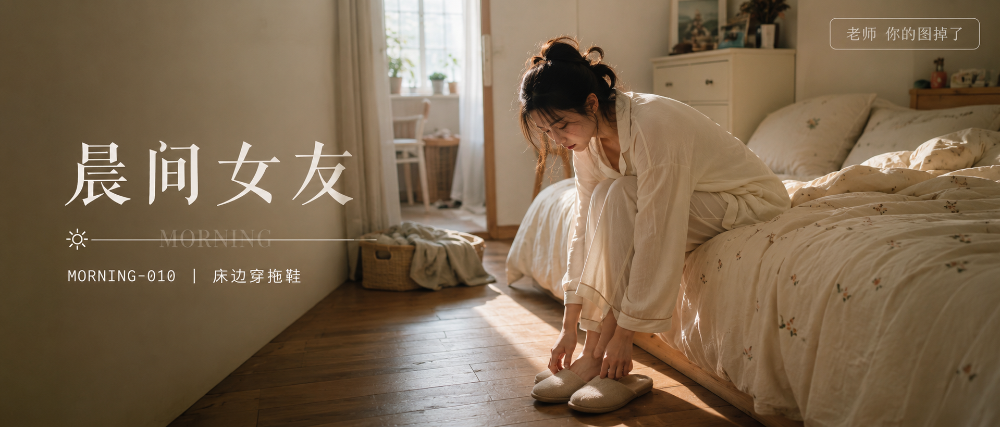
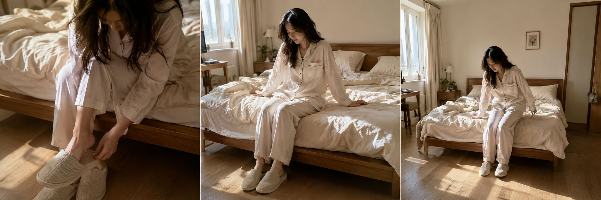
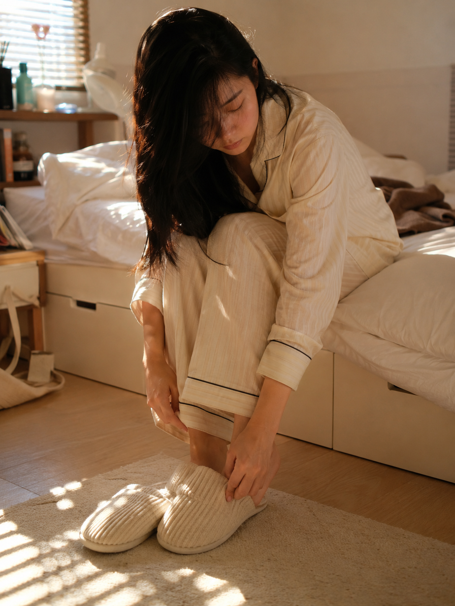
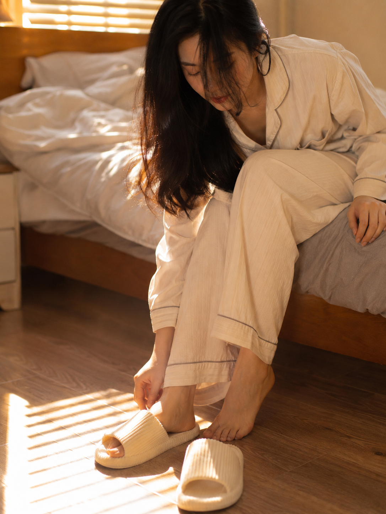
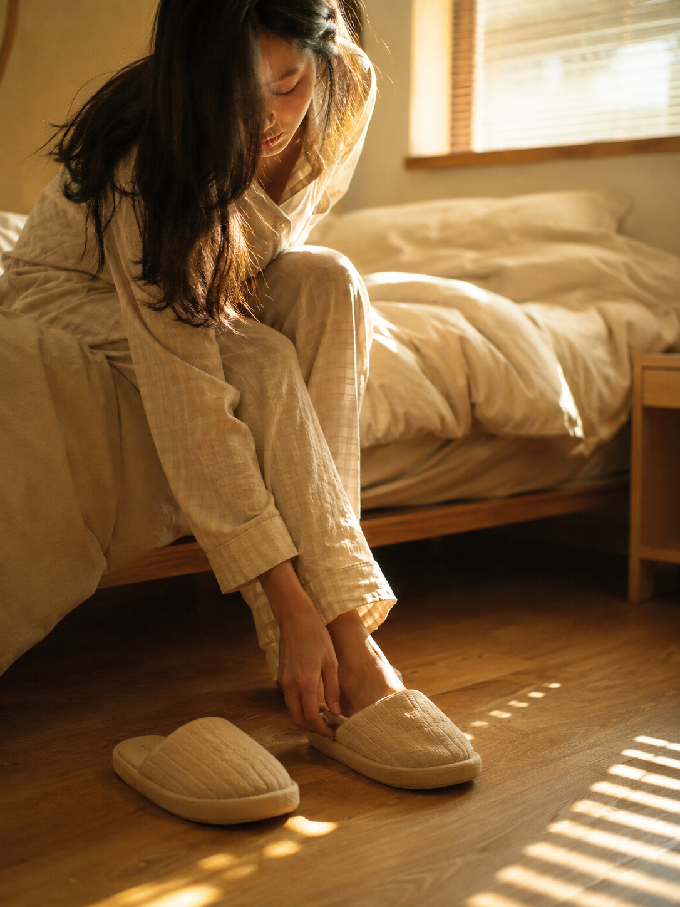

今天这组是「床边穿拖鞋」。清晨刚起床坐在床沿，低头把脚伸进拖鞋，散落的发丝、百叶窗漏进来的斜光、木地板上的光晕，没有刻意摆拍的真实生活感。

提示词：
清晨卧室内，一位穿着宽松睡衣的亚洲女生坐在床沿，低头俯身将脚伸进棉拖鞋，散落的头发遮住半边脸，阳光从百叶窗斜射进来，地板上映出细碎光晕，构图重心落在双脚和拖鞋的细节，背景是柔软凌乱的床铺，整体呈现暖黄色调，真实室内日常照片风格，五官自然清秀，面部干净，健康自然肤色

建议收藏这组 Prompt。核心结构是「坐在床沿 + 低头动作 + 百叶窗斜光」，这个框架可以延伸出穿袜子、整理睡裤、床边发呆等很多同类型日常瞬间。
这个系列会持续更新，下一期继续补同类型晨间场景。

#GPTImage2 #千问 #生图提示词 #Prompt #晨间女友 #床边穿拖鞋

