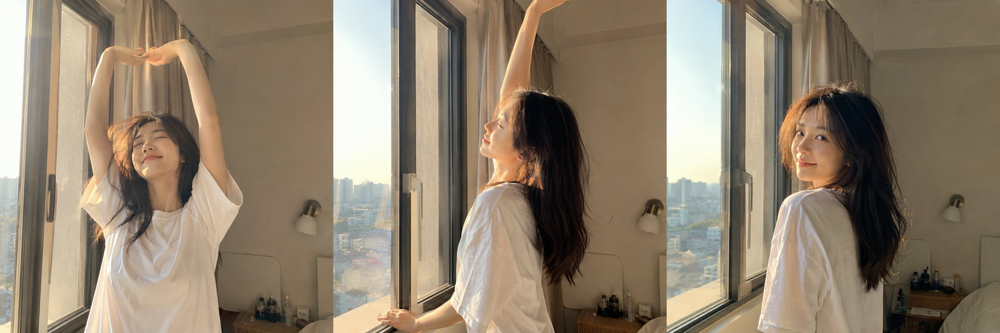

今天这组是「窗边伸懒腰」。清晨金色晨光斜射进卧室，她站在窗边做起床后第一个伸懒腰——双臂高举、微微仰头、半闭着眼享受那一刻的松弛，头发还没整理，宽松白色短袖自然垂落。

提示词：
男友第一人称视角，24岁亚洲女生清晨站在窗边正面伸懒腰，双臂高举过头顶，微微仰头闭眼，宽松白色居家短袖，头发微乱，柔和晨光从背后窗户洒入，五官自然清秀，表情松弛享受，健康自然肤色，干净自然肤质，iPhone 原相机随手抓拍，生活感摄影，避免 AI 美女脸、写真感、网红感、过度精修、暗沉肤色、很多痘印、明显皱纹。

建议收藏这组 Prompt。核心结构是「男友视角 + 窗边动作 + 晨光氛围」，把「伸懒腰」换成「扶窗发呆」「踮脚看窗外」「侧身倚窗」，可以延伸出很多同类型日常晨间场景。
这个系列会持续更新，下一期继续补同类型场景。

#豆包 #GPTImage2 #千问 #生图提示词 #Prompt #晨间女友 #窗边伸懒腰

