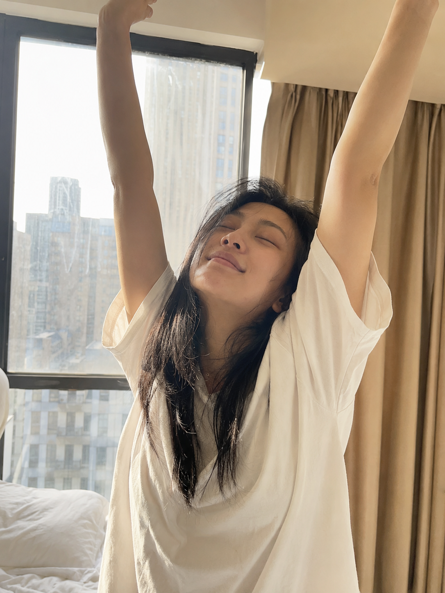
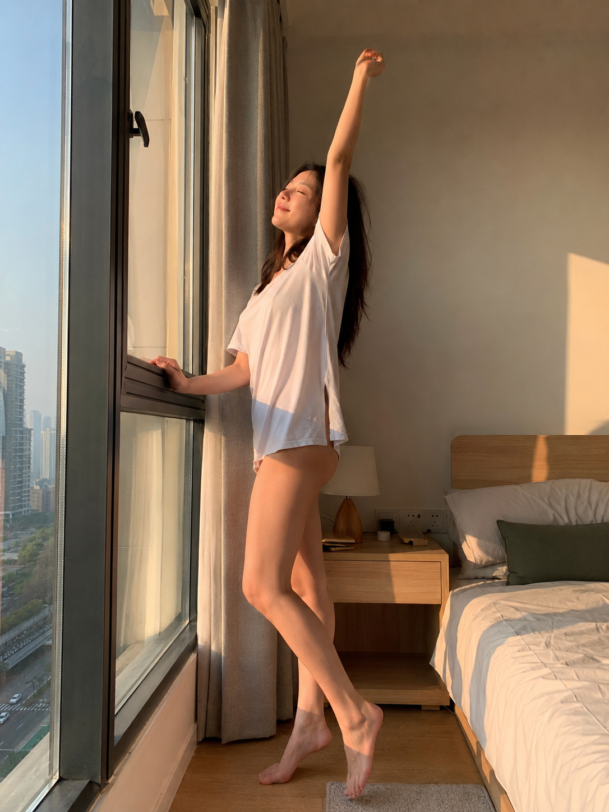
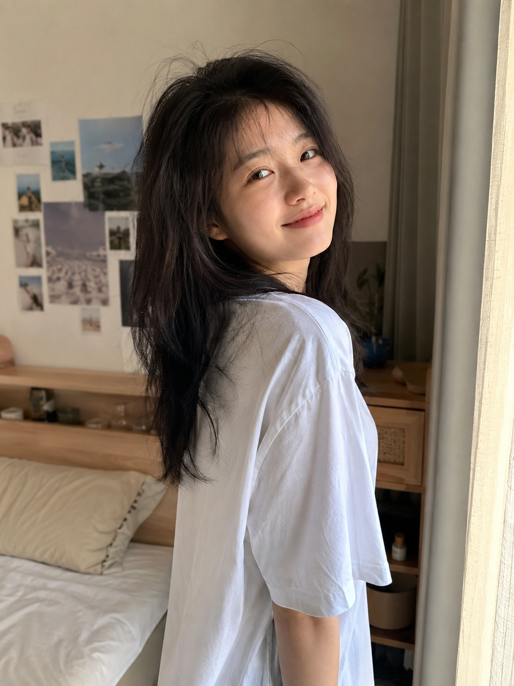

很多人问，为什么自己拍的晨起照片总是显得刻意，而别人的却像随手抓拍。答案往往就藏在一个动作里——伸懒腰。这是起床后最自然的身体反应，也是最容易被 AI 还原出真实感的瞬间。

**为什么这个场景容易出图**

1. 伸懒腰是身体的自然反射动作，AI 生成时不需要额外摆拍指令，动作本身自带松弛感。
2. 窗边逆光或侧光能自然勾勒出人物轮廓，光线本身就在做构图的工作。
3. 头发微乱、闭眼享受这类细节词，能有效打破"完美摆拍"的刻板印象，让画面更像生活抓拍。

**正面双臂上举**

清晨站在窗边，双臂高举过头顶，微微仰头闭眼，是伸懒腰最经典的第一瞬间。

提示词：
男友第一人称视角，24岁亚洲女生清晨站在窗边正面伸懒腰，双臂高举过头顶，微微仰头闭眼，宽松白色居家短袖，头发微乱，柔和晨光从背后窗户洒入，五官自然清秀，表情松弛享受，健康自然肤色，干净自然肤质，iPhone 原相机随手抓拍，生活感摄影，避免 AI 美女脸、写真感、网红感、过度精修、暗沉肤色、很多痘印、明显皱纹。

**侧身拉伸**

换成侧面视角，一手扶窗一手上举，微微踮脚，晨光勾出侧身轮廓，细节感更强。

提示词：
35mm 自然抓拍，24岁亚洲女生清晨侧身站在落地窗前伸懒腰，一手扶窗沿一手向上伸展，微微踮脚，宽松白色居家短袖，头发散乱微乱，金色晨光勾勒出侧身轮廓，表情微闭眼享受，五官自然清秀，健康自然肤色，干净自然肤质，生活感摄影，轻微皮肤纹理，避免写真感、商业广告感、过度精修、暗沉肤色、明显痘印和明显皱纹。

**伸懒腰后回望**

伸完懒腰转头看向镜头，是三个瞬间里女友感最强的一张，眼神接触很关键。

提示词：
男友第一人称视角，24岁亚洲女生清晨在窗边伸完懒腰后微微回头看向镜头，双臂自然放下，慵懒微笑，宽松白色居家短袖，头发微乱蓬松，柔和窗光从侧面打亮脸部，眼神真实温柔，五官自然清秀，健康自然肤色，50mm 半身浅景深，iPhone 随手抓拍质感，干净自然肤质，避免 AI 美女脸、摆拍感、写真感、网红感、过度精修和明显皱纹。

**关键参数说明**

1. 「男友第一人称视角」决定了画面的亲密感和拍摄角度，是女友感照片的核心视角设定。
2. 「头发微乱」「微微踮脚」「闭眼享受」这类细节词，是打破 AI 摆拍感、还原生活抓拍质感的关键。
3. 焦段词（35mm / 50mm）会影响画面的空间感和景深：35mm 带出更多环境信息，50mm 更聚焦人物本身。
4. 负向约束里的「避免 AI 美女脸、过度精修」是控制人物真实感的兜底手段，正向的「健康自然肤色、干净自然肤质」才是主控。

**可替换的元素**

- 场景：窗边可换成阳台、浴室门口、厨房，伸懒腰动作不变依然适用。
- 光线：柔和晨光可换成阴天散射光、黄昏暖光，营造不同情绪氛围。
- 服装：宽松白T可换成针织开衫、吊带睡衣，风格随场景调整。
- 焦段：想要更强的环境代入感用 35mm，想要更聚焦人物用 50mm 或 85mm。

#生图提示词 #GPTImage2 #千问 #豆包 #晨间女友 #窗边伸懒腰
