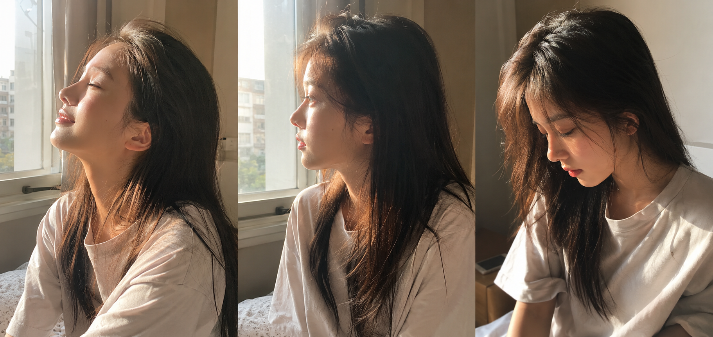
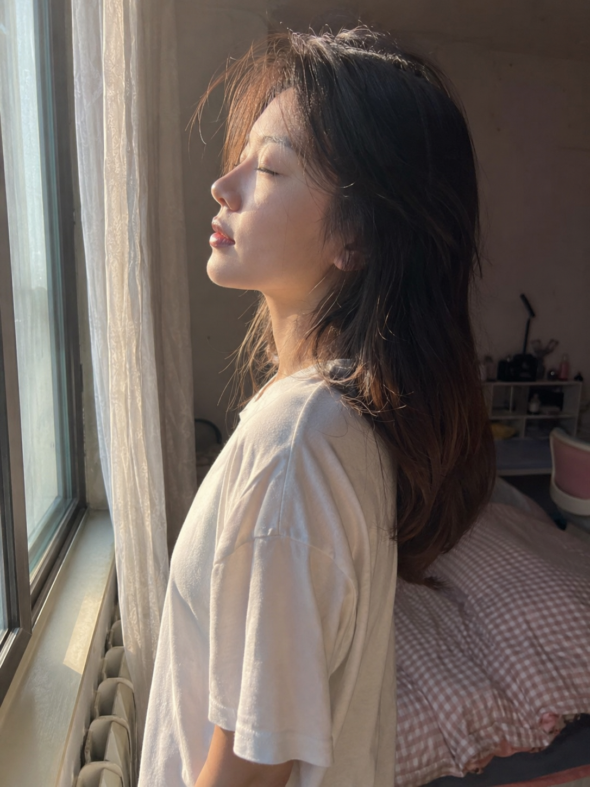
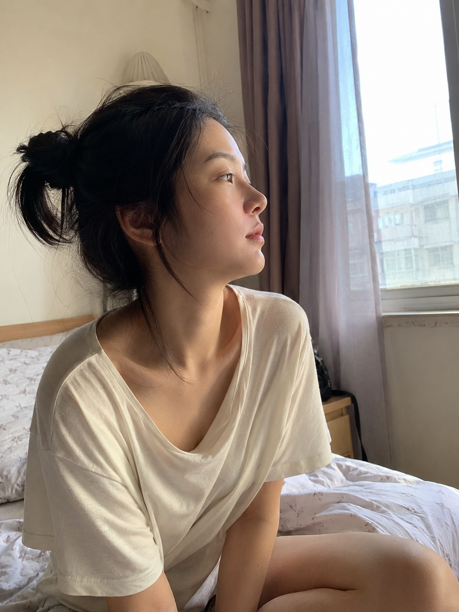

今天这组是「晨光洒在侧脸」。清晨阳光斜斜从窗户打进来，正好落在侧脸轮廓上——发丝被勾出金边，颧骨上有柔和光影，整个画面安静又温暖。三个瞬间分别是微闭眼沐光、侧脸发呆凝视窗外、低头安静，都是那种刚醒来还没完全清醒的自然状态。

提示词：
男友第一人称视角，24岁亚洲女生清晨侧脸朝向窗户，微闭眼享受阳光，宽松浅色居家 T 恤，晨光从窗户斜射打在侧脸轮廓上，发丝被光线勾勒出金边，五官自然清秀，健康自然肤色，50mm 半身浅景深，iPhone 原相机随手抓拍，避免 AI 美女脸、网红感、过度精修、面部变形。

核心结构是「侧脸构图 + 斜射晨光 + 松弛情绪状态」，这个框架可以延伸到阳台、咖啡馆靠窗等各种有自然侧光的场景。这个系列持续更新，下一期继续补晨间日常场景。

#豆包 #GPTImage2 #千问 #生图提示词 #Prompt #晨间女友 #侧脸光影

