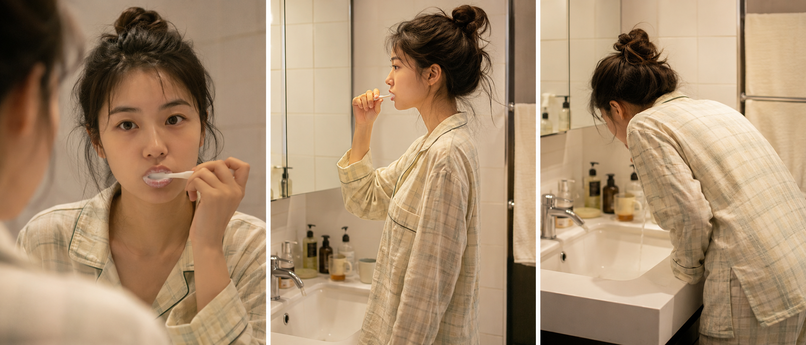
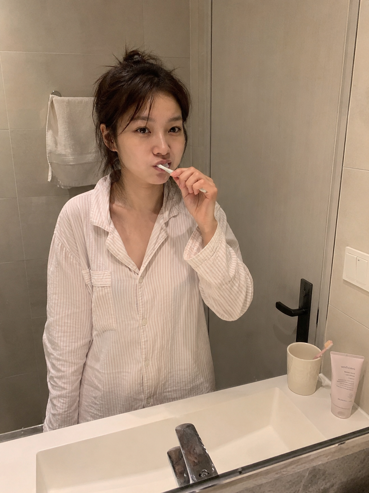
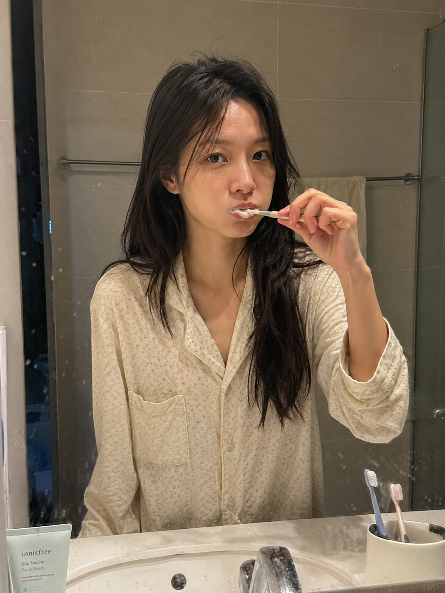
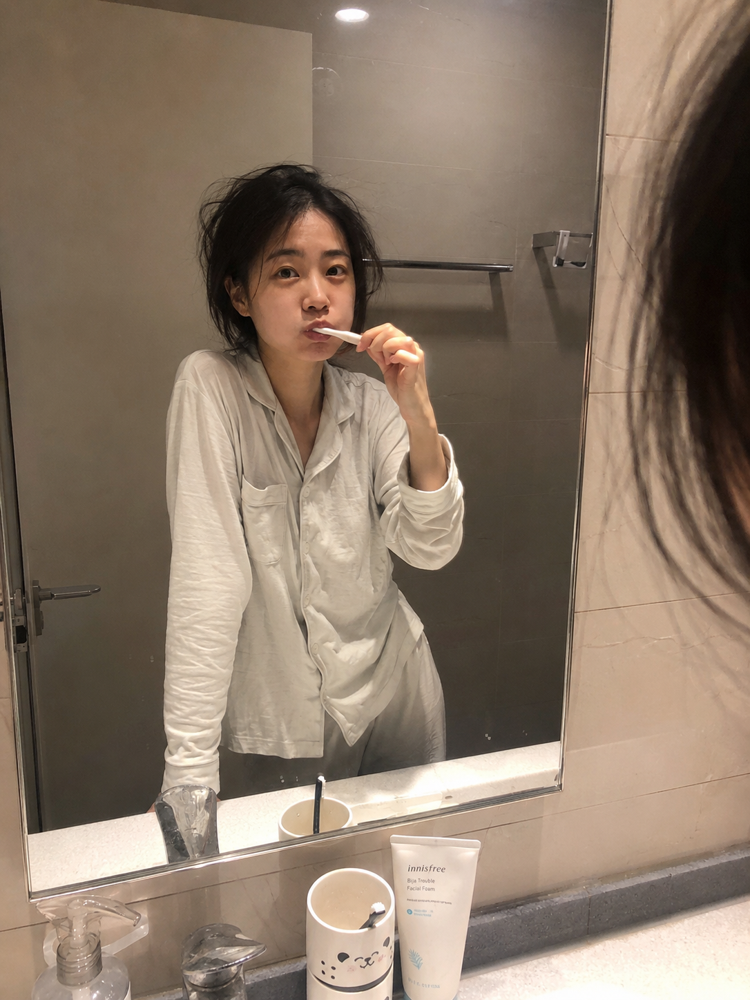
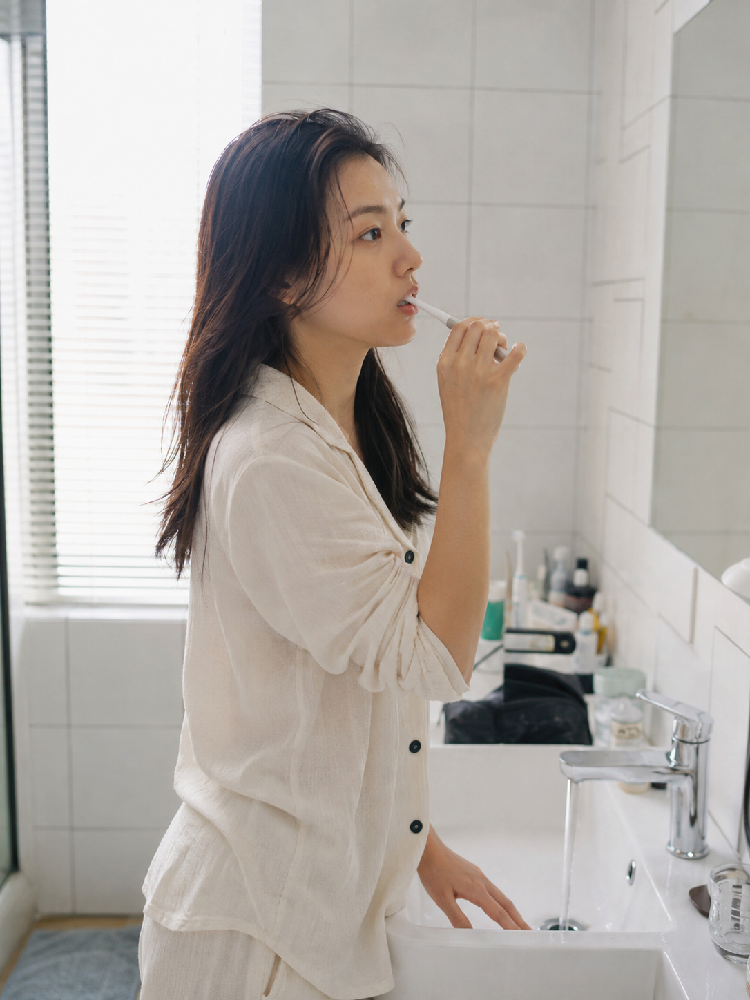
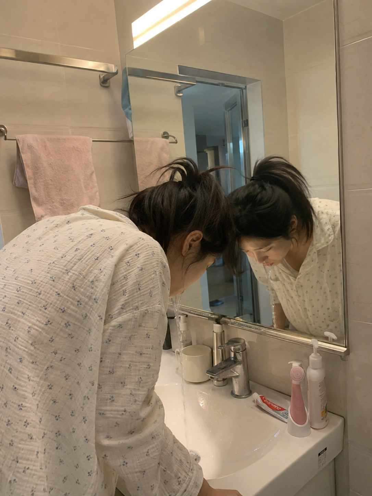

今天这组是「浴室镜前刷牙」。清晨浴室，对着镜子刷牙，头发还没整理，牙刷鼓着嘴角，暖白灯光打亮面部——三张图分别是镜中对视、侧身、低头漱口，都是不摆拍的真实晨间瞬间。

提示词：
男友第一人称视角，24岁亚洲女生清晨站在浴室洗手台前刷牙，透过浴室镜与镜头对视，嘴角带着刷牙时特有的微鼓神情，宽松睡衣，头发微乱未整理，浴室暖白灯光打亮面部，台盆边摆着牙杯和洗面奶，瓷砖背景干净，五官自然清秀，面部干净，健康自然肤色，iPhone 生活抓拍

建议收藏这组 Prompt。核心结构是「浴室镜前 + 刷牙动作 + 暖白灯光」，替换成洗脸、敷面膜、擦脸等动作可以延伸出很多同类型浴室晨间场景。
这个系列会持续更新，下一期继续补同类型晨间场景。

#GPTImage2 #千问 #生图提示词 #Prompt #晨间女友 #浴室刷牙

