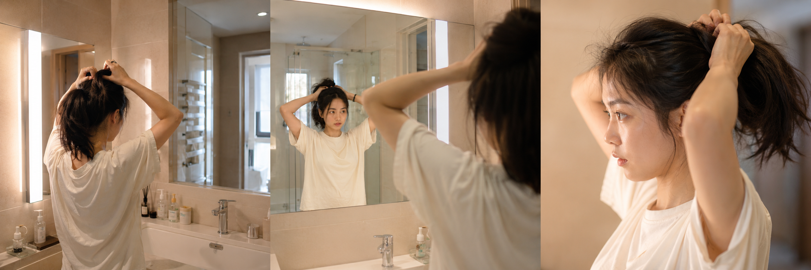

# 同一个镜前扎头发，3 种焦段生成结果差多少？

图友们大家好，今天这一期是「镜前扎头发」。

这是晨间女友系列第 17 期。这一期不是直接给提示词，而是做一个实验：同一场景、同一人物、同一动作，只改焦段词，看三张出图有多大差异。

---

**今天的实验**：清晨浴室镜前扎头发，固定所有变量，只改焦段。

**固定变量**：人物年龄、动作、服装、发型、光线、摄影风格、负向约束，全部不动。

**唯一变量**：`24mm` / `35mm` / `85mm`

---

**#01 ｜ 24mm 广角**

男友第一人称视角，24岁亚洲女生清晨站在浴室镜前扎头发，双手举起将散发拢到脑后，24mm 广角带出浴室全景：台盆、镜框、墙砖和暖白灯光，宽松奶白色居家 T 恤，头发自然微乱，五官自然清秀，面部干净，健康自然肤色，干净自然肤质，iPhone 原相机随手抓拍，真实生活感摄影，避免 AI 美女脸、网红感、过度精修、塑料皮肤、暗沉肤色、明显痘印、明显皱纹、斑点、面部变形

> 广角带出了台盆边沿、镜框、墙砖，人物占画面比例变小，浴室氛围感更强，适合想展示完整生活空间的场景。

---

**#02 ｜ 35mm 自然抓拍**

男友第一人称视角，24岁亚洲女生清晨站在浴室镜前扎头发，双手举起将散发拢到脑后，35mm 标准街拍焦段半身构图，镜面同时反射出她的正面和背后的空间层次，宽松奶白色居家 T 恤，头发自然微乱，五官自然清秀，面部干净，健康自然肤色，干净自然肤质，iPhone 原相机随手抓拍，真实生活感摄影，避免 AI 美女脸、网红感、过度精修、塑料皮肤、暗沉肤色、明显痘印、明显皱纹、斑点、面部变形

> 35mm 是最接近人眼的视角，半身构图同时带出镜面反射，正面和背后空间叠在一起，层次感最好。绝大多数日常场景用这个焦段最稳。

---

**#03 ｜ 85mm 人像焦段**

男友第一人称视角，24岁亚洲女生清晨站在浴室镜前扎头发，双手举起将散发拢到脑后，85mm 人像焦段主体突出、背景大幅虚化，近景聚焦手部动作和侧脸神情，暖白灯光勾勒发丝细节，宽松奶白色居家 T 恤，头发自然微乱，五官自然清秀，面部干净，健康自然肤色，干净自然肤质，iPhone 原相机随手抓拍，真实生活感摄影，避免 AI 美女脸、网红感、过度精修、塑料皮肤、暗沉肤色、明显痘印、明显皱纹、斑点、面部变形

> 85mm 背景大幅压缩虚化，视线全部落在手部动作和侧脸神情上，发丝细节被灯光勾出来，适合想突出人物状态、弱化环境的场景。

---

## 实验结论

| 焦段 | 视觉特点 | 适合场景 |
|---|---|---|
| 24mm 广角 | 空间感强，人物比例小，环境细节多 | 想展示浴室整体氛围、生活空间感 |
| 35mm 标准 | 视角自然，镜面反射层次好，最均衡 | 大多数日常场景的默认选择 |
| 85mm 人像 | 主体突出，背景虚化，发丝细节清晰 | 想突出动作和表情、弱化背景 |

这三条提示词只有焦段词不同，其余完全一致——如果你已经有了一套顺手的人物基础写法，换焦段就是最低成本的出图变化方式。

感兴趣的朋友们，欢迎收藏这组 Prompt，下期继续晨间系列。也可以在评论区告诉我你最想看哪种场景——是厨房做早餐、阳台吹晨风，还是出门前整理包？

---

## 往期回顾

- MORNING-015 浴室镜前刷牙
- MORNING-016 洗脸后的湿发

#GPTImage2 #千问 #生图提示词 #Prompt #晨间女友系列 #镜前扎头发 #焦段对比 #真实女友感
