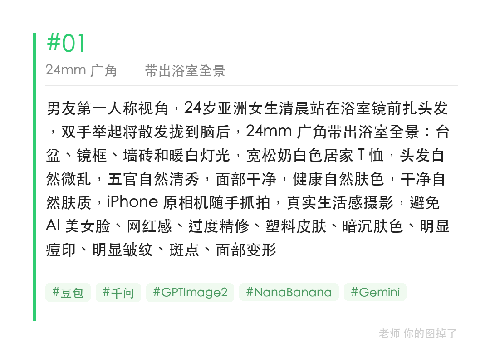
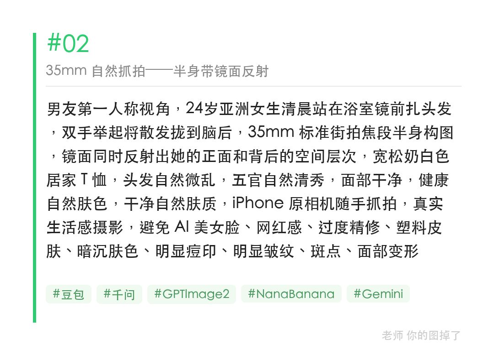
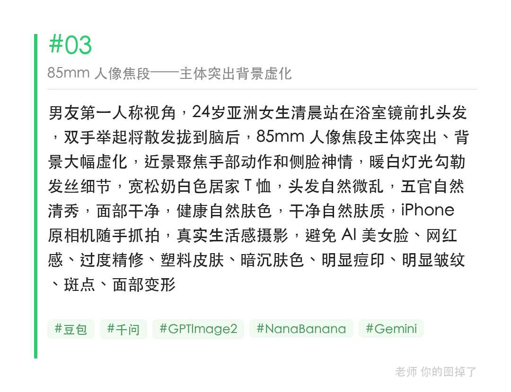

同一场景、同一人物，只改焦段词，24mm / 35mm / 85mm 出图差多少一目了然。

提示词：
男友第一人称视角，24岁亚洲女生清晨站在浴室镜前扎头发，双手举起将散发拢到脑后，35mm 标准街拍焦段半身构图，镜面同时反射出她的正面和背后的空间层次，宽松奶白色居家 T 恤，头发自然微乱，五官自然清秀，面部干净，健康自然肤色，干净自然肤质，iPhone 原相机随手抓拍，真实生活感摄影，避免 AI 美女脸、网红感、过度精修、塑料皮肤、暗沉肤色、明显痘印、明显皱纹、斑点、面部变形

#GPTImage2 #千问 #生图提示词 #Prompt #晨间女友系列 #镜前扎头发

