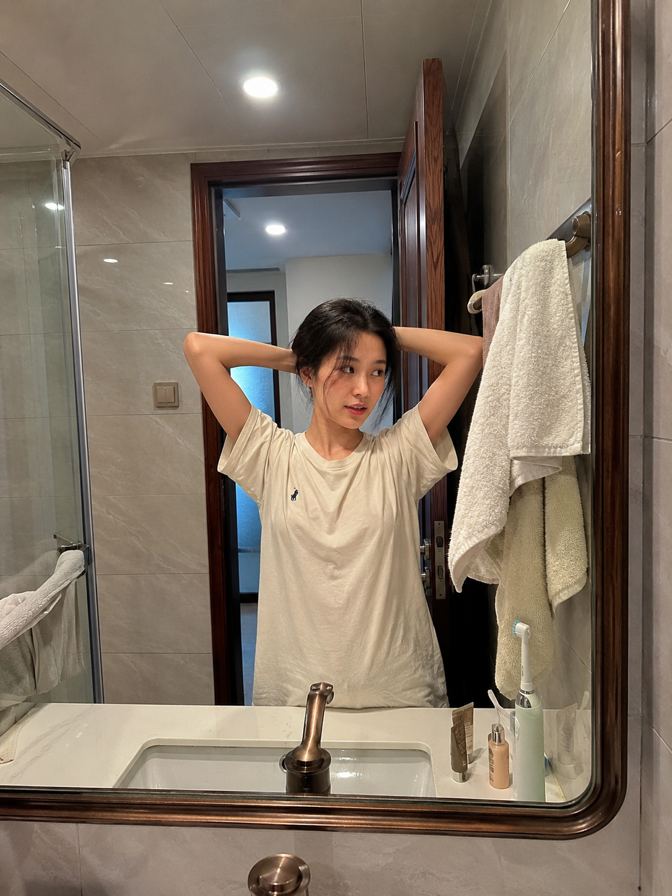
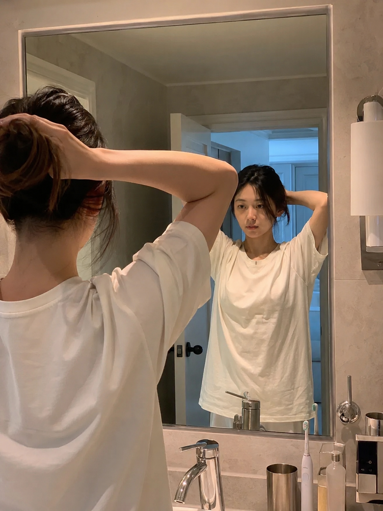
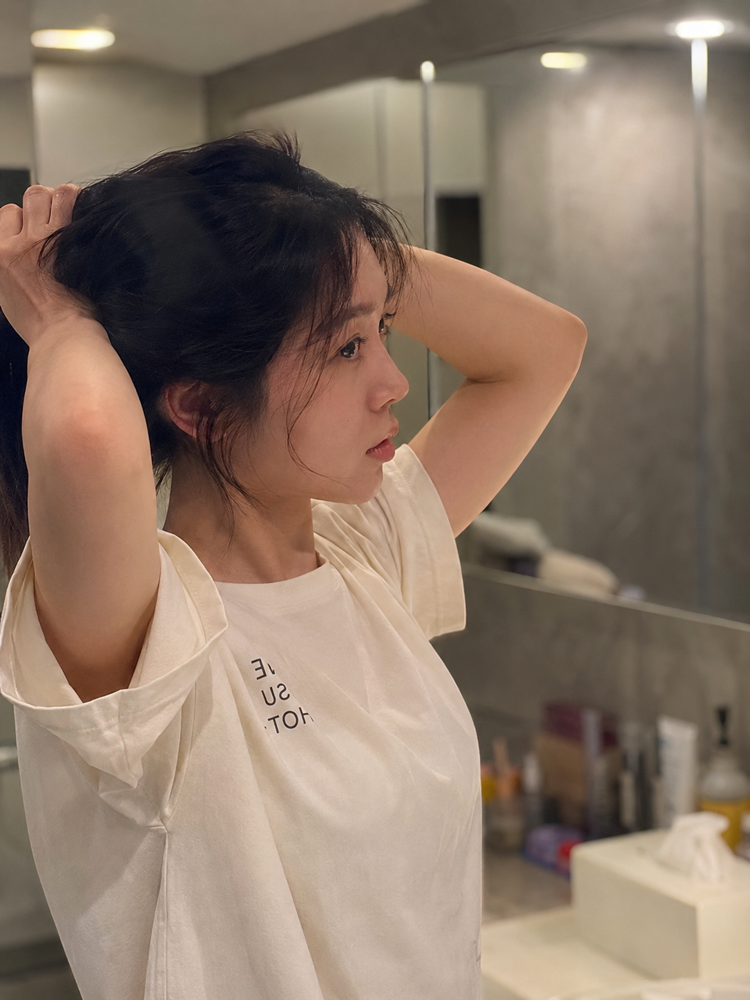

很多人写AI生图提示词习惯堆砌形容词，却忽略了一个最低成本、效果最明显的变量——焦段词。这一期做了一个对照实验：同一场景、同一人物、同一动作，固定所有变量只改焦段，看三张出图到底能差多少。

**为什么焦段是最容易被忽略的变量**

焦段决定的是空间关系和视觉重心，而不是画面内容本身。同一句"清晨浴室镜前扎头发"，用广角、标准、长焦三种焦段去演绎，环境比例、人物占比、背景虚化程度会完全不同，这种差异比换服装、换光线更直接、更可控。

**24mm广角——带出浴室全景**

台盆、镜框、墙砖和暖白灯光全部收进画面，人物占比变小，浴室氛围感更强，适合想展示完整生活空间的场景。

提示词：
男友第一人称视角，24岁亚洲女生清晨站在浴室镜前扎头发，双手举起将散发拢到脑后，24mm 广角带出浴室全景：台盆、镜框、墙砖和暖白灯光，宽松奶白色居家 T 恤，头发自然微乱，五官自然清秀，面部干净，健康自然肤色，干净自然肤质，iPhone 原相机随手抓拍，真实生活感摄影，避免 AI 美女脸、网红感、过度精修、塑料皮肤、暗沉肤色、明显痘印、明显皱纹、斑点、面部变形。

**35mm自然抓拍——半身带镜面反射**

35mm是最接近人眼的视角，半身构图同时带出镜面反射，正面和背后空间叠在一起，层次感最好，绝大多数日常场景用这个焦段最稳。

提示词：
男友第一人称视角，24岁亚洲女生清晨站在浴室镜前扎头发，双手举起将散发拢到脑后，35mm 标准街拍焦段半身构图，镜面同时反射出她的正面和背后的空间层次，宽松奶白色居家 T 恤，头发自然微乱，五官自然清秀，面部干净，健康自然肤色，干净自然肤质，iPhone 原相机随手抓拍，真实生活感摄影，避免 AI 美女脸、网红感、过度精修、塑料皮肤、暗沉肤色、明显痘印、明显皱纹、斑点、面部变形。

**85mm人像焦段——主体突出背景虚化**

背景大幅压缩虚化，视线全部落在手部动作和侧脸神情上，发丝细节被灯光勾出来，适合想突出人物状态、弱化环境的场景。

提示词：
男友第一人称视角，24岁亚洲女生清晨站在浴室镜前扎头发，双手举起将散发拢到脑后，85mm 人像焦段主体突出、背景大幅虚化，近景聚焦手部动作和侧脸神情，暖白灯光勾勒发丝细节，宽松奶白色居家 T 恤，头发自然微乱，五官自然清秀，面部干净，健康自然肤色，干净自然肤质，iPhone 原相机随手抓拍，真实生活感摄影，避免 AI 美女脸、网红感、过度精修、塑料皮肤、暗沉肤色、明显痘印、明显皱纹、斑点、面部变形。

**关键参数说明**

- "24mm/35mm/85mm"：这三个数值分别对应广角、标准、长焦，是整组实验唯一变化的词。
- "带出浴室全景"vs"主体突出背景虚化"：同一句描述在不同焦段下会自动调整环境与人物的比例关系。
- "镜面同时反射正面和背后空间层次"：35mm焦段特有的优势，能在一张图里叠加两层空间信息。
- 三条提示词里人物年龄、动作、服装、发型、光线、摄影风格、负向约束全部保持一致，这是让对比结果可信的前提。

**可替换的元素**

- 场景：浴室镜前可换成厨房台面、玄关穿鞋、阳台晾衣，焦段对比逻辑同样适用。
- 焦段：想要更强空间感用24mm以下的广角，想要商业写真质感可以试到100mm以上。
- 光线：暖白灯光可换成清晨自然光或暖黄夜灯，情绪基调会随之改变。

#生图提示词 #GPTImage2 #千问 #豆包 #晨间女友 #镜前扎头发
