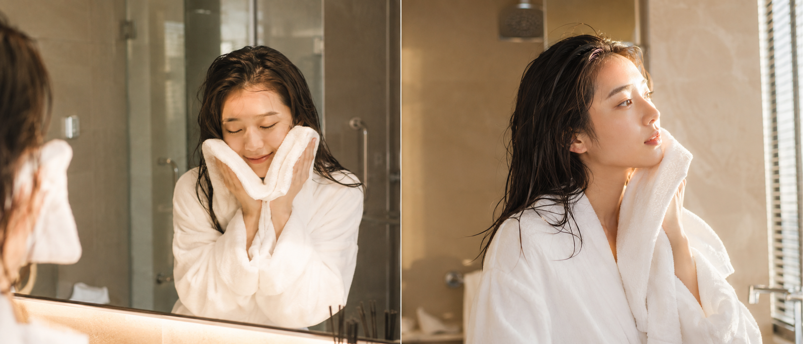

# 把这张图片发给 AI，它直接提取出了完整生图提示词，还能直接用

最近发现一个用法：不需要自己从头写提示词，直接把一张你喜欢的照片发给 AI，让它帮你"读图提词"——把这张图里所有的视觉信息翻译成可以用来生图的提示词。

我试了一下，效果出乎意料。

---

用的是这句话：

请帮我将这张图片的完整视觉效果提取成文本格式的提示词，包括但不限于色彩、字体、构图、特效、镜头、场景、布景等。

把这句话和一张照片一起发给 AI（GPT Image 2、千问、豆包都可以），它会给你把画面里的所有信息逐条整理成提示词格式。

我用的原图是这样的：

---

晨间浴室，刚洗完脸，毛巾还贴着脸，眼睛微闭，白色浴袍——这种日常瞬间很难用语言直接描述，但 AI 分析图片的时候会自动注意到每一个细节。

AI 拿到这张图之后，给我提取出了这段提示词：

24岁亚洲女生，刚洗完脸，站在浴室镜前，双手捧着白色毛巾轻轻按压脸颊，眼睛微闭，表情放松自然，头发微湿随意搭在肩膀，身穿白色浴袍，面部干净无妆，五官自然清秀，健康自然肤色，干净自然肤质，眼神真实。浴室背景柔和，镜中有轻微倒影，早晨柔光从侧面照进，暖白色自然光，轻微颗粒感，iPhone镜头直出质感，真实生活感，构图居中偏近景，避免 AI 美女脸、网红感、过度精修、塑料皮肤、暗沉肤色、面部变形

整体结构挺完整的：**人物状态 → 动作细节 → 服装 → 肤质 → 场景 → 光线 → 摄影风格 → 负向约束**。

然后我直接把这段提示词放进去重新生成了一次——

---

这是用 AI 提取出来的提示词重新生成的图：

场景基本还原了：浴室、毛巾、白浴袍、侧光、微湿的头发。提取的提示词里有一条「iPhone镜头直出质感，真实生活感」，生成出来的图果然带了一点那种日常感的颗粒。

在这个基础上我稍微调了一下构图和光线，让侧脸的轮廓更明显——

---

调整后的变体：

24岁亚洲女生，刚洗完脸，坐在浴室台盆边，毛巾搭在脖颈，侧脸望向窗外，头发半湿微卷，白色浴袍宽松，面部干净五官自然清秀，健康自然肤色，表情松弛放空，皮肤光泽自然。清晨侧逆光从窗边透进，打亮颧骨和侧脸轮廓，背景柔和虚化，50mm定焦感，自然景深，莫兰迪暖色调，轻微过曝感，日系生活摄影风格，避免 AI 美女脸、网红感、过度精修、塑料皮肤、暗沉肤色

改了三个地方：「站在镜前」→「坐在台盆边」，「暖白色自然光」→「侧逆光打亮颧骨」，加入「50mm定焦感 + 莫兰迪暖色调」。

侧脸的光更好看了，氛围感也往上走了一些。

---

**这个"读图提词"方法最值得记的几点：**

AI 从图里提取的提示词，通常比你自己从头写的更准——因为它会注意到你描述不出来的东西，比如「镜中有轻微倒影」「轻微颗粒感」「构图居中偏近景」，这些词你一般想不到，但它从图里直接读出来了。

提取出来的提示词可以直接用，也可以只用其中一部分——比如你只想要光线描述，把其他的换成自己的场景。

不限场景：街拍、室内、风景、道具——任何你想复现的图都可以用这句话试一下。

---

如果你手上有一张特别喜欢的照片，发给 AI 试试这句提取语，它给你的内容往往比你自己写的更完整。

你用 AI 生过哪类场景？评论区说说，下一期可以专门出一期那个场景的提示词。

---

## 往期回顾

- MORNING-016 洗脸后的湿发
- MORNING-015 浴室镜前刷牙
- MORNING-014 晨光洒在侧脸

#GPTImage2 #千问 #豆包 #生图提示词 #Prompt #晨间女友 #拿毛巾擦脸
