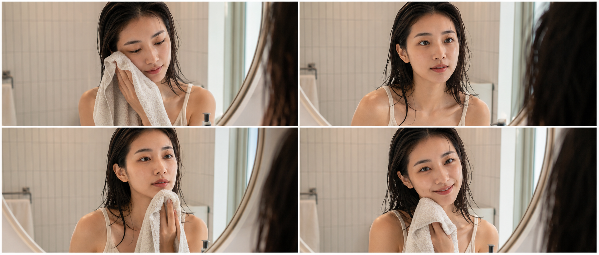
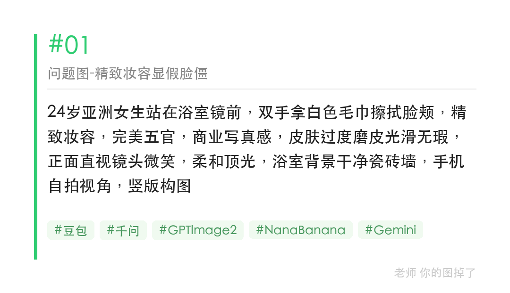
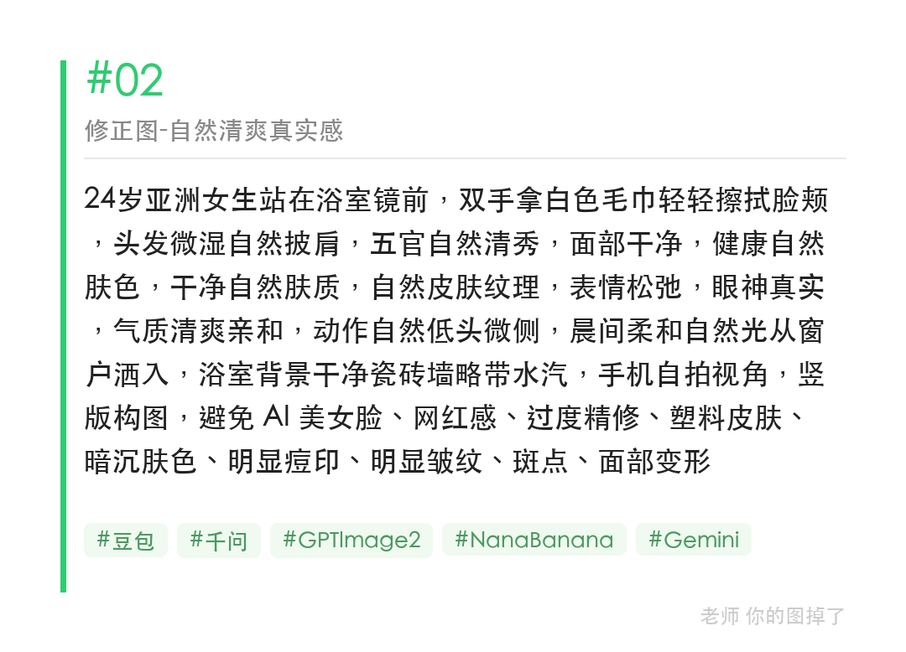

拿毛巾擦脸这种日常小动作，AI 生成容易显脸僵，问题往往出在「精致妆容」「完美五官」这类词上。

提示词：
24岁亚洲女生站在浴室镜前，双手拿白色毛巾轻轻擦拭脸颊，头发微湿自然披肩，五官自然清秀，面部干净，健康自然肤色，自然皮肤纹理，表情松弛，眼神真实，动作自然低头微侧，晨间柔和自然光，避免 AI 美女脸、网红感、过度精修、塑料皮肤、明显痘印、面部变形

#GPTImage2 #千问 #生图提示词 #Prompt #晨间女友 #拿毛巾擦脸

