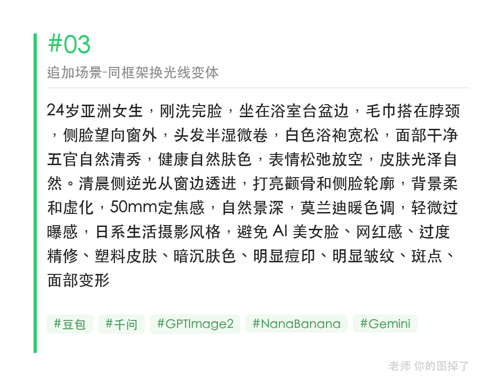

发现一个用法：把照片直接发给 AI，让它帮你"读图提词"，提取出来的提示词直接可以用来重新生成。

提取用这句话：
请帮我将这张图片的完整视觉效果提取成文本格式的提示词，包括但不限于色彩、字体、构图、特效、镜头、场景、布景等。

AI 拆解出来的提示词比自己写的更完整——它会注意到「镜中有轻微倒影」「轻微颗粒感」这种你自己想不到的细节。

#GPTImage2 #千问 #生图提示词 #Prompt #晨间女友 #拿毛巾擦脸

