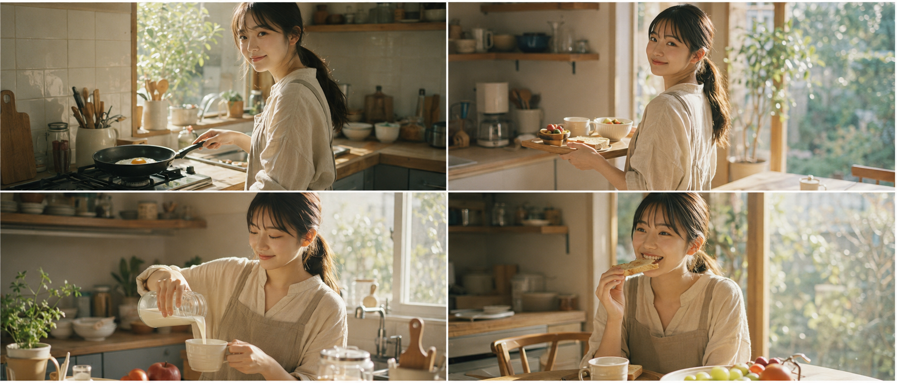
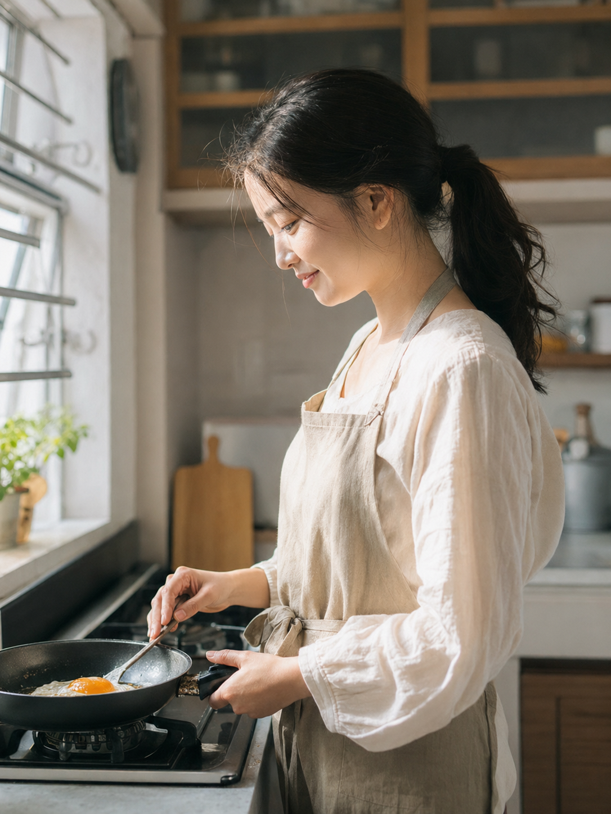
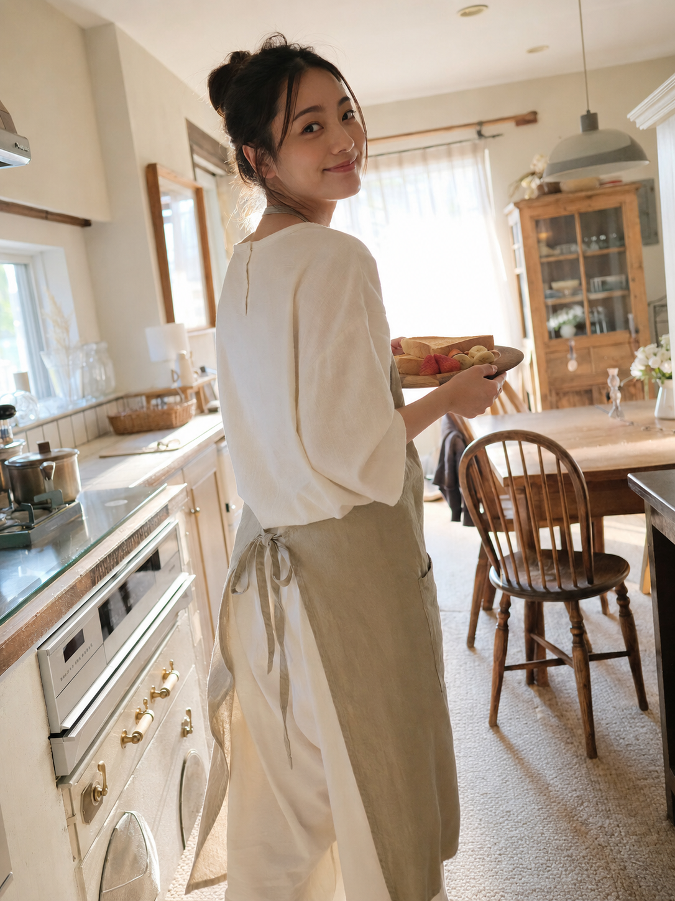
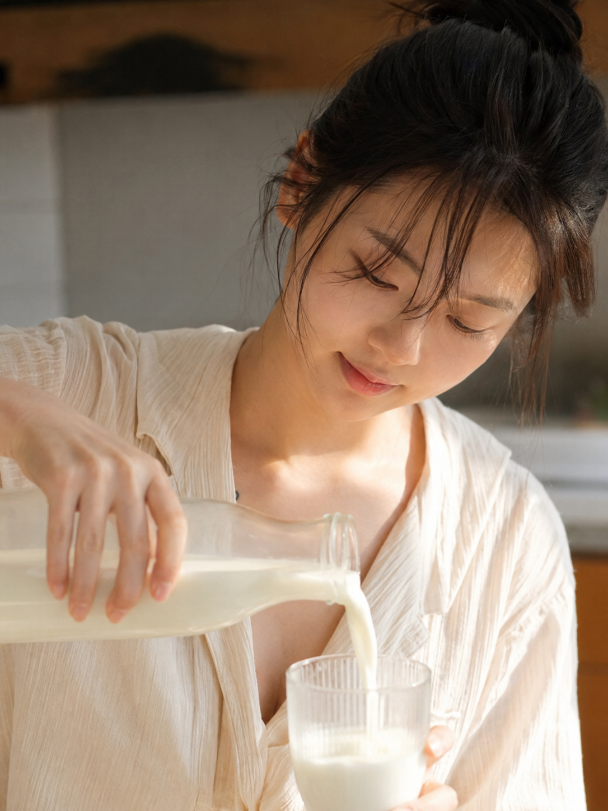

# 朋友圈都以为我请了摄影师，其实只是在厨房拍了张早餐照

早晨的厨房光线其实比卧室更好用——灶台边的侧光、窗边的逆光、餐桌上的顶光，三种光在同一个空间里就能全占齐。今天这组就是围绕「厨房做早餐」这个场景写的三张图，从煎蛋到端盘子再到倒牛奶，一步步把生活感堆出来。

## 灶台前煎蛋

24岁亚洲女生站在厨房灶台前用平底锅煎鸡蛋，晨光从厨房窗户斜射进来，身穿米白色棉麻家居服外系浅卡其色围裙，头发随意扎成低马尾几缕碎发垂落，低头专注看着锅里的煎蛋侧脸露出自然笑意，50mm 标准镜头平视机位，浅景深虚化背景橱柜，五官自然清秀，面部干净，健康自然肤色，干净自然肤质，表情松弛，眼神真实，胶片质感晨间生活照，避免 AI 美女脸、网红感、过度精修、塑料皮肤、暗沉肤色、明显痘印、明显皱纹、斑点、面部变形

## 端着餐盘回头笑

24岁亚洲女生端着装有吐司和水果的餐盘从厨房走向餐桌，途中转头看向镜头露出温柔笑容，晨光从侧后方逆光洒在发丝边缘形成柔和光晕，身穿米白色棉麻家居服外系浅卡其色围裙，35mm 广角镜头低机位仰拍，带出整个晨间厨房环境，气质清爽亲和，轮廓清晰，皮肤光泽自然，眼神真实，日系生活写真风格，避免 AI 美女脸、网红感、过度精修、塑料皮肤、暗沉肤色、明显痘印、明显皱纹、斑点、面部变形

## 倒牛奶特写

24岁亚洲女生手持玻璃牛奶罐正在往杯子里倒牛奶，视线低垂专注看着杯口，晨光从正面柔和洒落打亮面部和牛奶液体的光泽，身穿米白色棉麻家居服，85mm 长焦镜头近距离特写带浅景深，背景厨房台面虚化，五官自然清秀，面部干净，干净自然肤质，皮肤光泽自然，表情松弛，避免 AI 美女脸、网红感、过度精修、塑料皮肤、暗沉肤色、明显痘印、明显皱纹、斑点、面部变形

---

**Prompt 拆解：**

- `晨光从窗户斜射/侧后方逆光/正面柔和洒落`：三张图分别用了不同方向的光线，是拉开画面差异的核心变量
- `米白色棉麻家居服外系浅卡其色围裙`：统一服装保证同一人物同一场景的连贯感
- `50mm / 35mm / 85mm`：分别对应平视中景、广角仰拍环境、长焦特写，一组图里把常用焦段都用上了
- `低头专注 / 转头看向镜头 / 视线低垂`：动作和视线方向的变化让三张图不会显得重复
- `五官自然清秀、面部干净、健康自然肤色`：这几个词是控制人物质感的关键，去掉容易滑向精修网红脸

**哪些词可以替换：**

- 场景：厨房台面可以换成「餐桌」「阳台早餐桌」，光线逻辑不变
- 道具：牛奶可以换成「咖啡壶」「果汁」，动作描述随之微调
- 服装：围裙可以换成「针织开衫」「简约家居睡袍」，风格会更休闲

**适合哪些模型：**

GPT Image 2 对光线方向和服装细节的还原度更稳，千问在生活化场景的自然感上表现也不错，两者都能出好效果，豆包适合快速出图但细节需要多试几次。

---

这组厨房场景存起来，下次想拍「有生活气」的照片直接套用就行。你也可以在评论区说说想看哪个场景的下一期。

---

## 往期回顾

- MORNING-018 拿毛巾擦脸
- MORNING-017 镜前扎头发
- MORNING-016 洗脸后的湿发

#GPTImage2 #千问 #豆包 #生图提示词 #Prompt #晨间女友 #厨房早餐
