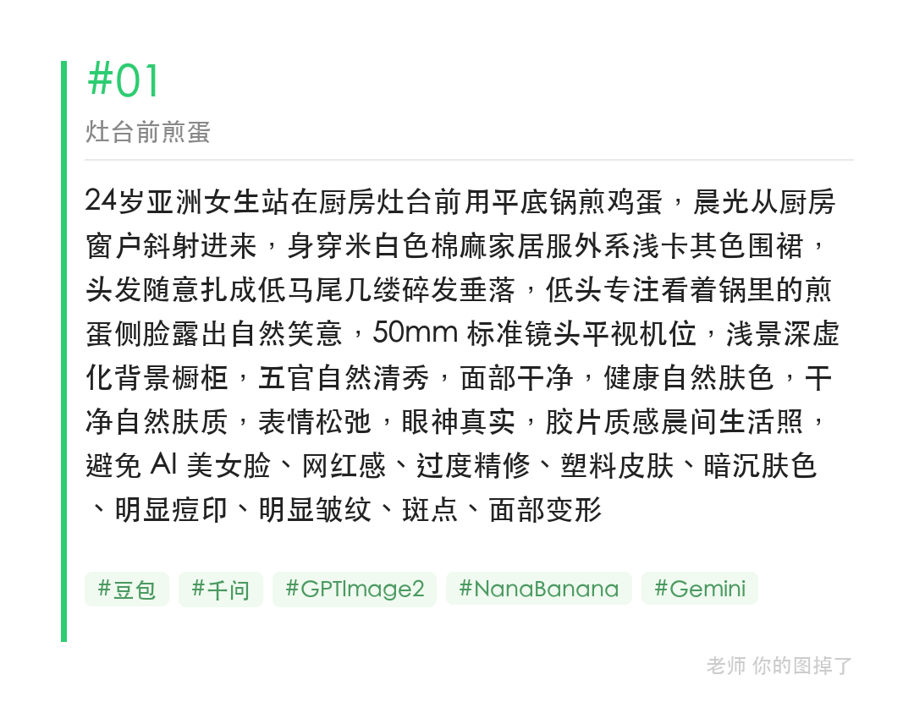
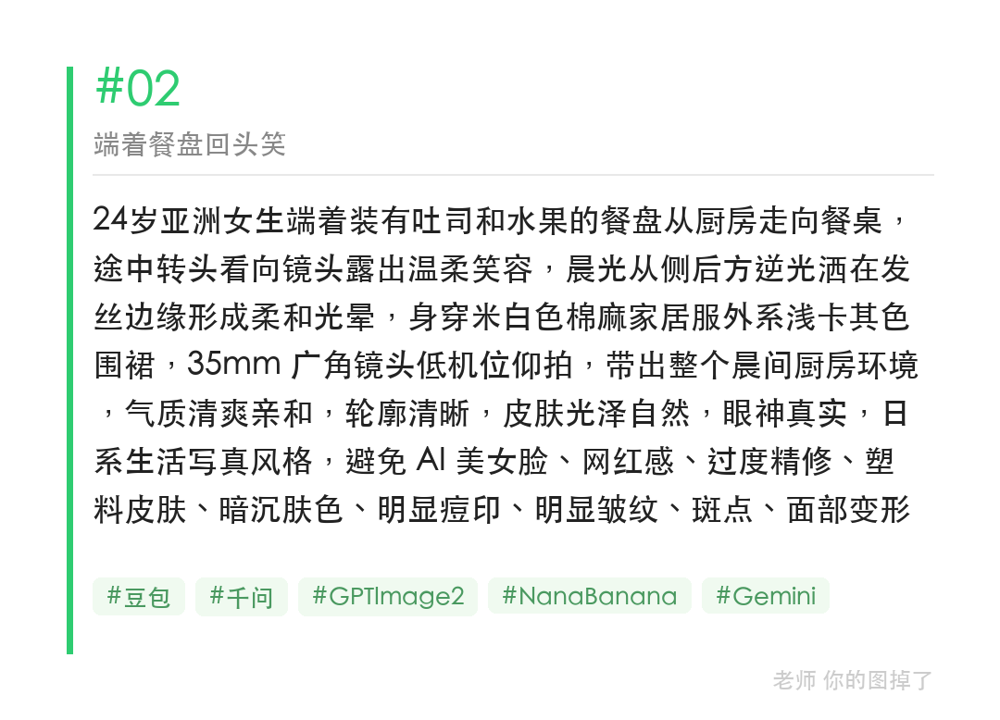
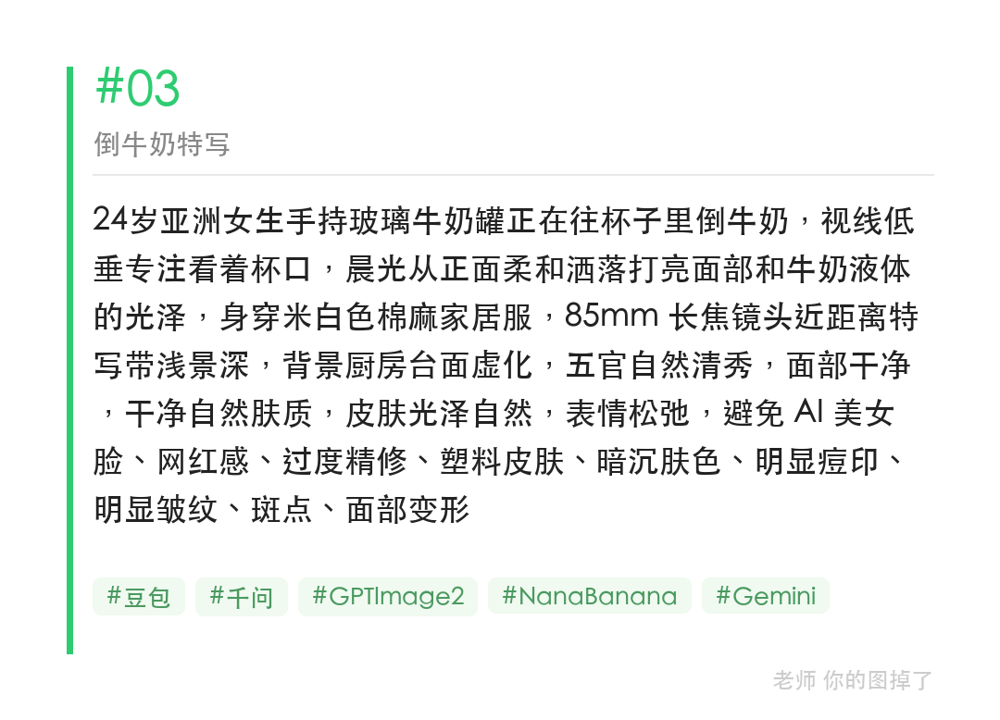

厨房光线其实比卧室更好用，灶台侧光、窗边逆光、餐桌顶光三种光线同时占齐。这组围绕「厨房做早餐」写的提示词，从煎蛋到端盘子再到倒牛奶，把生活感一步步堆出来。

提示词：
24岁亚洲女生站在厨房灶台前用平底锅煎鸡蛋，晨光从厨房窗户斜射进来，身穿米白色棉麻家居服外系浅卡其色围裙，头发随意扎成低马尾几缕碎发垂落，低头专注看着锅里的煎蛋侧脸露出自然笑意，50mm 标准镜头平视机位，浅景深虚化背景橱柜，五官自然清秀，面部干净，健康自然肤色，避免 AI 美女脸、网红感、过度精修、塑料皮肤、暗沉肤色、明显痘印、明显皱纹、斑点、面部变形

#GPTImage2 #千问 #生图提示词 #Prompt #晨间女友 #厨房早餐

