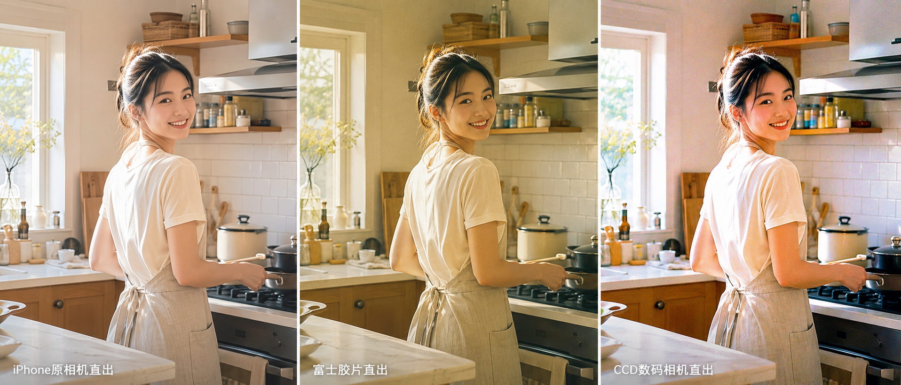
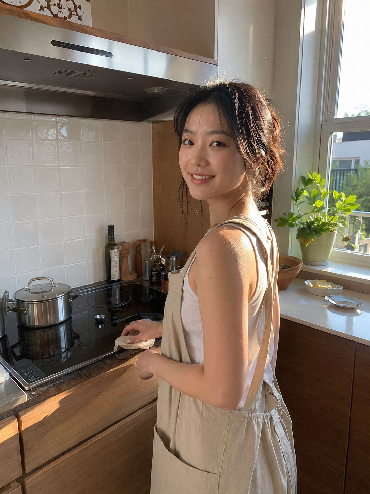
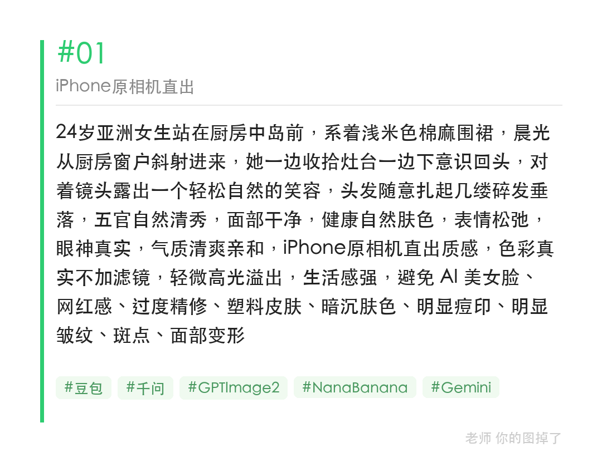
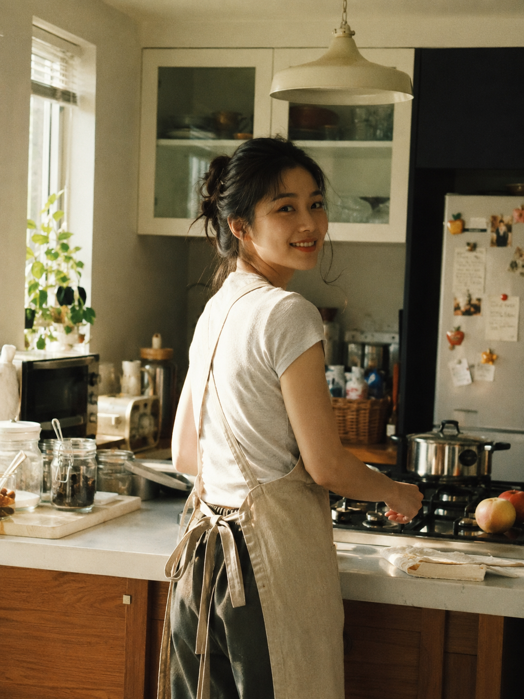
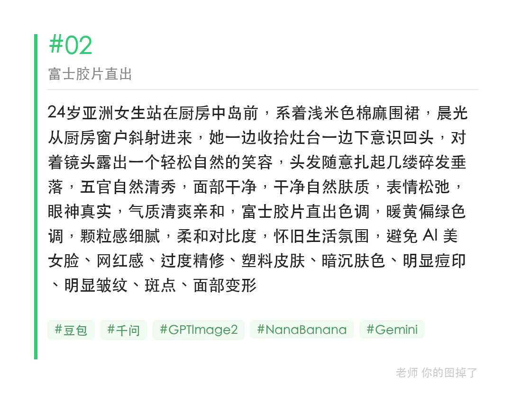
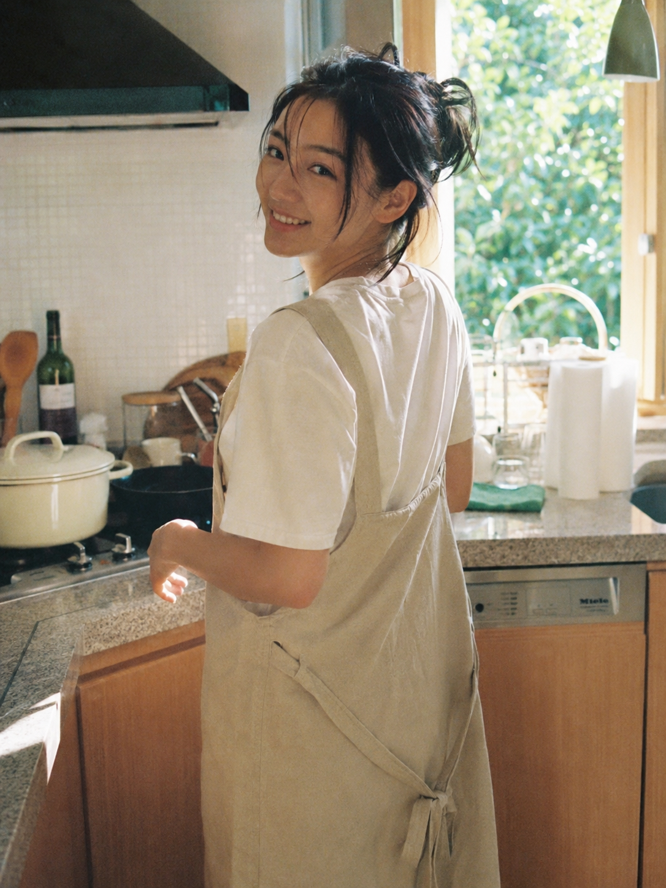
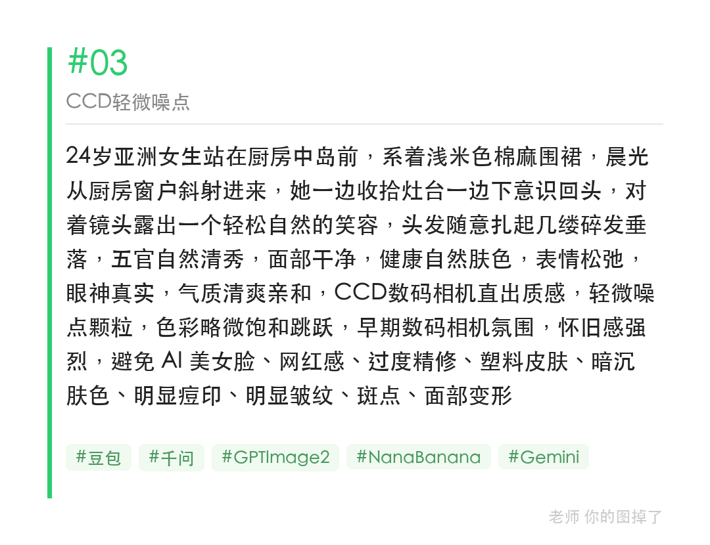

同一个厨房回眸瞬间，只换相机质感这一个词，iPhone直出、富士胶片、CCD数码，观感差异比想象中更大。

提示词：
24岁亚洲女生站在厨房中岛前，系浅米色棉麻围裙，晨光斜射，下意识回头露出自然笑容，五官自然清秀，面部干净，健康自然肤色，表情松弛，气质清爽亲和，[相机风格词替换]，避免 AI 美女脸、网红感、过度精修、塑料皮肤

#GPTImage2 #千问 #生图提示词 #Prompt #晨间女友 #风格对比

