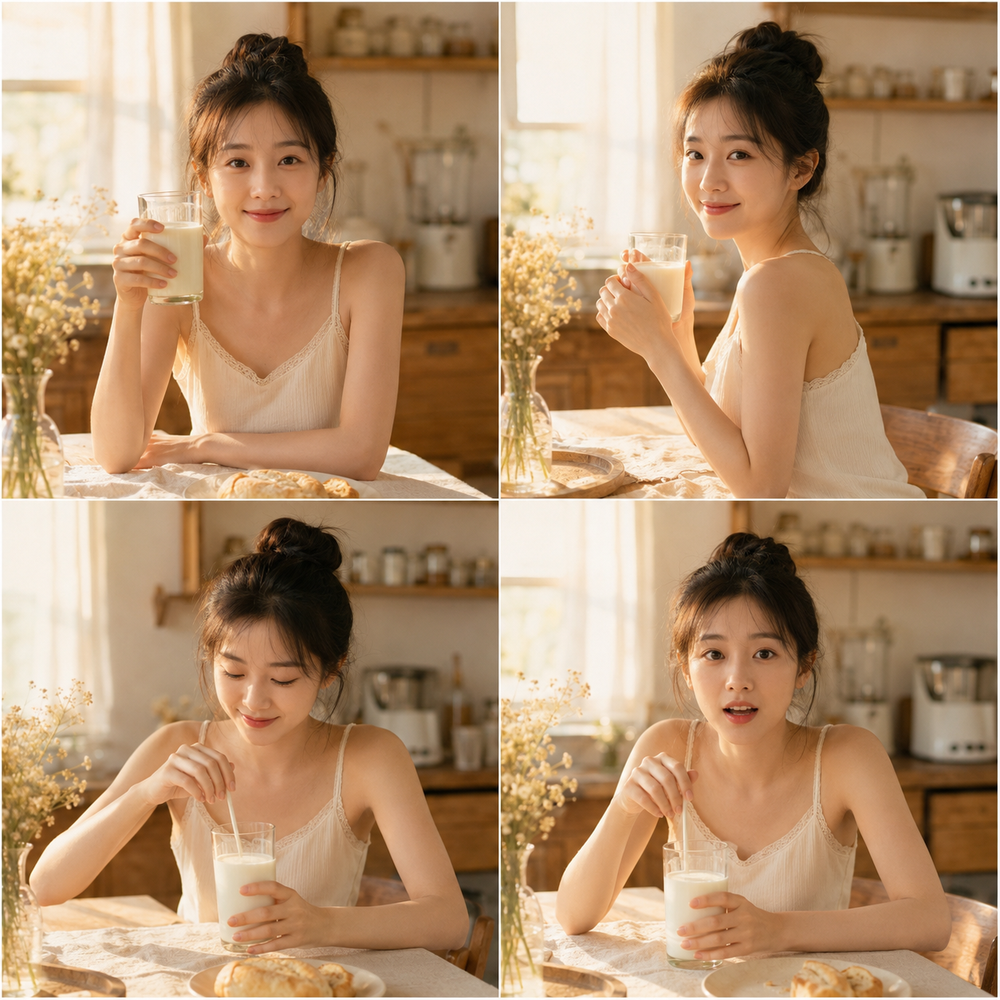
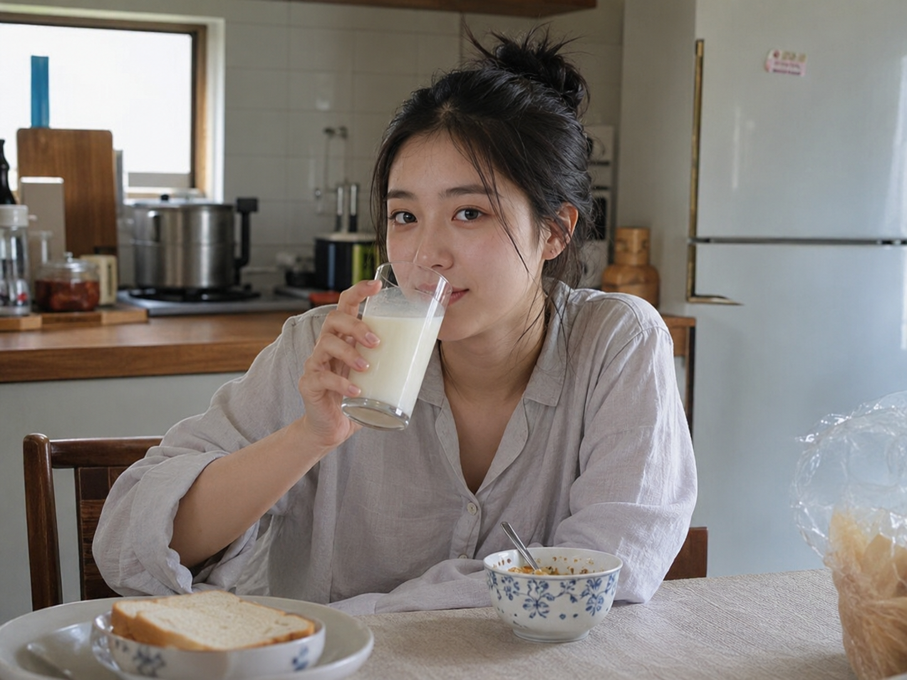
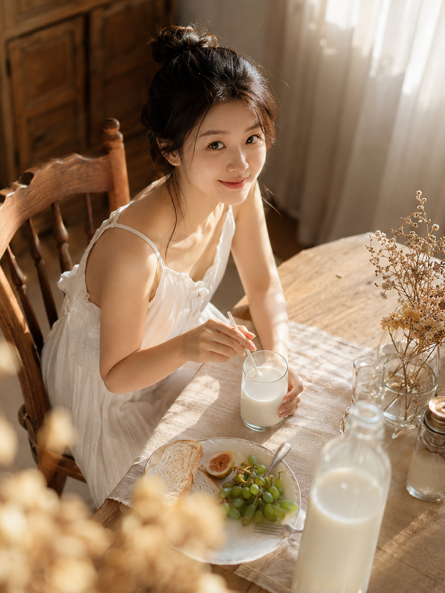

# 这杯牛奶的写法我改了3版，第3版才终于不像摆拍

图友们大家好，今天想聊聊"餐桌前喝牛奶"这个场景——听起来很简单，但我写了三版提示词，才把它从一张普通的"坐着喝奶"照片，改成一张真的会让人多看两眼的图。

最开始我图省事，只写了最基础的描述：人坐在餐桌前，手里端杯牛奶，看镜头。结果出来的图很干净，但也很平——像证件照配了杯牛奶，没有任何情绪流动，光线也是那种哪里都能拍的平淡室内光。

24岁亚洲女生坐在餐桌前喝一杯牛奶，看向镜头，五官自然清秀，面部干净，健康自然肤色，皮肤白皙，晨间居家服装，厨房背景，避免 AI 美女脸、网红感、过度精修、塑料皮肤、暗沉肤色、明显痘印、明显皱纹、斑点、面部变形

第一版的问题很典型：没有光线设计，没有场景细节，人物动作也是最生硬的"端杯看镜头"。这类写法生成的图基本上换个背景就能用在任何场景，缺乏辨识度。

于是我加了两样东西：一是给光线一个具体来源——清晨暖光从窗户斜射进来；二是给桌面加了点道具，面包和鲜花，让整个画面看起来是"正在发生的生活"，而不是"摆好了等你拍"。动作也从"端杯看镜头"改成"捧杯轻抿一口，侧脸转向镜头"，多了一个转瞬即逝的小动作。

24岁亚洲女生坐在餐桌前，双手捧着一杯牛奶轻抿一口，侧脸转向镜头浅笑，五官自然清秀，面部干净，健康自然肤色，皮肤白皙，肤色白皙均匀，气质清爽亲和，晨间居家米色针织衫，木质餐桌上摆着面包和鲜花点缀，清晨暖光从窗户斜射入室内，光线洒在牛奶杯和脸颊上，避免 AI 美女脸、网红感、过度精修、塑料皮肤、暗沉肤色、明显痘印、明显皱纹、斑点、面部变形

这一版已经好了很多，光线让画面有了温度，道具也让餐桌不再是空的。但总觉得还差一点——动作太"静"了，缺一个能让人一眼记住的表情或瞬间。

最后一版我把机位也改了：从正对镜头改成45度侧上方俯拍，前景故意留一点浅景深虚化的牛奶瓶和餐具；动作换成"低头搅拌又抬眸"，表情是带着点惊喜感的笑——这种"被拍到"的瞬间感，比任何摆拍姿势都更有说服力。

24岁亚洲女生坐在餐桌前，低头用吸管搅拌牛奶又抬眸看向镜头，嘴角带着惊喜般的笑意，45度侧上方机位俯拍，浅景深虚化前景的牛奶瓶和餐具，五官自然清秀，面部干净，健康自然肤色，皮肤白皙，肤色白皙均匀，表情松弛，眼神真实，晨间居家白色棉麻连衣裙，木质餐桌搭配亚麻桌布和干花装饰，清晨暖金色阳光透过纱帘洒在肩颈和发丝上形成光斑，避免 AI 美女脸、网红感、过度精修、塑料皮肤、暗沉肤色、明显痘印、明显皱纹、斑点、面部变形

三版放在一起看，差异其实就三个维度：**光线有没有具体来源、道具有没有生活痕迹、动作是不是转瞬即逝的瞬间而不是摆拍姿势**。第一版全都没有，第二版补上了光线和道具，第三版又加上了机位变化和瞬间感的表情。

如果你也在写类似的日常场景提示词，最应该改掉的一个习惯就是：别只写"人在做什么"，多问自己一句"这束光从哪来、桌上还有什么、TA的表情是不是刚好被抓拍到的"。

---

这套改写思路存一下，下次拍任何"坐在xx前做xx"的场景都能直接套用；也欢迎评论区聊聊，你写提示词时最容易漏掉哪个细节。

---

## 往期回顾

- MORNING-022 递给你一杯咖啡
- MORNING-021 晨光里的餐桌
- MORNING-020 站在厨房回头笑

#GPTImage2 #千问 #豆包 #生图提示词 #Prompt #晨间女友 #喝牛奶
