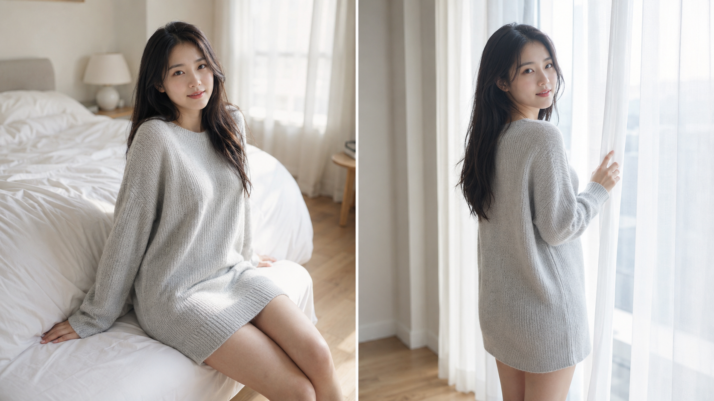
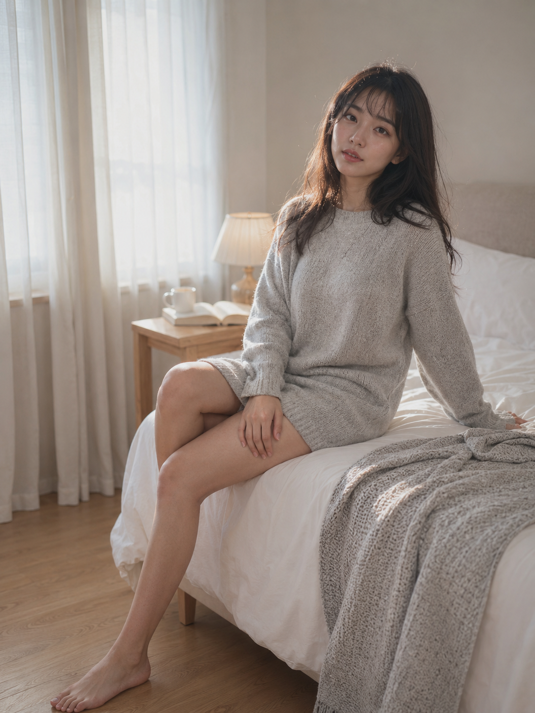
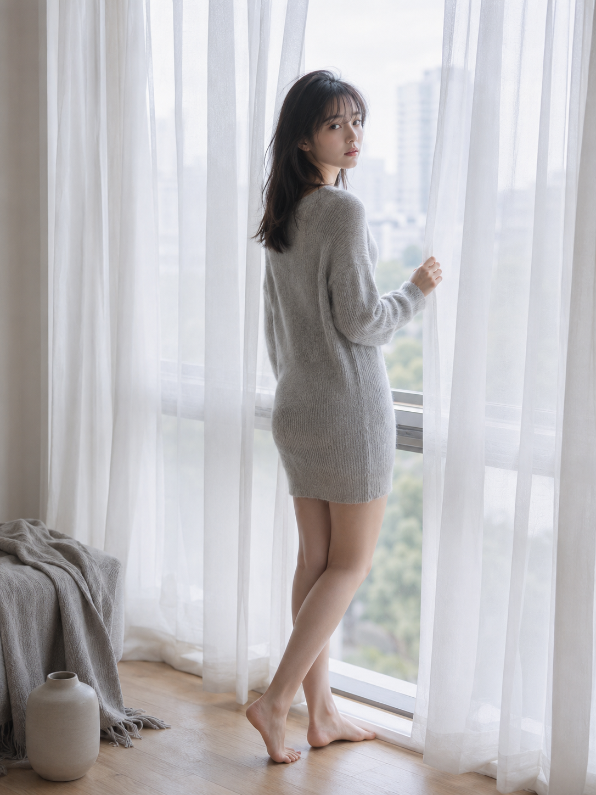
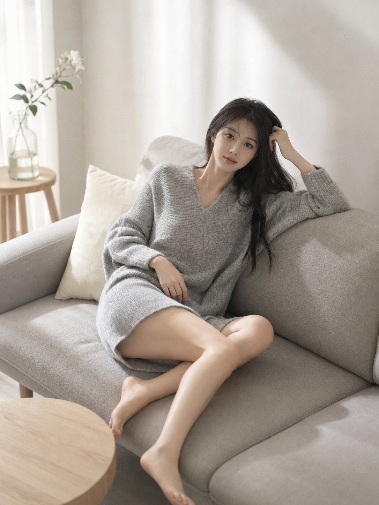
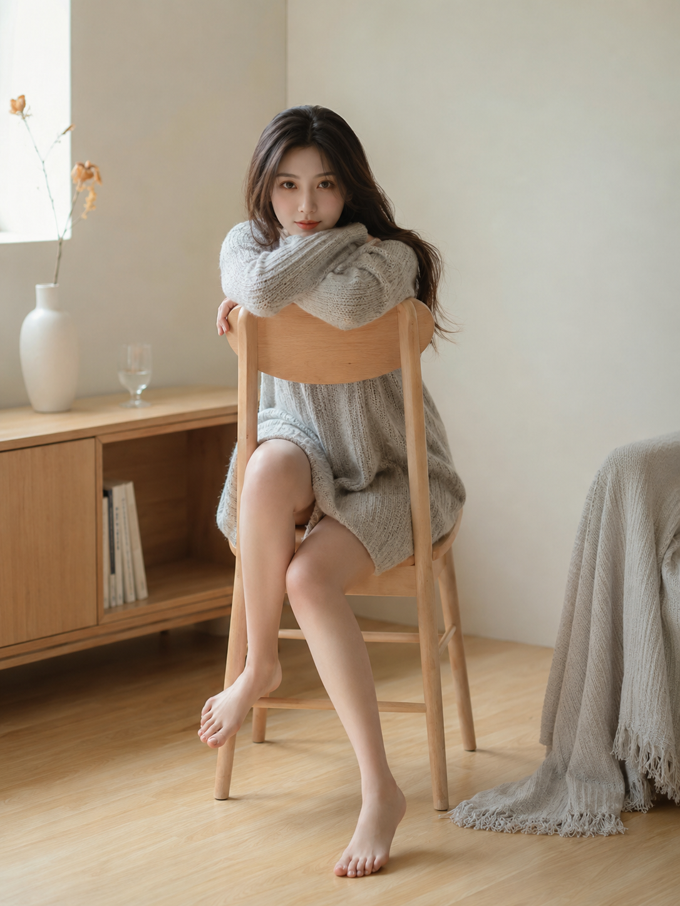
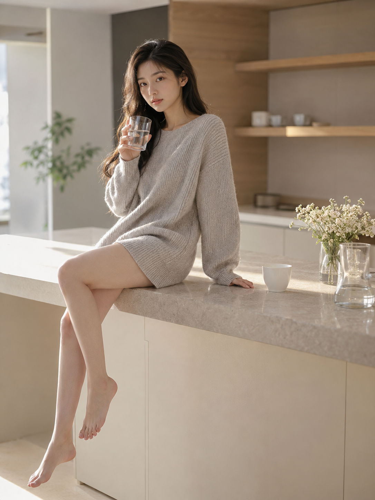

# 朋友圈都以为是真拍，这组晨光居家女友写真只靠一段话

这组图没有靠夸张妆容或复杂布景抢注意力。真正决定成片质感的，是先把人物身份、服装与色调锁死，再让动作、空间和机位发生变化。

从卧室、窗边到客厅和厨房，八个画面看起来像同一组真实写真，而不是八次互不相干的随机生成。先统一人物，再扩展场景，是这套写法最值得复用的部分。

---

## 01｜先让人物看起来像真实存在

第一张选择床边半坐：正脸清晰、动作自然，白色床品和浅灰毛衣形成柔和层次。这里没有堆“绝美”“完美五官”，而是用自然清秀、真实肤质、安静眼神控制人物质感。

---

## 02｜用纱帘把逆光变柔

落地窗场景最容易过曝，白纱帘既是布景，也是天然柔光箱。让人物回眸而不是完全侧身，能够保留轮廓光，同时让五官仍然清楚。

---

## 03｜姿势变化，人物设定不变

沙发侧躺把机位切到略微俯拍，动作与前两张完全不同，但头发、服装、肤色和低饱和灰白色调保持一致。同组图片至少固定四个身份锚点，换姿势时才不容易换脸。

---

## 04｜一把椅子，也能建立画面张力

反坐木椅的结构线条能托住身体姿态。直视镜头带来吸引力，但表情仍保持克制，不会滑向商业棚拍或网红写真。

---

## 05｜把生活动作写进镜头

清晨饮水不是摆拍感很强的动作。玻璃杯高光、岛台石材和侧面晨光一起出现后，画面会更像被偶然记录下来的电影静帧。

---

## 这组图的设计思路

- 人物层：同一年龄、脸、身材、发型、服装与气质，正向描述优先于负面词。
- 光线层：统一为清晨柔光，只改变侧逆光、漫射光和雾面反射的方式。
- 空间层：卧室、窗边、客厅、镜前、地毯、厨房和浴室构成完整的居家叙事。
- 镜头层：50mm 为主，局部切换 85mm 与轻俯拍，既统一又不重复。

和 AI 交互时，不要一上来同时改人物、服装、场景和摄影风格。先要求它严格沿用上一张的人物身份与造型，再只替换动作、机位和空间，成组稳定性会明显更高。

---

## 原版提示词｜卧室晨光·床边半坐

下面保留一份未经压缩的原版，直接复制即可：

24岁亚洲女生，同一人物，同一张脸，同一身材，同一气质，黑棕色自然长发披肩，发丝微微凌乱，额前轻薄碎发，五官自然清秀，面部干净，皮肤白皙细腻但保留真实肤质。穿浅灰色宽松针织毛衣裙，长袖，柔软绒感，长度到大腿中部，整体不暴露，赤脚。她坐在白色床铺边缘，一条腿自然垂下踩在浅木地板上，另一条腿曲起收在床沿，身体微微后倾，一只手撑在身后，另一只手轻搭在膝盖上，头微微侧过来看向镜头，眼神安静、慵懒、带克制的暧昧感，突出肩颈线、锁骨线、腿部线条和女性柔美。场景为高级居家卧室，白色床品自然褶皱，浅灰针织毯随意搭在床尾，床边有浅木色小边几、白色马克杯、一本翻开的书、低矮暖光台灯，背景是半透明白纱窗帘和柔和晨光。整体色彩为雾灰、奶油白、浅木色、冷调晨光灰，低饱和、高级、安静。自然光从侧后方窗户洒入，柔和勾勒肩颈、腿部和毛衣纹理，画面有呼吸感、私密感、克制的性张力。竖版3:4构图，中景偏全身，人物位于画面中心偏右，50mm镜头，浅景深，轻胶片颗粒，低对比柔光，居家艺术写真质感。无文字、无水印、无logo。负面词：避免AI美女脸、避免网红感、避免过度磨皮、避免塑料皮肤、避免浓妆、避免五官失真、避免手指错误、避免多手多脚、避免身体比例异常、避免过度暴露、避免内衣外露、避免低俗色情感、避免廉价情欲感、避免背景杂乱、避免强硬阴影、避免过曝死白、避免文字、避免水印、避免logo。

这份原版最核心的不是篇幅，而是顺序：人物身份 → 服装 → 动作 → 场景 → 光线 → 镜头 → 负面约束。替换其他主题时，沿用这个结构即可。

---

喜欢哪一个居家瞬间？可以收藏这套结构，也欢迎在评论区留下想看的动作或空间，我会继续把它拆成可直接使用的写法。

---

## 往期回顾

- MORNING-023 餐桌前喝牛奶
- MORNING-022 递给你一杯咖啡
- MORNING-021 晨光里的餐桌

#GPTImage2 #千问 #豆包 #生图提示词 #Prompt #晨间女友 #居家写真
