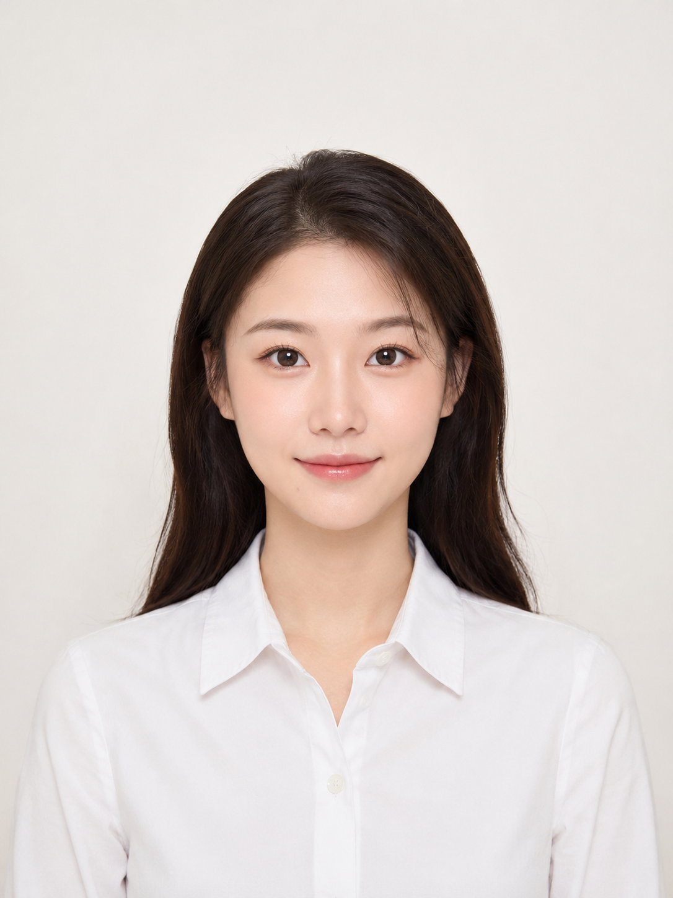

今天这组是「海马体风格五套人像模板」。我把经典证件照、校园青春照、都市职业照、文艺气质照、甜美可爱照整理成同一套清爽影棚人像 Prompt。

这组图的核心是低饱和纯色背景、大面积柔光、自然精修和真实耐看的亚洲女性形象。人物要好看，但不要网红脸；皮肤要干净，但不要塑料磨皮；画面要像一次轻快、精致、明亮的影棚拍摄。

提示词：
22-28 岁亚洲女性在干净明亮的海马体风格影棚中拍摄人像写真，奶油白、浅灰、浅粉或浅蓝低饱和纯色背景，大面积柔光，五官自然清秀，面部干净，健康自然肤色，干净自然肤质，自然皮肤纹理，气质清爽亲和，画面简洁明亮，精致但不夸张，避免 AI 美女脸、网红感、过度精修、塑料皮肤、暗沉肤色、明显痘印、明显皱纹、斑点和面部变形。

建议收藏这组 Prompt。核心结构是「低饱和影棚背景 + 干净妆造 + 柔和棚拍光 + 自然好看的人物质感」，这个框架可以延伸出很多证件照、头像和个人品牌图。
这个系列会持续更新，下一期继续补同类型场景。

#GPTImage2 #豆包 #千问 #生图提示词 #Prompt #海马体影棚写真系列 #海马体风格

