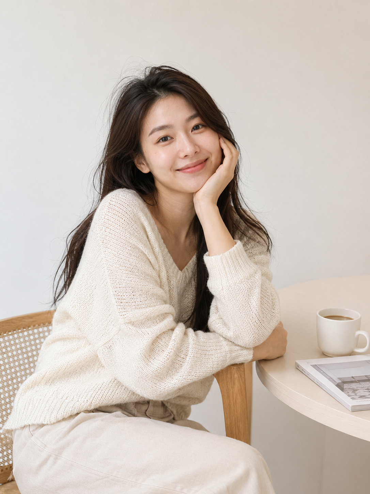
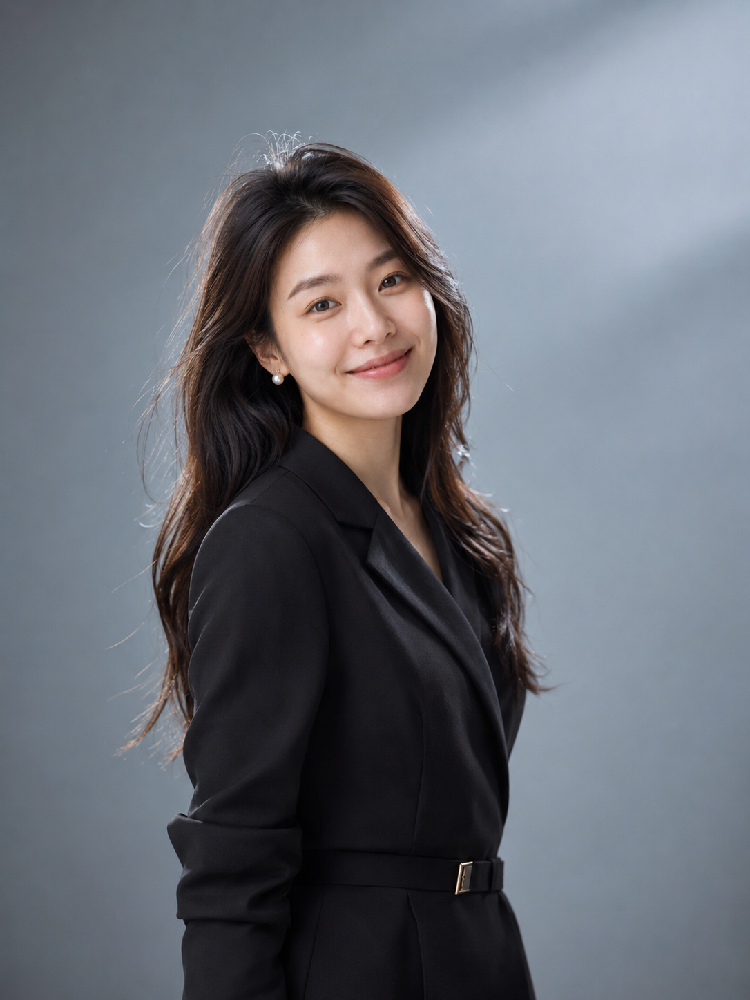
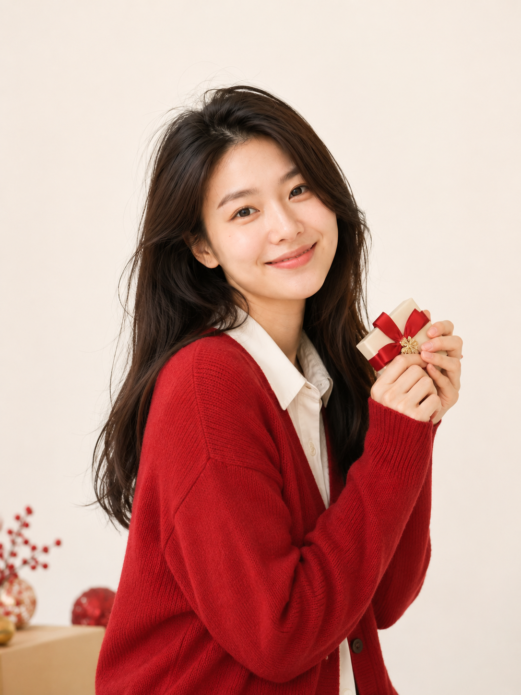
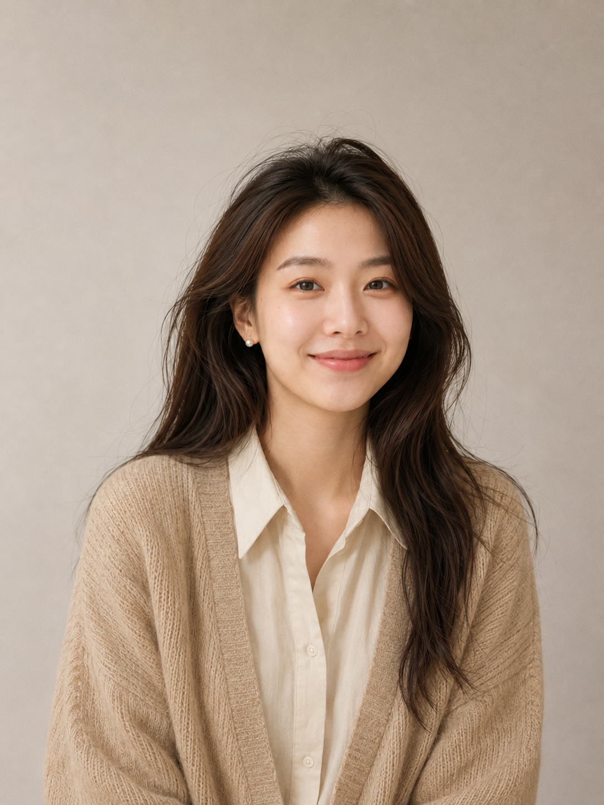
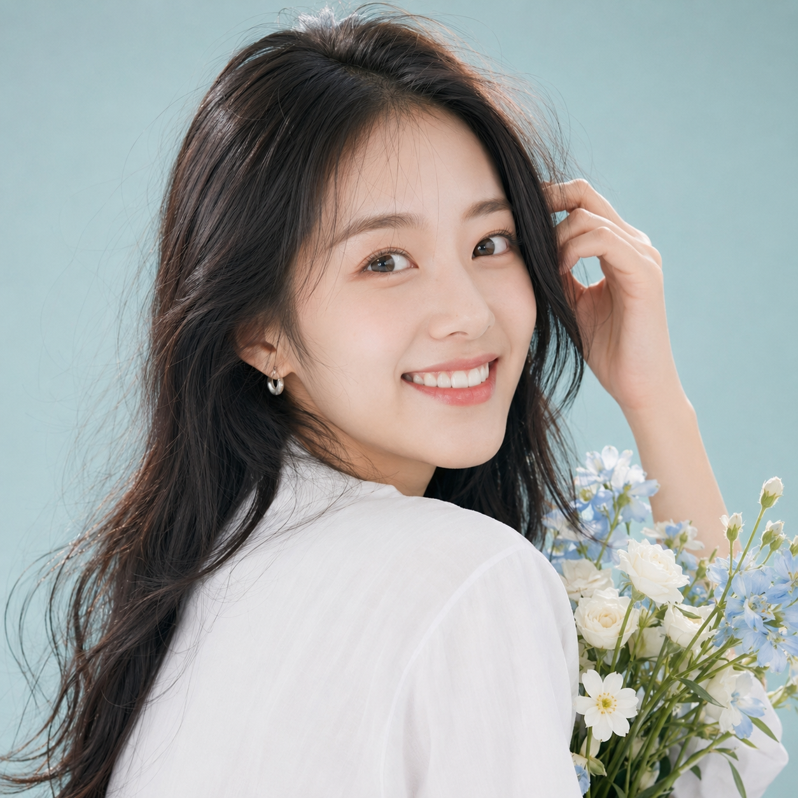

# 3 分钟生成海马体写真，GPT Image 2 后五套模板直接复制

## 场景说明

图友们大家好，今天这一期是「海马体风格后五套写真模板」。

这一组更适合想一次性做头像、封面、节日照和个人形象图的朋友：画面保持干净影棚、柔和光线、自然好看的亚洲女生状态，不走网红脸，也不做过度商业修图。

提示词主要按 GPT Image 2 的中文自然语言写法整理，也可以在豆包、千问及其他支持中文提示词的生图工具上尝试。想要人物更一致，建议每次都保留同一段人物设定和风格约束，只替换场景、动作、道具和色调。

## 自然生活照：松弛感头像模板

适用场景：适合做朋友圈头像、小红书生活封面、公众号作者页配图。重点是影棚里的生活感，干净、亲近、不杂乱。

提示词：

同一位 24-27 岁亚洲女性，五官自然清秀，面部干净，健康自然肤色，气质清爽亲和，自然好看但不网红。她在奶油白影棚里的简约生活角落拍摄自然生活写真，背景保持干净，有浅色小边桌、一本杂志和一杯咖啡，穿宽松米白针织衫和浅色休闲长裤，发型自然蓬松，伪素颜清透妆。人物轻靠椅背，托腮看向镜头，露出放松微笑，3:4 竖幅中景构图，保留少量生活感空间但不杂乱，日光模拟主光从侧前方照入，柔和中性色调，局部阴影自然，真实皮肤纹理，轻微毛孔质感，海马体影棚写真风格，轻快简，简洁明亮，避免 AI 美女脸、网红感、过度精修、塑料皮肤、暗沉肤色、明显痘印、明显皱纹、斑点、面部变形、杂乱家居和商业棚拍感。

拆解：这条的关键是“影棚里的日常”，不是把背景做成复杂家居。保留咖啡、杂志、小边桌这类轻道具即可，人物状态要松弛、清爽、亲近。

## 电影海报照：个人品牌封面模板

适用场景：适合做公众号封面、个人品牌视觉、社交平台主图。它比普通头像更有故事感，但仍然保持脸部干净柔和。

提示词：

同一位 24-27 岁亚洲女性，五官自然清秀，面部干净，健康自然肤色，气质清爽亲和，自然好看但不网红。她在干净高级的影棚中拍摄电影海报感个人形象照，深浅渐变雾灰蓝背景，穿简约黑色西装裙和细腻珍珠耳饰，妆容精致但不浓艳，身体微侧站立，肩颈舒展，眼神坚定地看向镜头，表情有故事感但不过度冷脸。半身到七分身构图，人物占画面 60%-70%，右侧留出海报式空间，主光、辅光和轻微轮廓光形成层次，脸部仍然柔和，整体对比稍高但不脏，海马体影棚写真风格，精致光影，干净高级，轻戏剧感，保留自然皮肤纹理，避免过暗、电影剧照脏感、夸张姿势、过度液化、AI 美女脸、网红感、塑料皮肤、暗沉肤色、明显痘印、明显皱纹、斑点和面部变形。

拆解：电影感主要靠眼神、轮廓光和留白完成，不需要复杂布景。背景越克制，人物越容易显得高级。

## 节日仪式感照：可分享纪念照模板

适用场景：适合节日朋友圈、小红书封面、活动头像。它有节日氛围，但不会堆满装饰，画面依然清爽。

提示词：

同一位 24-27 岁亚洲女性，五官自然清秀，面部干净，健康自然肤色，气质清爽亲和，自然好看但不网红。她在简洁明亮的影棚中拍摄节日仪式感写真，奶油白纯色背景搭配少量浅红和金色点缀，穿红色细针织开衫内搭白色衬衫，发型精致自然，妆容明亮清透。人物手捧一个小礼物盒，身体轻微侧身，笑容自然，眼神清亮，半身中景构图，背景留白明显，画面重点在人。柔光为主，局部暖色点缀，整体明亮偏暖，肤色清透，海马体影棚写真风格，节日写真，仪式感，简洁明亮，青春活力，避免堆满装饰、廉价影楼布景、强烈饱和红绿配色、AI 美女脸、网红感、过度精修、塑料皮肤、暗沉肤色、明显痘印、明显皱纹、斑点和面部变形。

拆解：节日元素只做点缀，礼盒、花束、丝带任选一种就够。不要让道具抢掉人物的脸和表情。

## 轻复古证件照：高级感头像模板

适用场景：适合头像、简历照片升级、纪念照。它比普通证件照更温柔，但仍然端正、清晰、耐看。

提示词：

同一位 24-27 岁亚洲女性，五官自然清秀，面部干净，健康自然肤色，气质清爽亲和，自然好看但不网红。她在暖灰和奶油米色无缝背景前拍摄轻复古证件照，穿低饱和复古衬衫和浅咖针织开衫，佩戴小号珍珠耳钉，柔雾妆，唇色自然。人物以正面到 15 度侧脸看向镜头，微笑克制，表情温柔端正，肩颈线条干净，胸像到半身构图，画面稳定，头顶和肩部保留适当呼吸空间。柔和大面积棚拍光，暖调，轻微胶片颗粒但保持清晰，肤质自然，不过度磨皮，海马体影棚写真风格，证件照升级，真实五官，自然修饰，避免老照片泛黄、强颗粒、厚重复古滤镜、AI 美女脸、网红感、塑料皮肤、暗沉肤色、明显痘印、明显皱纹、斑点、面部变形和僵硬表情。

拆解：这张的复古感来自低饱和服装、暖灰背景和柔雾妆，不要把画面做成泛黄旧照片。

## 活力社交头像：高点击头像模板

适用场景：适合朋友圈、小红书、公众号作者头像。人物更靠近镜头，表情更外放，但仍然自然。

提示词：

同一位 24-27 岁亚洲女性，五官自然清秀，面部干净，健康自然肤色，气质清爽亲和，自然好看但不网红。她在低饱和浅蓝绿色影棚背景前拍摄活力社交头像，背景纯色或轻微柔和渐变，穿简洁白色上衣，搭配细小银色耳饰，妆容自然元气，眼部有干净高光。人物回头看向镜头，开朗笑容，轻轻抬手整理头发，手边拿一小束浅色花但不遮挡脸部，近景半身构图，人物占比高，头像裁切友好，可延展为 3:4 或 1:1。明亮均匀柔光，肤色清透，眼神真实有互动感，海马体影棚写真风格，青春元气，清爽影棚，明亮自然，可分享感，避免网红脸、过度美颜、大面积道具遮挡脸部、AI 美女脸、塑料皮肤、暗沉肤色、明显痘印、明显皱纹、斑点和面部变形。

拆解：头像图最怕“好看但没有记忆点”。这条用回头笑、浅色花束、浅蓝绿背景制造轻互动感，同时保持脸部清晰。

## 使用建议

1. 想让人物更一致：五条都保留同一段人物设定，例如年龄、五官气质、肤色、妆发和“同一位亚洲女性”，只替换动作、背景、道具和光线。
2. 想让画面更真实：保留“自然皮肤纹理、轻微毛孔质感、不过度磨皮”，同时避免把负向词写得太多，先把正向画面描述清楚。
3. 想换工具尝试：GPT Image 2、豆包、千问都可以用中文自然语言直接试，出图差异较大时优先微调画幅、人物占比、背景颜色和光线方向。

建议收藏这一组。下次想做头像、封面、节日照或职业形象图时，直接替换服装和背景颜色就能继续复用；也欢迎在评论区留言你想要的写真主题，我会继续补同类型 Prompt。

## 往期回顾

- [海马体风格五套人像模板](../HMT-001-海马体风格五套人像模板/HMT-001-海马体风格五套人像模板.md)

#GPTImage2 #豆包 #千问 #生图提示词 #Prompt #海马体影棚写真系列 #海马体写真 #小红书头像 #写真Prompt
