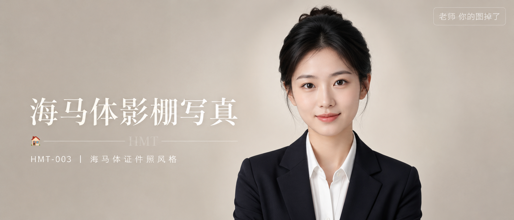
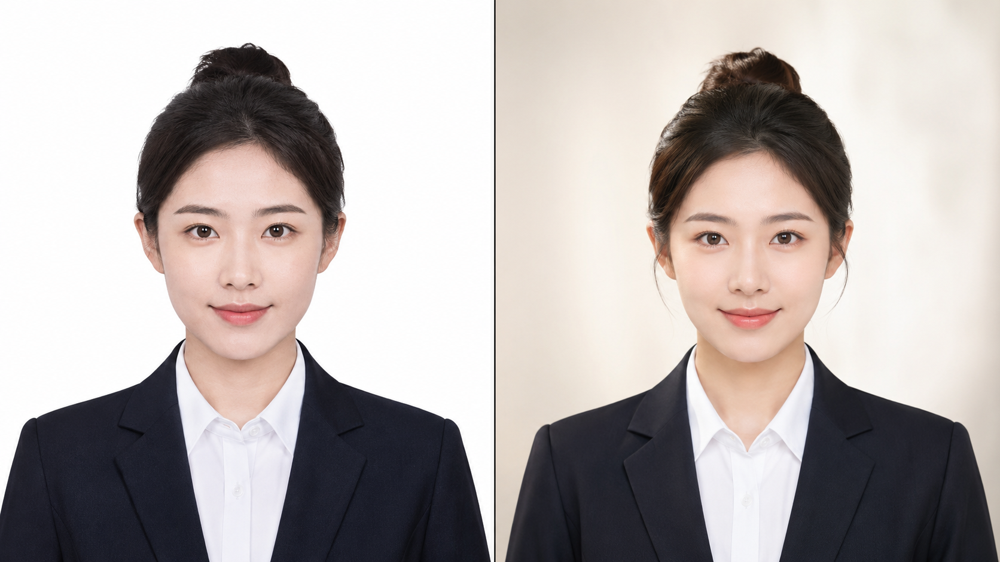
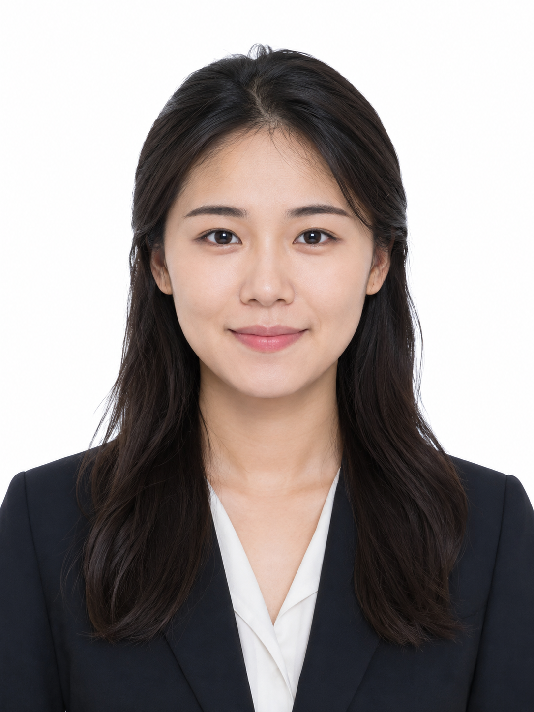
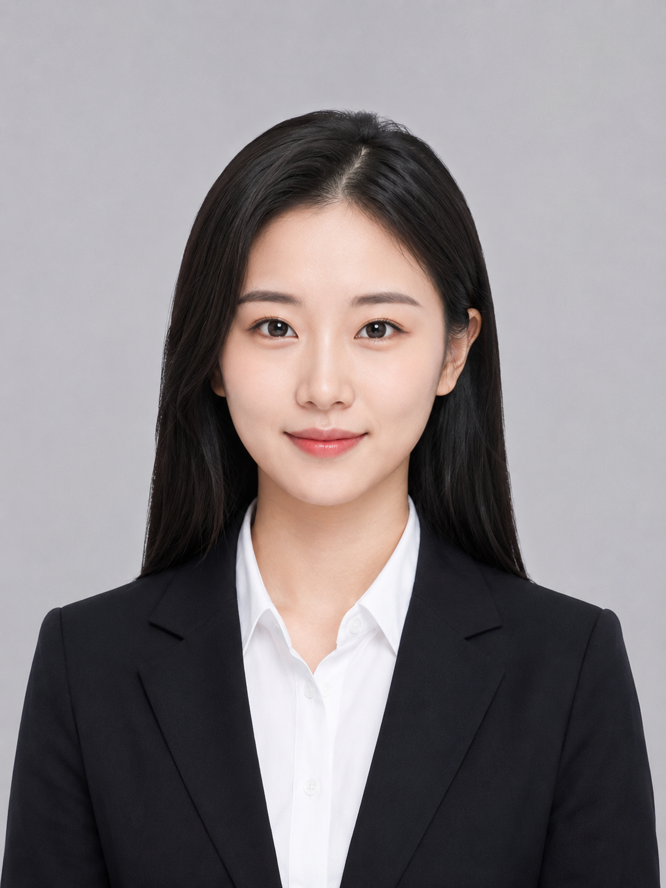
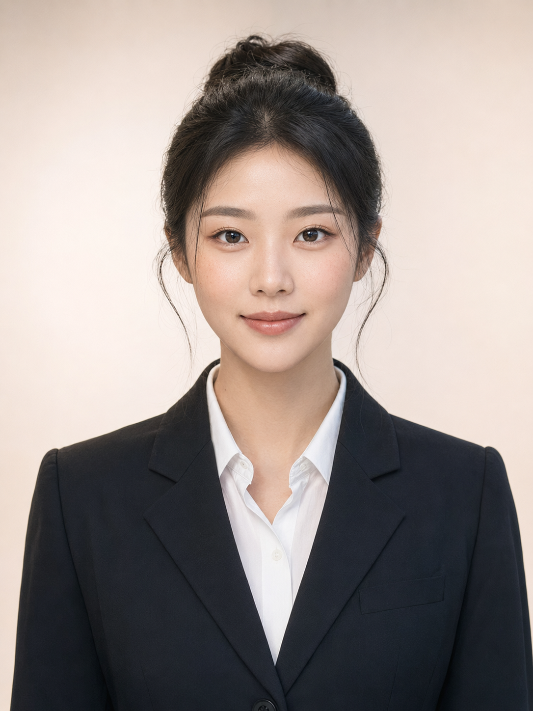

今天这组是「海马体证件照风格」。

很多人用 AI 生成证件照，出来的效果总觉得差点意思——光线平、背景硬、五官过于完美——和真正去海马体拍的那种通透感、立体感差距明显。

核心问题是提示词缺了几个关键维度：布光方式、背景质感、妆容细节、镜头焦段。把这四样补齐，效果会有质的差距。

最终版提示词：

海马体影棚证件照风格，24岁亚洲女生，韩式精英感裸妆：一字平眉、肤感底妆不遮雀斑、浅珊瑚色腮红、自然裸色唇色，黑色直发盘发高颅顶留两缕碎发，深色单排扣西装外套配白衬衫，蝴蝶光从正上方45度均匀补光面部立体轮廓，鼻梁阴影清晰，颧骨微立体，皮肤通透细腻有光泽，眼中有明亮自然高光眼神光，淡米白色低饱和背景带轻微柔焦渐变，半身3:4构图头部居上三分之一，正面直视镜头表情平静从容带淡淡微笑，摄影棚50mm标准镜头，轻微景深，五官自然清秀，面部干净，气质清爽亲和，避免 AI 美女脸、网红感、过度精修、塑料皮肤、暗沉肤色、明显痘印、明显皱纹、斑点、面部变形

三版对比从新手写法一路迭代，差距非常直观。建议收藏这组 Prompt。核心结构是「布光方式 × 背景质感 × 妆容细节 × 肤质控制」，可以延伸到学生证、简历照、社交头像等各类证件照场景。

#GPTImage2 #千问 #生图提示词 #Prompt #海马体写真 #证件照

