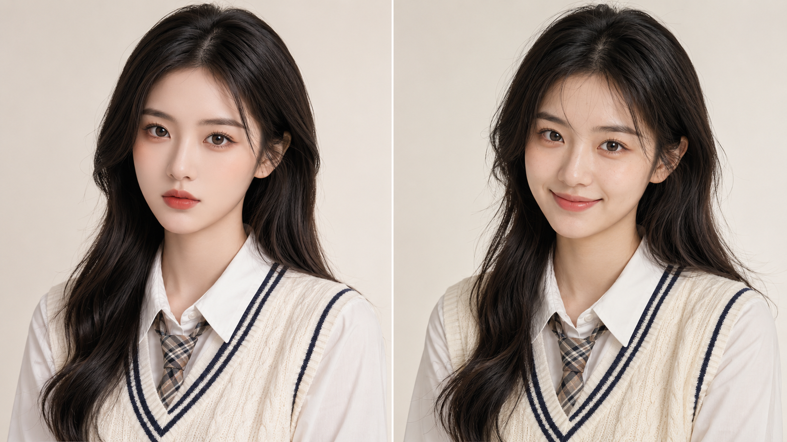
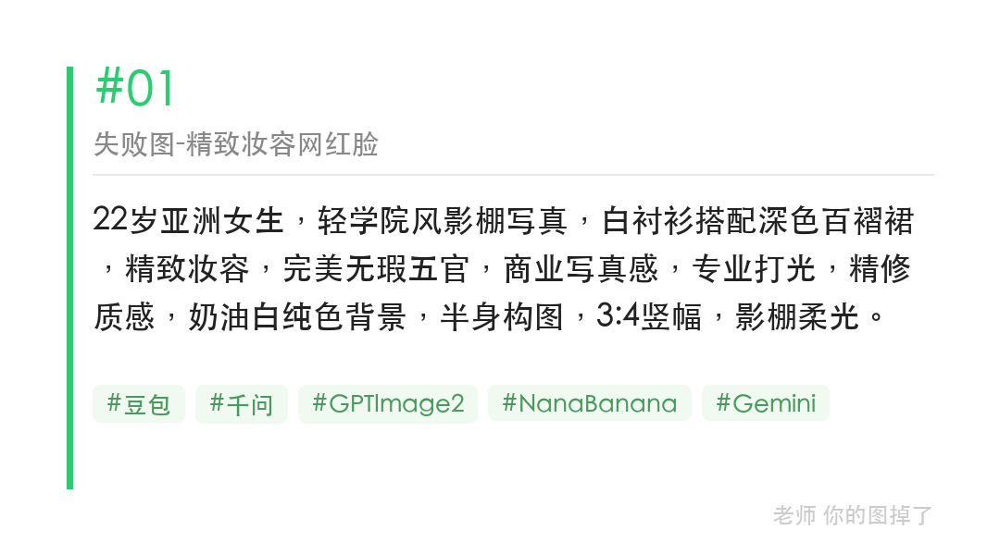
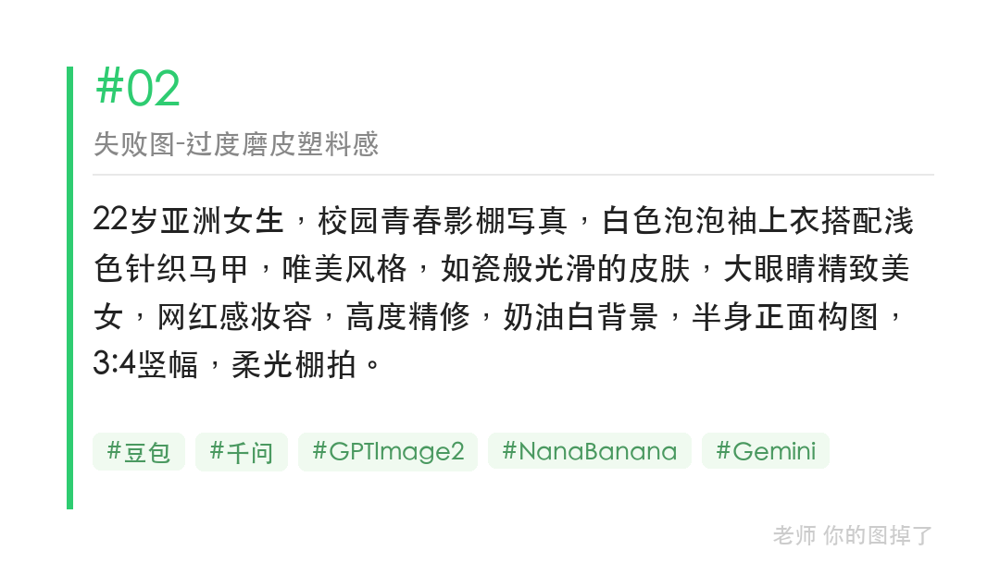
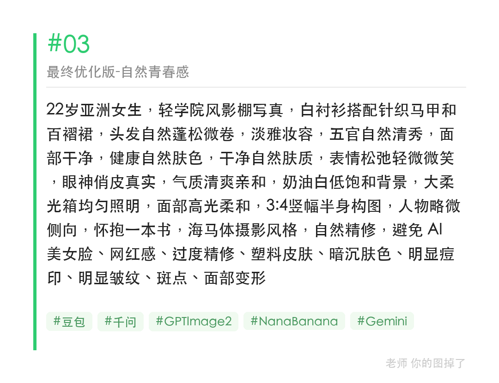

校园青春写真最常见的失败：加了「精致妆容」和「如瓷般光滑的皮肤」，AI 直接走商业写真模板，网红脸、塑料皮肤全来了。

删掉这两类词，换成「淡雅妆容」「干净自然肤质」「表情松弛」，青春感立刻回来。

提示词（修正版）：
22岁亚洲女生，轻学院风影棚写真，白衬衫搭配针织马甲，五官自然清秀，干净自然肤质，表情松弛轻微微笑，眼神俏皮真实，奶油白背景，大柔光箱，3:4竖幅半身，海马体风格，自然精修，避免AI美女脸、网红感、过度精修、塑料皮肤

#GPTImage2 #千问 #生图提示词 #Prompt #海马体影棚写真 #校园青春照

