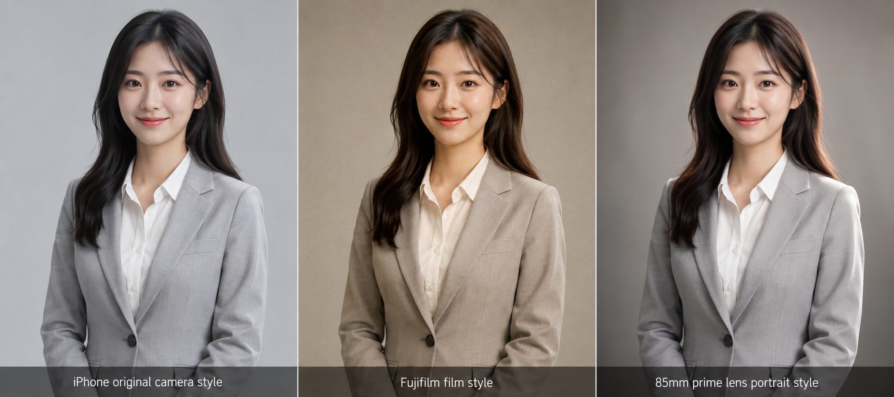
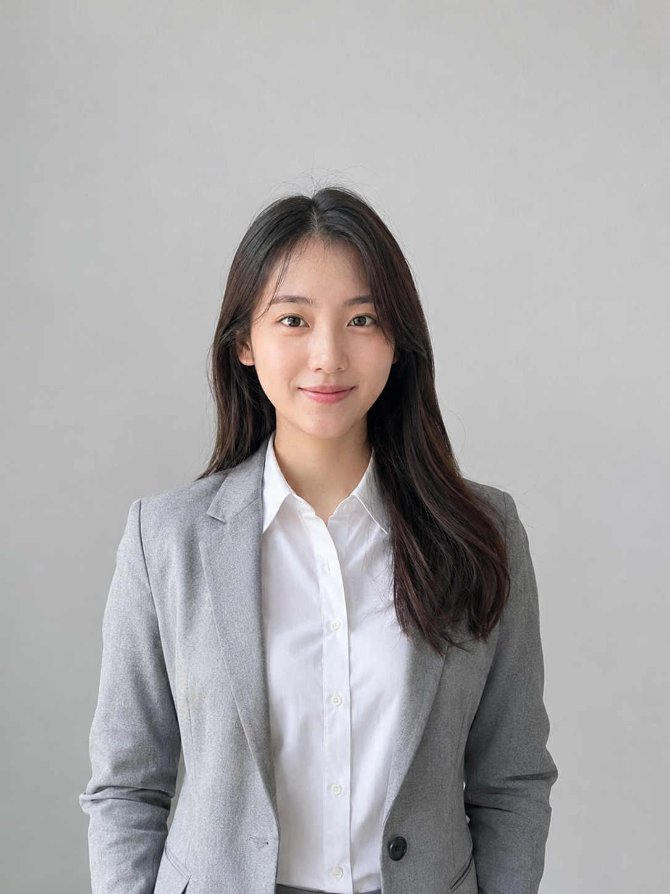
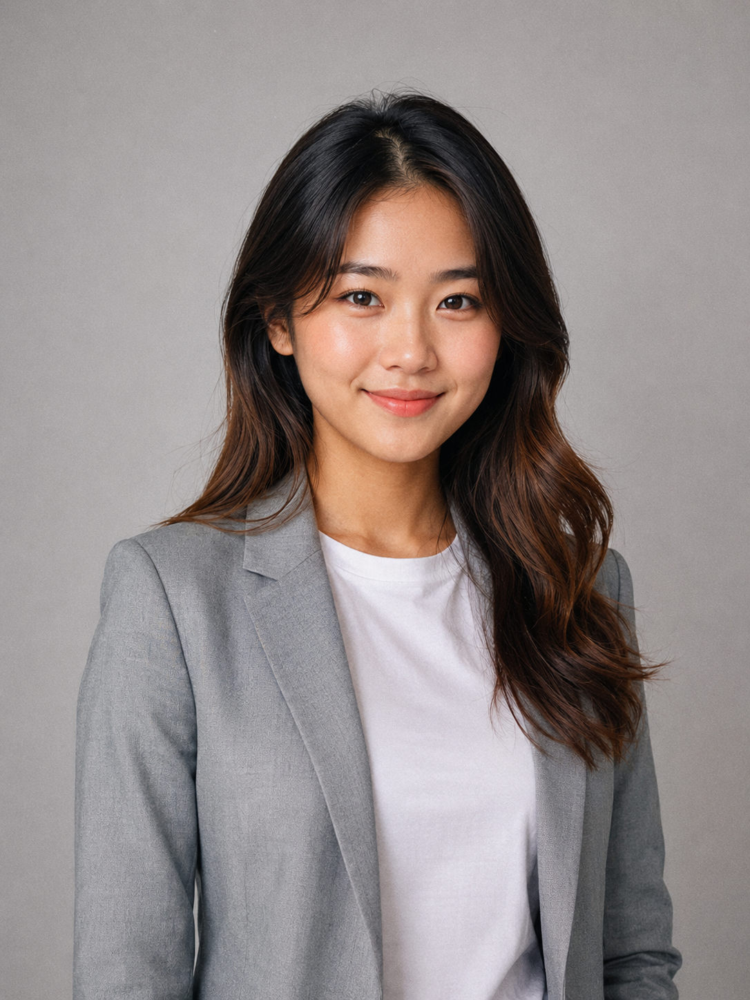
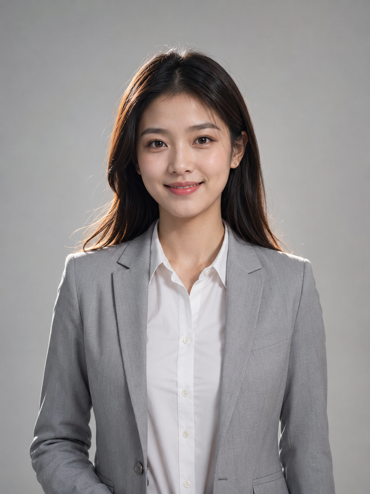

# 同一套职业照，换一种拍法，差距有多大？

去年帮朋友准备简历，她找了一张「自拍证件照」放上去，HR 说：「看起来像旅游团照。」

后来她问我能不能用 AI 重新生成一组，我们试了三次，前两次出来都觉得差点意思——直到第三次换了思路：**不改场景，不改人物，只换摄影风格词**，同一张照片三种质感，结果立刻就不一样了。

这一期我们做一个小测试：同一位职业女性，同样的浅灰背景、白衬衫西装，站姿一模一样。变量只有一个——**摄影风格**。

---

图友们大家好，我是「老师 你的图掉了」，今天这一期是都市职业照。

职业照的需求比想象中高频——简历、LinkedIn、部门通讯录、个人品牌主页——但绝大多数人手头没有摄影师，也不想花几百块去拍一次。AI 生成职业照，其实完全够用，关键是提示词里的「摄影风格词」写什么。

今天测了三种，差异比我预期的大。

---

第一种，用的是 **iPhone 原相机风**。

这个写法最容易被忽视，但出来的效果最「日常」——脸是真实的脸，肤色是自然的肤色，没有任何「AI 精修感」。背景干净，光线均匀，看起来就像一个朋友帮你在明亮的室内随手拍的那种。如果你想要的是「不做作、有温度」的头像，这个方向最合适。

22岁亚洲女性，青春自然气质，穿修身白衬衫搭配浅灰西装外套，站姿挺直、淡定自信微笑，眼神稳定，肩线舒展，浅灰低饱和纯色无缝背景，柔光主光均匀照明，iPhone 原相机拍摄风格，自然色彩还原，清透自然肤色，日常感，非商业感，3:4 竖幅半身构图，人物居中，头顶留少量呼吸空间，五官自然清秀，面部干净，干净自然肤质，眼神真实，气质清爽亲和，避免 AI 美女脸、网红感、过度精修、塑料皮肤、暗沉肤色、明显痘印、明显皱纹、斑点、面部变形

---

第二种，换成了 **富士 Velvia 胶片直出风**。

同样是影棚，同样是白衬衫西装，但整个色彩基调变了——饱和度略高，暖调，轻微颗粒感，肤色明亮但偏暖一点。看起来更「有质感」，像是 2010 年代那种精心布光的写真照，多了一层情绪。

喜欢稍微有「风格感」的朋友，这个方向值得试试。不同平台对这种风格的接受度也不同，小红书会很吃。

22岁亚洲女性，青春自然气质，穿修身白衬衫搭配浅灰西装外套，站姿挺直、淡定自信微笑，眼神稳定，肩线舒展，浅灰低饱和纯色无缝背景，柔光主光均匀照明，富士 Velvia 胶片直出风格，色彩浓郁饱和度略高，暖调自然，轻微胶片颗粒感，肤色明亮，3:4 竖幅半身构图，人物居中，头顶留少量呼吸空间，五官自然清秀，面部干净，干净自然肤质，眼神真实，气质清爽亲和，避免 AI 美女脸、网红感、过度精修、塑料皮肤、暗沉肤色、明显痘印、明显皱纹、斑点、面部变形

---

第三种，换成 **数码单反 85mm 定焦镜头人像风**。

这个是三种里最「专业」的感觉——背景自然虚化，人物主体清晰，边缘轮廓光把脸型和轮廓打出来了，层次感最强。这是大多数商务头像/领英头像惯用的那种质感。

如果你要发的是 LinkedIn、公司官网、简历投互联网大厂，这个是最稳的选择。

22岁亚洲女性，青春自然气质，穿修身白衬衫搭配浅灰西装外套，站姿挺直、淡定自信微笑，眼神稳定，肩线舒展，浅灰低饱和纯色无缝背景，柔光主光加边缘轮廓光，数码单反 85mm 定焦镜头人像风格，背景自然虚化，人物清晰，层次感强，轮廓立体，肤色高级干净，3:4 竖幅半身构图，人物居中，头顶留少量呼吸空间，五官自然清秀，面部干净，干净自然肤质，眼神真实，气质清爽亲和，避免 AI 美女脸、网红感、过度精修、塑料皮肤、暗沉肤色、明显痘印、明显皱纹、斑点、面部变形

---

总结一下三种风格的适用场景：

| 风格词 | 视觉效果 | 适合内容类型 |
|---|---|---|
| iPhone 原相机 | 清透自然，无修饰感 | 社交头像、个人品牌、小红书 |
| 富士 Velvia 胶片 | 暖调饱和，有质感 | 小红书封面、写真头像、有温度感的简历 |
| 85mm 定焦镜头 | 背景虚化，轮廓立体 | LinkedIn、商务简历、企业通讯录 |

三条提示词的场景、人物、服装、背景、光线全部一致，只改了相机/风格词那一句——这是最省事的换风格方式，不用重新想场景。

---

如果这三种你都想试，建议先跑第三种（85mm 定焦）确认人脸效果满意，再复制改风格词跑另外两条，节省出图次数。

有没有想看的其他职业照风格测试？欢迎评论告诉我，下期优先做。

---

## 往期回顾

- HMT-004 校园青春照
- HMT-003 海马体证件照风格
- HMT-002 海马体风格后五套写真模板

#GPTImage2 #千问 #豆包 #生图提示词 #Prompt #海马体写真 #职业照
