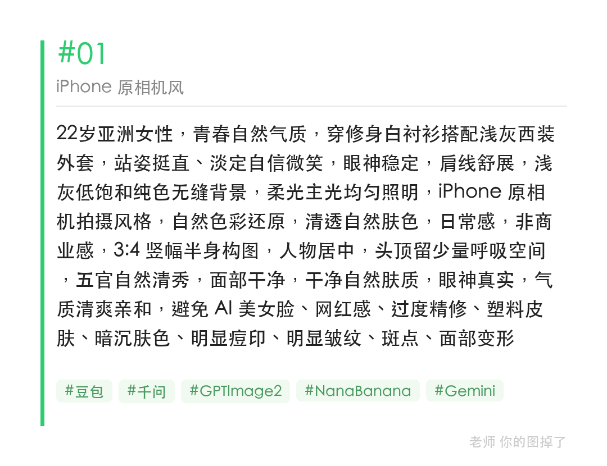
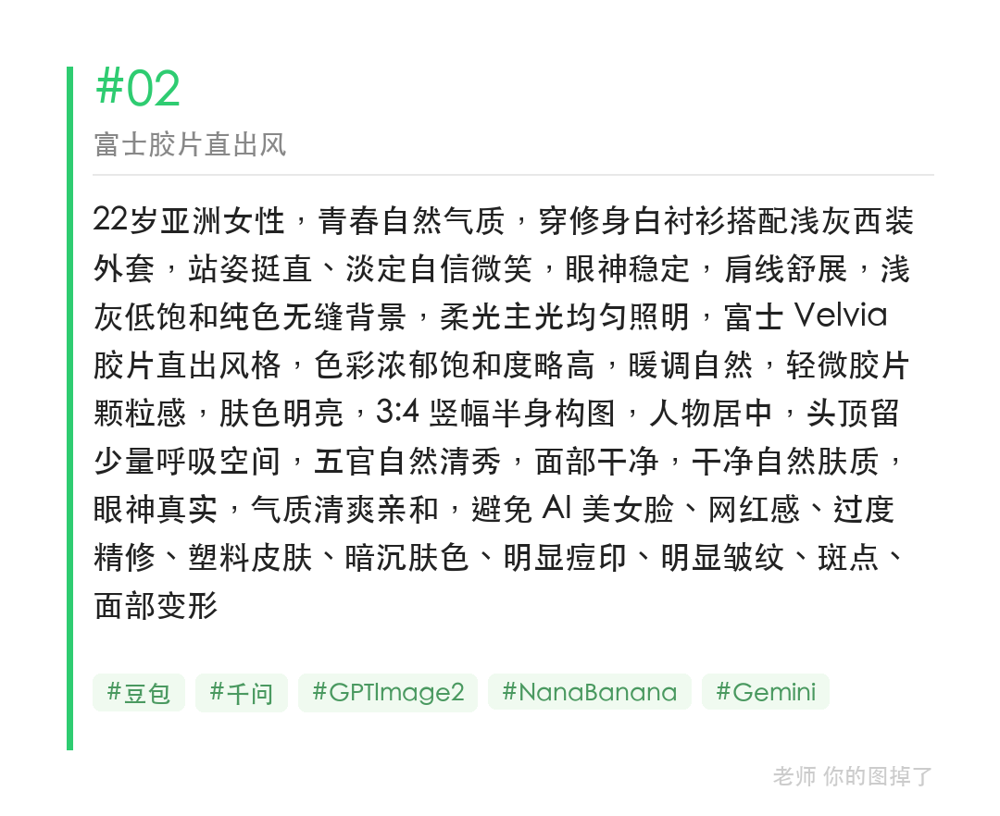
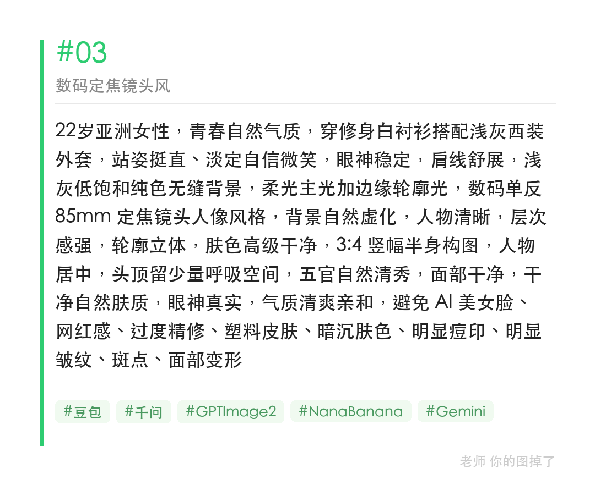

同一套职业照场景，同一人物同一构图，只换摄影风格词，iPhone 原相机/富士胶片/85mm 定焦三种质感对比一目了然。

提示词：
22岁亚洲女性，修身白衬衫搭浅灰西装，浅灰无缝背景，柔光主光，85mm 定焦镜头人像风格，背景自然虚化，轮廓立体，肤色高级干净，五官自然清秀，避免 AI 美女脸、网红感、过度精修、塑料皮肤、面部变形

#GPTImage2 #千问 #生图提示词 #Prompt #海马体写真 #职业照

