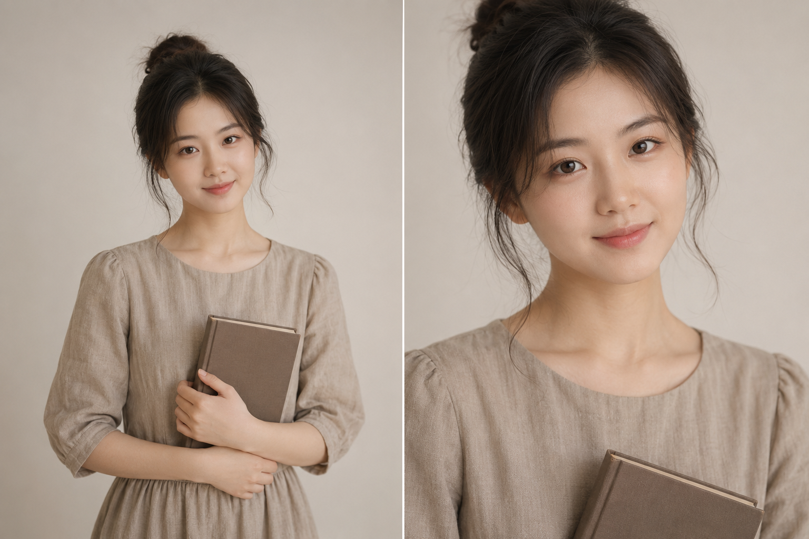

# 同一文艺气质，三种景别，哪种最有意境感？

**今天的实验：** 同一场景、同一人物、同一道具，只改景别，看中景、近景、特写三种构图在文艺气质照里的真实差距。

**变量说明：** 人物设定、服装、道具、背景、光线全部固定。只有构图景别和画面裁切范围不同。

---

**#01 ｜ 中景半身**

22岁亚洲女生，温柔文艺气质，身穿浅咖色棉麻连衣裙，手捧一本精装硬壳书，低头微笑，眼神温柔放松，奶油白无缝背景，柔光箱均匀照明加微弱暖背光，光线包裹感强，色调暖灰低对比，五官自然清秀，面部干净，健康自然肤色，干净自然肤质，表情松弛，气质清爽亲和，中景半身构图3:4竖幅人物居中，画面留白明显，海马体影楼风格，细腻光影，自然皮肤纹理，避免AI美女脸、网红感、过度精修、塑料皮肤、暗沉肤色、明显痘印、明显皱纹、斑点、面部变形

> 特点：人物和背景留白比例适中，能同时展示服装全貌和书道具，适合想呈现整体造型和气质感的场景，是文艺写真的常规切入方式。

---

**#02 ｜ 近景七分身**

22岁亚洲女生，温柔文艺气质，身穿浅咖色棉麻连衣裙，手捧一本精装硬壳书，低头微笑，眼神温柔放松，奶油白无缝背景，柔光箱均匀照明加微弱暖背光，光线包裹感强，色调暖灰低对比，五官自然清秀，面部干净，健康自然肤色，干净自然肤质，表情松弛，气质清爽亲和，近景七分身构图3:4竖幅人物偏左三分法留白，画面呼吸感更强，海马体影楼风格，细腻光影，自然皮肤纹理，避免AI美女脸、网红感、过度精修、塑料皮肤、暗沉肤色、明显痘印、明显皱纹、斑点、面部变形

> 特点：景别拉近，留白集中在一侧，画面呼吸感更强。人物偏左的三分法能给右侧留出放标题或文案的空间，非常适合做公众号封面和头图。

---

**#03 ｜ 特写胸像**

22岁亚洲女生，温柔文艺气质，身穿浅咖色棉麻连衣裙，手捧一本精装硬壳书，低头微笑，眼神温柔放松，奶油白无缝背景，柔光箱均匀照明加微弱暖背光，光线包裹感强，色调暖灰低对比，五官自然清秀，面部干净，健康自然肤色，干净自然肤质，表情松弛，气质清爽亲和，特写胸像构图3:4竖幅面部细节突出头顶留少量空间，海马体影楼风格，细腻光影，自然皮肤纹理，避免AI美女脸、网红感、过度精修、塑料皮肤、暗沉肤色、明显痘印、明显皱纹、斑点、面部变形

> 特点：景别最近，面部表情和皮肤细节一览无余。柔光暖调在这个景别下包裹感最强，情绪传递最直接，适合做头像或着重展示妆感肤质的场景。

---

## 三种景别对比

| 景别 | 构图关键词 | 视觉特点 | 适合用途 |
|---|---|---|---|
| 中景半身 | 人物居中，明显留白 | 整体感强，服装道具都在画面内 | 整体造型展示、写真封面 |
| 近景七分身 | 三分法偏左，一侧留白 | 呼吸感强，有排版空间 | 公众号头图、社交封面 |
| 特写胸像 | 面部突出，头顶少量空间 | 情绪最浓，皮肤质感清晰 | 头像、妆感展示、情绪人像 |

**结论：** 文艺气质照不靠特殊光效或复杂场景，靠的是景别选择和画面克制。三种景别在同一提示词下表现各有侧重——需要整体感选中景，需要排版空间选近景，需要情绪感选特写。

---

你最常用哪种景别？评论区告诉我，下期可以专门做一期某一景别的深度变体实验。

觉得有用的话收藏起来，下次生成文艺类写真时直接对照这张对比表调整景别词。

---

## 往期回顾

- HMT-005 都市职业照
- HMT-004 校园青春照
- HMT-003 海马体证件照风格

#GPTImage2 #千问 #豆包 #生图提示词 #Prompt #海马体影棚写真 #文艺气质照
