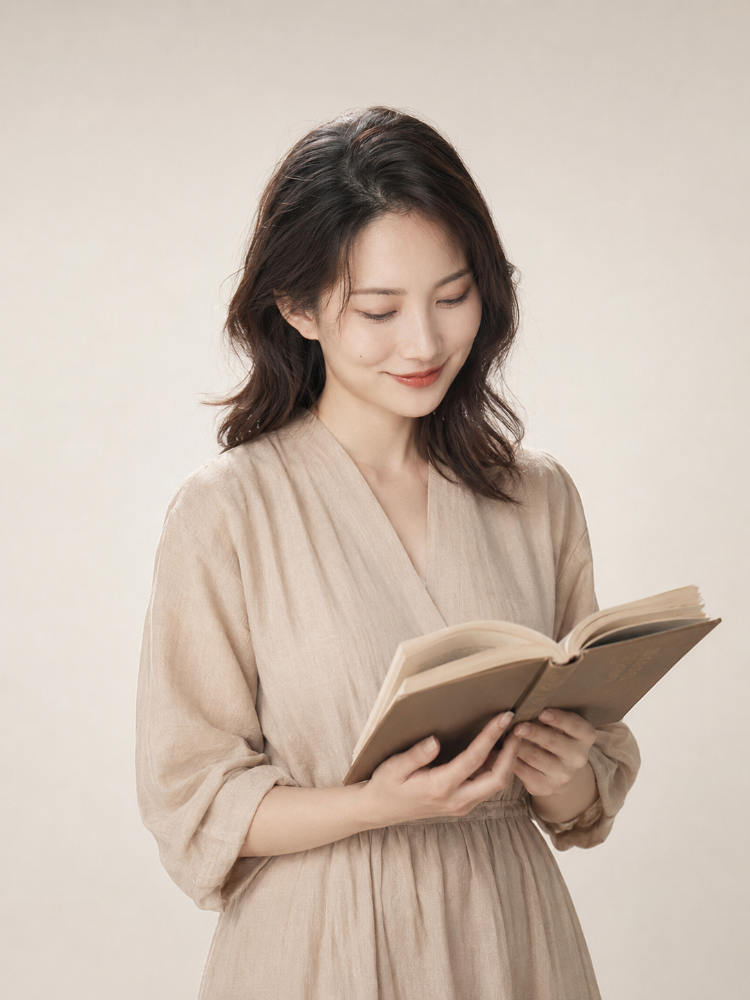
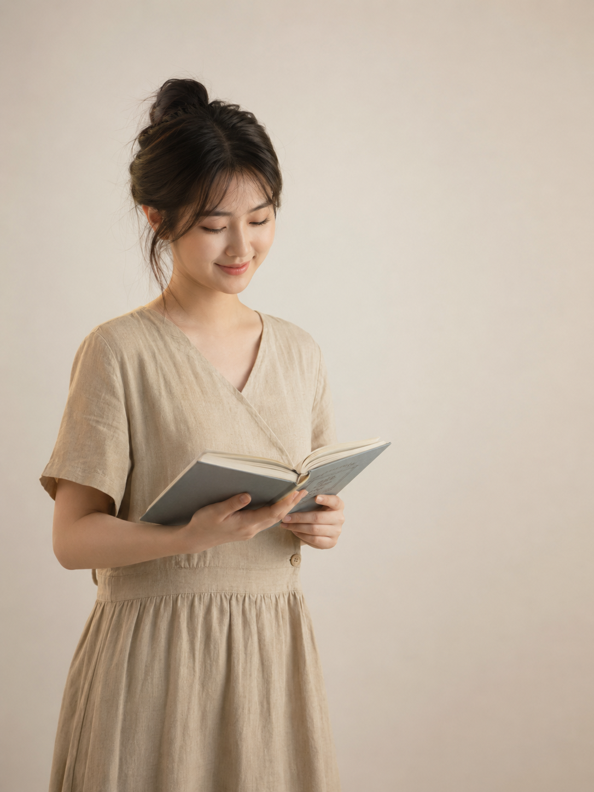
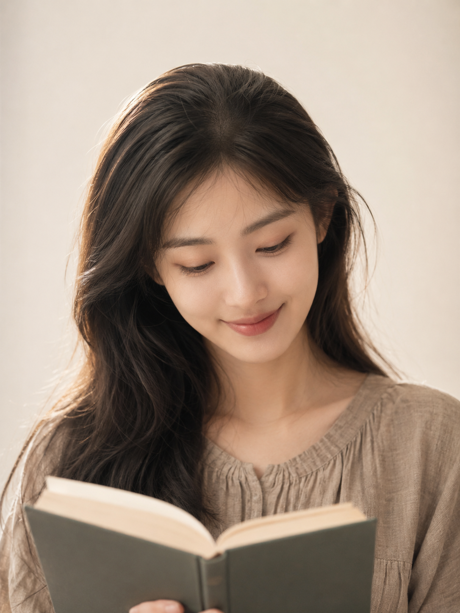

影棚白背景写真想要文艺气质，很多人卡在一个问题上：同一套服装、同一个道具，为什么换个景别效果差这么多？

**为什么景别是影棚写真的核心变量**

影棚写真不像街拍，背景是固定的，光线也趋于统一，能产生视觉差异的就剩构图和景别。景别决定了画面里人物与留白的比例，也决定了情绪的呈现方式：中景给呼吸感，特写给情绪感，七分身则在两者之间找平衡。

**中景半身：最有余韵**

人物居中，上下左右都有留白，适合表达安静、内敛的状态。

提示词：
22岁亚洲女生，温柔文艺气质，身穿浅咖色棉麻连衣裙，手捧一本精装硬壳书，低头微笑，眼神温柔放松，奶油白无缝背景，柔光箱均匀照明加微弱暖背光，光线包裹感强，色调暖灰低对比，五官自然清秀，面部干净，健康自然肤色，干净自然肤质，表情松弛，气质清爽亲和，中景半身构图3:4竖幅人物居中，画面留白明显，海马体影楼风格，细腻光影，自然皮肤纹理，避免AI美女脸、网红感、过度精修、塑料皮肤、暗沉肤色、明显痘印、明显皱纹、斑点、面部变形

**近景七分身：留白与情绪兼顾**

人物偏左，三分法留白，比中景多了一点亲近感，又不至于压迫。

提示词：
22岁亚洲女生，温柔文艺气质，身穿浅咖色棉麻连衣裙，手捧一本精装硬壳书，低头微笑，眼神温柔放松，奶油白无缝背景，柔光箱均匀照明加微弱暖背光，光线包裹感强，色调暖灰低对比，五官自然清秀，面部干净，健康自然肤色，干净自然肤质，表情松弛，气质清爽亲和，近景七分身构图3:4竖幅人物偏左三分法留白，画面呼吸感更强，海马体影楼风格，细腻光影，自然皮肤纹理，避免AI美女脸、网红感、过度精修、塑料皮肤、暗沉肤色、明显痘印、明显皱纹、斑点、面部变形

**特写胸像：情绪密度最高**

面部细节突出，头顶留少量空间，视线聚焦度最强，适合情绪类主题。

提示词：
22岁亚洲女生，温柔文艺气质，身穿浅咖色棉麻连衣裙，手捧一本精装硬壳书，低头微笑，眼神温柔放松，奶油白无缝背景，柔光箱均匀照明加微弱暖背光，光线包裹感强，色调暖灰低对比，五官自然清秀，面部干净，健康自然肤色，干净自然肤质，表情松弛，气质清爽亲和，特写胸像构图3:4竖幅面部细节突出头顶留少量空间，海马体影楼风格，细腻光影，自然皮肤纹理，避免AI美女脸、网红感、过度精修、塑料皮肤、暗沉肤色、明显痘印、明显皱纹、斑点、面部变形

**关键参数说明**

- 「奶油白无缝背景」：锁定影棚纯白底，避免生成有质感的灰白或有纹理的墙面
- 「柔光箱均匀照明加微弱暖背光」：前方柔光压平影子，背光给人物边缘加轮廓，是影棚出图的标准打光逻辑
- 「色调暖灰低对比」：整体调性控制词，让出来的图不会过于艳丽或冷硬
- 「海马体影楼风格」：对模型的风格锚定，引导生成类影棚写真感觉

**可替换的元素**

- 道具：精装书 → 相机、鲜花一枝、陶瓷马克杯
- 服装：浅咖棉麻连衣裙 → 白色针织衫、浅蓝亚麻衬衫
- 景别词：中景半身 → 全身远景（展示服装整体）、侧身四分之三身
- 背景：奶油白无缝背景 → 浅灰无缝背景、象牙白无缝背景

#生图提示词 #GPTImage2 #千问 #豆包 #海马体写真 #文艺气质照
