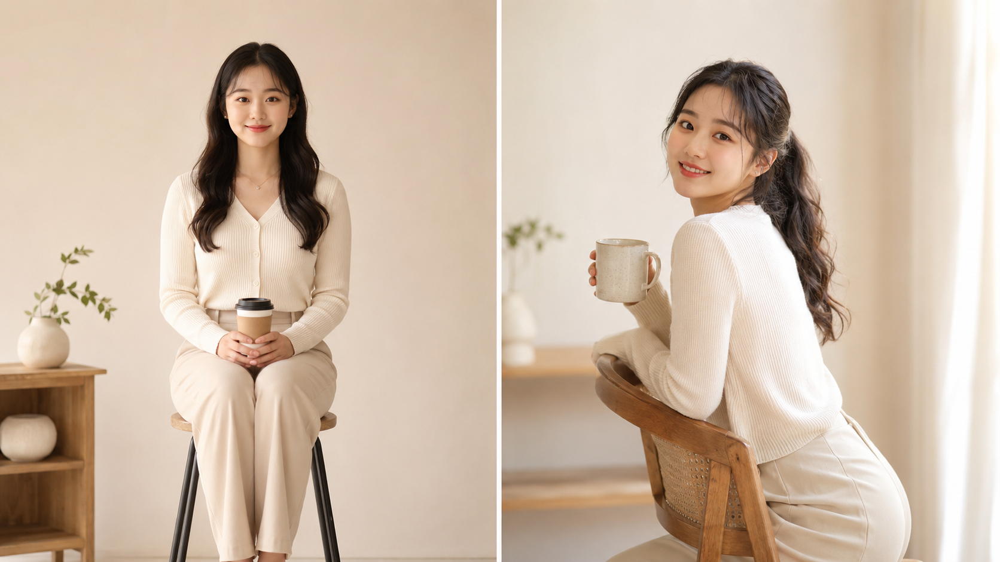
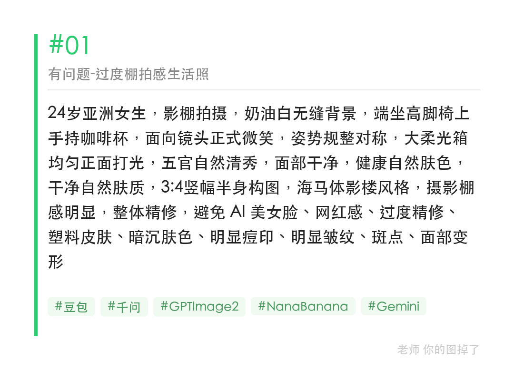
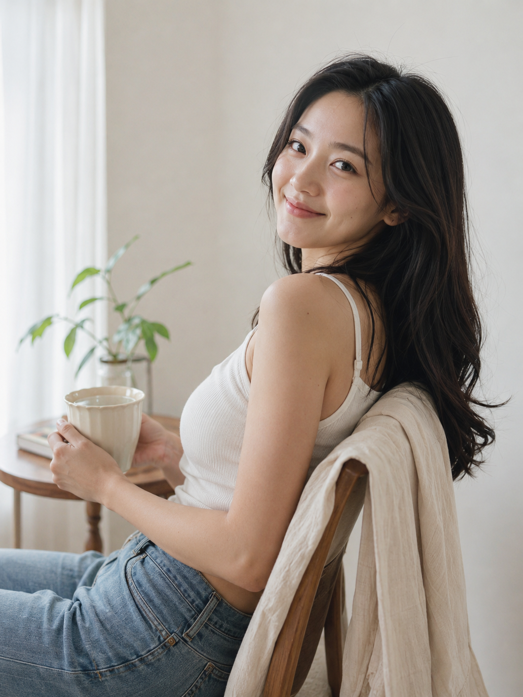
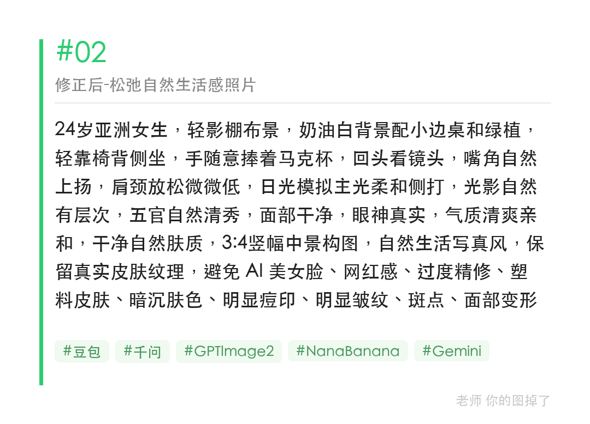

生成「自然生活感」照片时，姿态词和光线方向才是关键，道具选对了也没用。把「端坐正面均匀打光」改成「轻靠椅背侧坐 + 日光模拟侧打」，出图质感完全不同。

提示词：
轻影棚布景，奶油白背景配小边桌和绿植，轻靠椅背侧坐，手随意捧着马克杯，回头看镜头，嘴角自然上扬，肩颈放松微微低，日光模拟主光柔和侧打，光影自然有层次，五官自然清秀，眼神真实，气质清爽亲和，保留真实皮肤纹理

#GPTImage2 #千问 #豆包 #生图提示词 #Prompt #海马体影棚写真 #自然生活照

