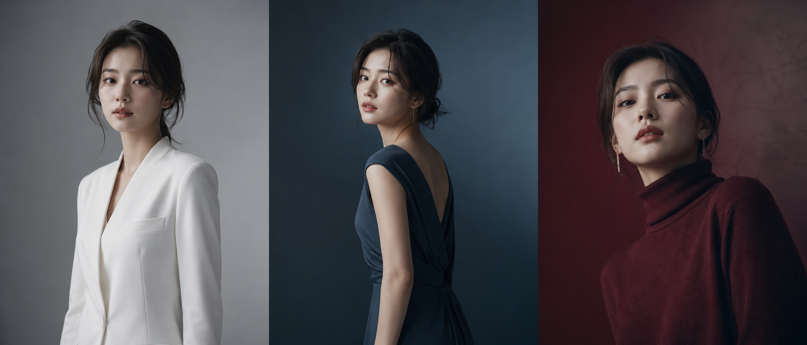
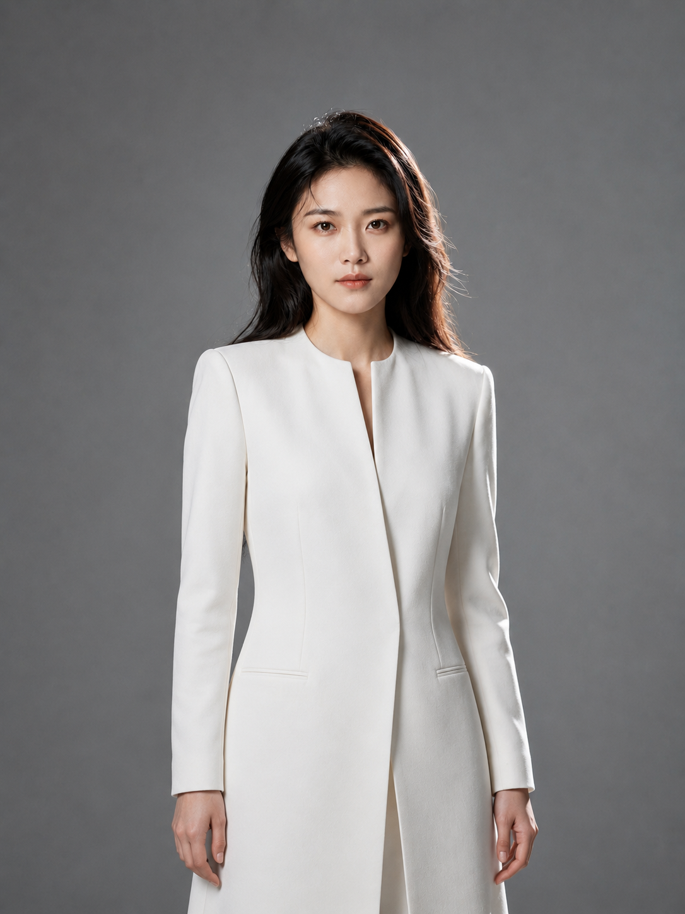
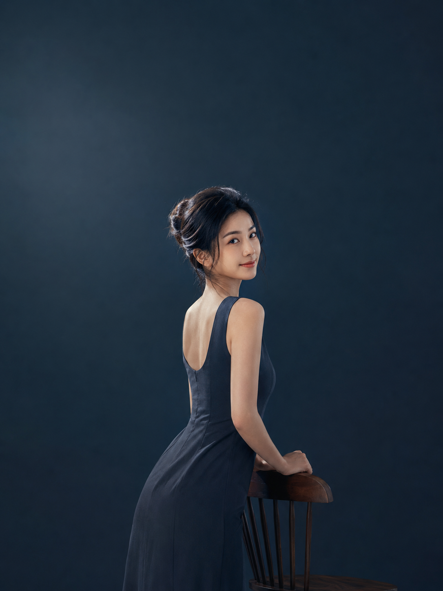
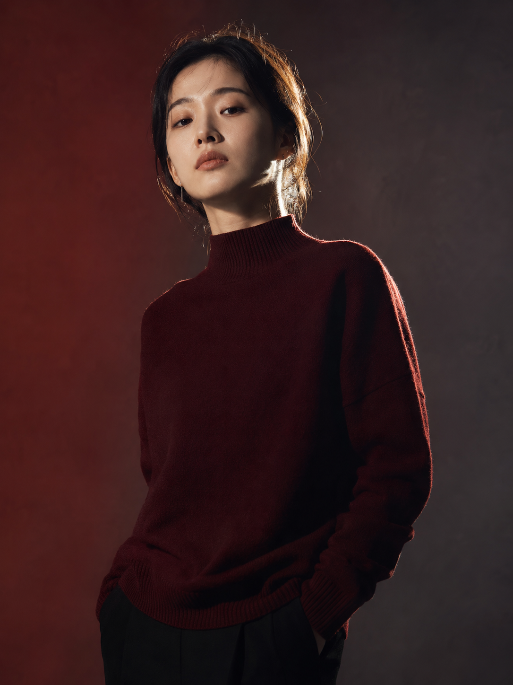

# 不用去片场，AI 直接生成电影海报级个人形象照

有个朋友找我说，她想要一套个人品牌用图，要有点戏剧感，但又不要那种夸张的商业大片感——"就是那种感觉有故事的照片"。

这个需求我听懂了：海马体影棚风格打底，但光影层次要更强，眼神要有内容，整体像一张电影海报里的人物定妆照。

---

## 生成思路

从"有故事感的形象照"这个需求，我拆解出四个关键点：

- **背景**：放弃奶油白，改用低饱和渐变深色调（雾灰、深蓝灰、酒红灰），让人物从背景中"站出来"
- **光线**：从单灯柔光升级为三光位布光——主光 + 辅光 + 轮廓光，脸部有层次但不夸张
- **动作**：不能只是"对着镜头微笑"，要加入侧颜、回眸、仰拍等角度，给眼神创造余地
- **服装**：简约剪裁为主，深色或低饱和系，不抢脸，但要有线条感

---

## 第一稿：最直接的站姿

适合场景：头像、简历、个人品牌主视觉

提示词：

24岁亚洲女性，简约白色无领长款西装外套，雾灰低饱和渐变无缝背景，正面站立微侧身，眼神平静坚定直视镜头，肩颈舒展，双手自然垂落，五官自然清秀，面部干净，健康自然肤色，干净自然肤质，表情松弛，气质清爽亲和，主光加辅光加轮廓光三光位布光，面部光线柔和，轮廓有层次，半身构图，3:4竖幅，人物居中偏下，海报级影棚人像，精致光影，轻戏剧感，避免AI美女脸、网红感、过度精修、塑料皮肤、暗沉肤色、明显痘印、明显皱纹、斑点、面部变形

---

**优化点**：第一稿出来效果干净，但感觉还是偏证件照——人站得太正，眼神直射镜头，"有故事"的感觉不够。

两个改动：换成侧身回眸的动作，加一把高背椅作为画面支撑点，背景换成深蓝灰让整体质感更沉稳。

---

## 优化版：侧颜 + 回眸角度

适合场景：公众号封面、个人品牌视觉、社交头像

提示词：

24岁亚洲女性，深蓝灰哑光简约连衣裙，深蓝灰渐变无缝背景，3/4侧身轻微回眸看向镜头，嘴角微扬带有故事感，高背木椅作为倚靠支撑，眼神有内容感而非空洞，五官自然清秀，面部干净，健康自然肤色，干净自然肤质，轮廓清晰，皮肤光泽自然，主光从斜45度打入，辅光补充暗部细节，发际线轮廓光勾勒，半身至七分身构图，3:4竖幅，留出海报式上方空间，精致光影低对比，避免AI美女脸、网红感、过度精修、塑料皮肤、暗沉肤色、明显痘印、明显皱纹、斑点、面部变形

---

## 追加场景：仰拍视角，压迫感更强

适合场景：想要"强气场"形象照、封面需要视觉冲击力时

这套写法把机位放低，人物微微俯视镜头，气场立刻不一样——不是冷漠，是一种"我知道我在哪里"的自信感。

提示词：

24岁亚洲女性，酒红色简约高领毛衣，酒红灰低饱和渐变无缝背景，微仰拍角度，人物俯视镜头，表情冷静带有压迫感故事感，极简单支细耳饰，五官自然清秀，面部干净，健康自然肤色，表情松弛，眼神真实，气质清爽亲和，轮廓清晰，强侧光营造脸部阴影层次，发际线轮廓光，七分身构图，3:4竖幅，人物占画面65%，电影海报质感，精致光影高对比，避免AI美女脸、网红感、过度精修、塑料皮肤、暗沉肤色、明显痘印、明显皱纹、斑点、面部变形

---

## 可优化方向

- **换服装色系**：深酒红换成墨绿或深咖，整体风格从"戏剧感"偏向"沉稳知性"
- **换背景渐变方向**：从上深下浅改为左深右浅，可以让人物融入感更强
- **加入道具**：单支干花、薄透丝巾叠加在肩部，不影响整体干净感，但增加细节层次

---

## 这类需求的通用思路

想生成"有故事感"的形象照，不是靠把场景做复杂——核心是三点：**背景降饱和、光线加层次、动作给余地**。背景退后，光影往前，人物就自然立体了。

---

*发现哪套提示词出效果了？评论区告诉我，下期继续深挖。*

---

## 往期回顾

- HMT-008 自然生活照
- HMT-007 甜美可爱照
- HMT-006 文艺气质照

#GPTImage2 #千问 #豆包 #生图提示词 #Prompt #海马体影棚写真 #电影海报照
