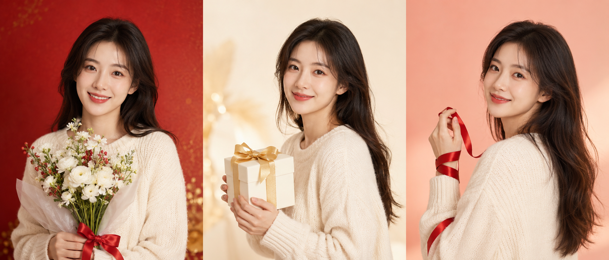
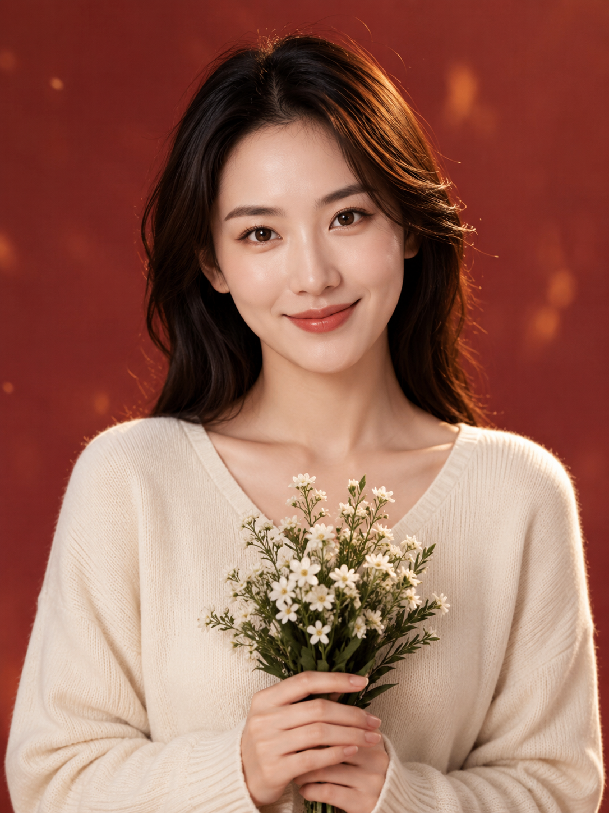
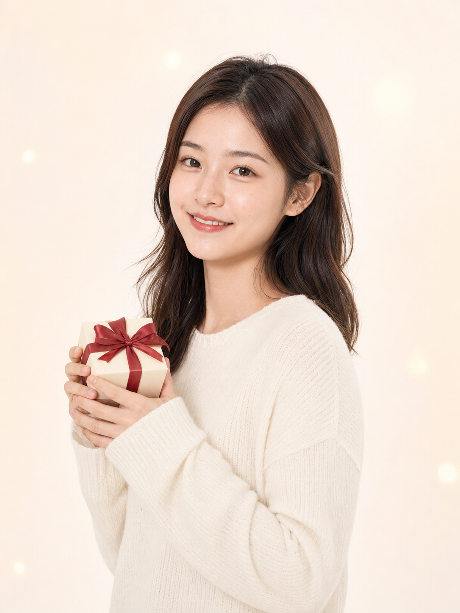
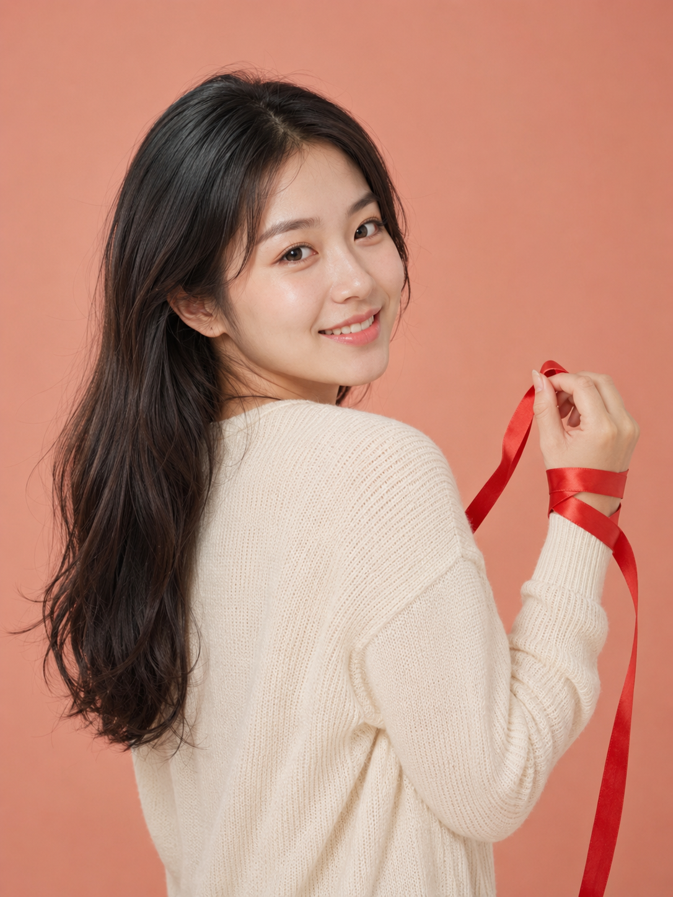

# 同一套服装，换了 3 种节日色调背景，出图差异比我想象的大

**今天的实验：** 同一件奶白针织上衣，同一个动作方向，只换影棚背景色调——测试不同节日氛围下的出图效果。

**变量说明：** 人物年龄、服装、发型、大柔光箱主光全部固定，只改背景颜色和道具。

---

**#01 ｜ 圣诞暖红调 × 白色花束**

海马体摄影风格影棚写真，22岁亚洲女生，低饱和浅红色背景加轻微金色渐变点缀，手捧白色小花束，穿奶白色针织上衣，肩颈放松，正面微笑看镜头，大柔光箱均匀主光，局部暖色轮廓光，整体明亮偏暖，五官自然清秀，面部干净，健康自然肤色，表情松弛，眼神真实，气质清爽亲和，半身3:4竖构图，柔和高光，轻微节日氛围，自然皮肤纹理，写实摄影风格，避免 AI 美女脸、网红感、过度精修、塑料皮肤、暗沉肤色、明显痘印、明显皱纹、斑点、面部变形

> 特点：浅红背景配白花束，暖意十足但不俗气；局部金色轮廓光让整体更有层次，适合圣诞或年末仪式感场景。

---

**#02 ｜ 新年金白调 × 小礼盒**

海马体摄影风格影棚写真，22岁亚洲女生，奶油白背景加轻微金色光晕，双手捧小礼盒，穿奶白色针织上衣，轻微侧身约15度，嘴角微笑有仪式感，大柔光箱均匀主光，整体明亮纯净，五官自然清秀，面部干净，健康自然肤色，干净自然肤质，表情松弛，气质清爽亲和，半身3:4竖构图，背景简洁无杂物，写实摄影风格，自然皮肤纹理，避免 AI 美女脸、网红感、过度精修、塑料皮肤、暗沉肤色、明显痘印、明显皱纹、斑点、面部变形

> 特点：奶油白加金晕是最百搭的节日底色，这套写法服装背景几乎同色，反而让人物肤色和面部表情更突出，纪念感强。

---

**#03 ｜ 春节粉橙调 × 细丝带**

海马体摄影风格影棚写真，22岁亚洲女生，浅粉橙色纯色背景低饱和柔和，手持红色细丝带轻绕手腕，穿奶白色针织上衣，轻微回眸笑看镜头，大柔光箱主光加微弱暖色辅光，肤色通透明亮，五官自然清秀，面部干净，表情松弛愉悦，眼神真实，轮廓清晰，半身3:4竖构图，干净自然肤质，自然皮肤纹理，写实摄影风格，避免 AI 美女脸、网红感、过度精修、塑料皮肤、暗沉肤色、明显痘印、明显皱纹、斑点、面部变形

> 特点：粉橙背景比正红更温柔，细丝带道具体量小但颜色跳脱，动作改成轻微回眸让画面更有动态感，很适合春节头像。

---

## 三种色调对比

| 色调方案 | 背景色 | 道具 | 氛围特点 | 适合场景 |
|---|---|---|---|---|
| #01 圣诞暖红调 | 低饱和浅红+金色渐变 | 白色花束 | 温暖隆重，节日感最强 | 圣诞/元旦/年末 |
| #02 新年金白调 | 奶油白+轻微金晕 | 小礼盒 | 纯净高级，仪式感足 | 新年/生日/纪念日 |
| #03 春节粉橙调 | 低饱和浅粉橙 | 红色细丝带 | 温柔喜庆，亲和度高 | 春节/情人节/朋友圈 |

---

**结论：节日色调的关键不是颜色有多鲜艳，而是饱和度要控制在低位。** 这三套写法的背景色都刻意降低了饱和度，节日氛围靠道具颜色和轮廓光来传递——这样人物脸部才是视觉中心，而不是被背景抢走。

如果你不确定用哪套，优先选 **#02 金白调**，最百搭，换个道具可以用在任何节日场景。

---

好了，这三套今天就分享到这里，哪种色调最合你口味？评论区告诉我，我可以专门做一期你喜欢的风格详细拆解。喜欢的话记得收藏，下次有需要直接翻出来用。

---

## 往期回顾

- HMT-009 电影海报照
- HMT-008 自然生活照
- HMT-007 甜美可爱照

#GPTImage2 #千问 #豆包 #生图提示词 #Prompt #海马体写真 #节日仪式感照
