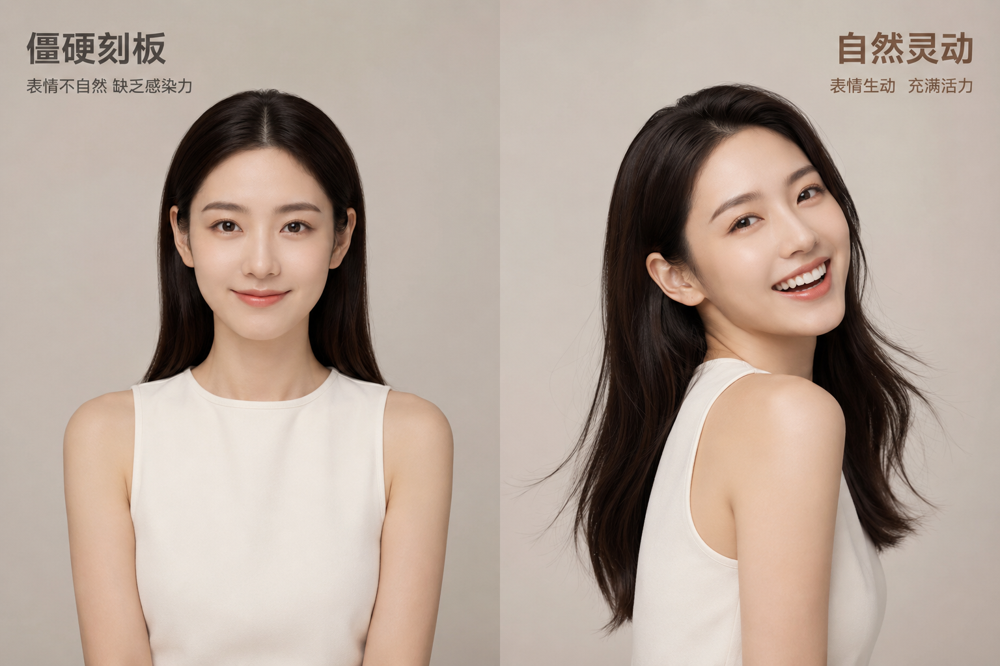
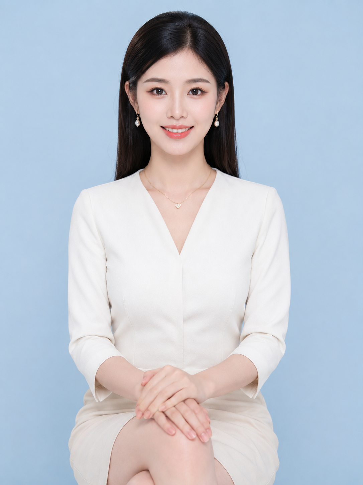
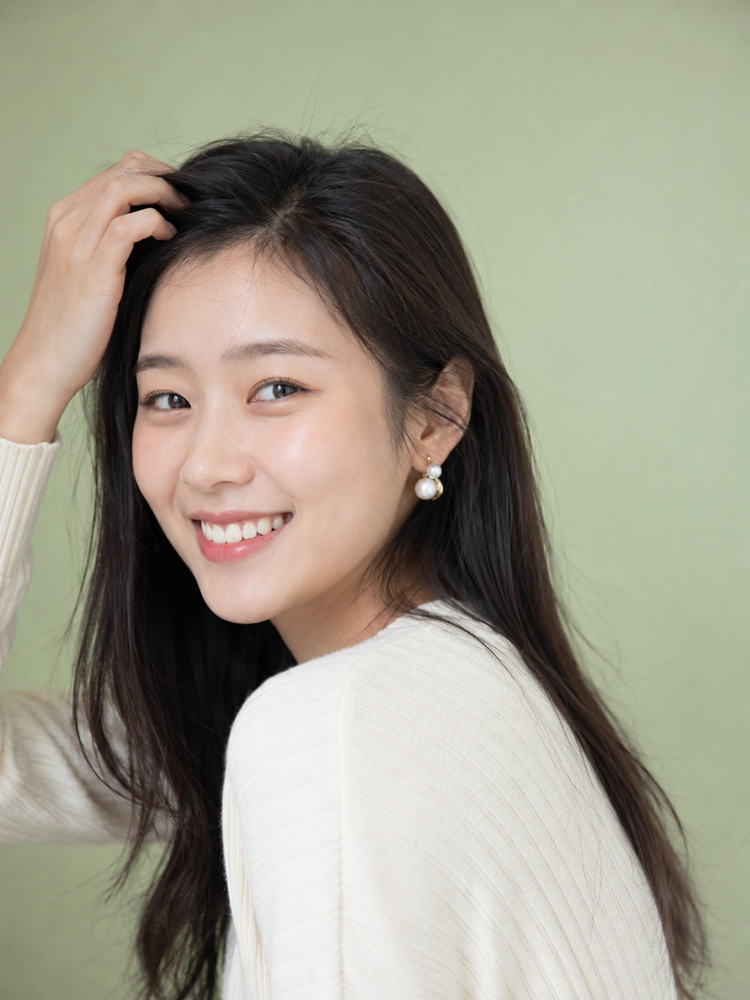

# 朋友圈头像总显僵硬？海马体这个思路存一下

刷小红书和公众号，总能一眼分辨出哪些头像是"照相馆式"的，哪些是"有生活感"的。区别往往不在滤镜，而在姿态和表情——很多人生成 AI 头像时，习惯性写成正面端坐、标准微笑，结果出来的图确实清晰精致，却透着一股说不出的僵硬感，像证件照多打了层柔光。

先看一张典型的"问题图"。这条提示词里写的是正面对镜头、双手交叠、标准微笑，看起来规规矩矩，但放在朋友圈或公众号作者位，就是缺了点亲和力：

24岁亚洲女生，简洁上衣搭配质感配饰，正面端坐面对镜头，标准证件照式微笑，双手交叠放在膝盖上，姿态刻板僵硬，完美精致妆容，商业写真感强烈，浅蓝色纯色影棚背景，大柔光箱均匀布光略显平淡，近景半身3:4构图，人物居中对称，避免自然互动感、避免真实生活气息

问题出在哪，其实拆开看很清楚：

第一，姿态是"面对镜头"而不是"看向镜头"——前者是摆拍逻辑，后者才是互动逻辑，眼神和身体角度需要留一点错位感，才像真实的抓拍瞬间。

第二，"标准微笑"这个词本身就在引导模型生成对称、克制的表情，缺少眼神里的情绪起伏。

第三，"完美精致妆容""商业写真感"这类词会把整体质感往影楼精修的方向拉，而社交头像需要的恰恰是"没那么用力"的自然感。

改法也不复杂，把姿态从"正面端坐"改成"微侧身回头"，把表情从"标准微笑"改成"开朗笑容+自然小动作"，再把负向约束里加上对网红脸和过度精修的排除：

24岁亚洲女生，青春自然气质，简洁米白色针织上衣，戴一副质感耳饰，身体微微前倾，轻轻回头看向镜头露出开朗笑容，手指自然抬起拨了下头发，五官自然清秀，面部干净，健康自然肤色，眼神真实，气质清爽亲和，浅绿色低饱和纯色影棚背景，明亮均匀柔光，眼神有自然高光，肤色清透，近景半身构图，人物略偏画面一侧留白，35mm焦段浅景深，避免AI美女脸、网红感、过度精修、塑料皮肤、暗沉肤色、明显痘印、明显皱纹、斑点、面部变形

同样是影棚背景、同样是半身近景，多了"回头""拨头发"这类微动作后，整张图的呼吸感完全不同——这也是为什么很多博主头像看起来像"被抓拍到的一瞬间"，而不是"专门去拍的"。

这个思路不只适合头像，任何需要"亲和力优先"的场景都能套用：把摆拍动词换成互动动词（回头、抬手、微倾），把"标准""精致"换成"自然""放松"，模型给出的画面质感会明显松弛下来。

下一期打算继续拆一个更常见的问题——为什么同样是"自然光"，出来的皮肤质感却天差地别，感兴趣的话可以留言告诉我们。

---

觉得这条思路有用的话，存一下这篇文章，下次生成头像可以直接对照着改。也欢迎在评论区留言你遇到的其他生成困惑，说不定就是下一期的选题。

---

## 往期回顾

- HMT-010 节日仪式感照
- HMT-009 电影海报照
- HMT-008 自然生活照

#GPTImage2 #千问 #豆包 #生图提示词 #Prompt #海马体写真 #活力社交头像
