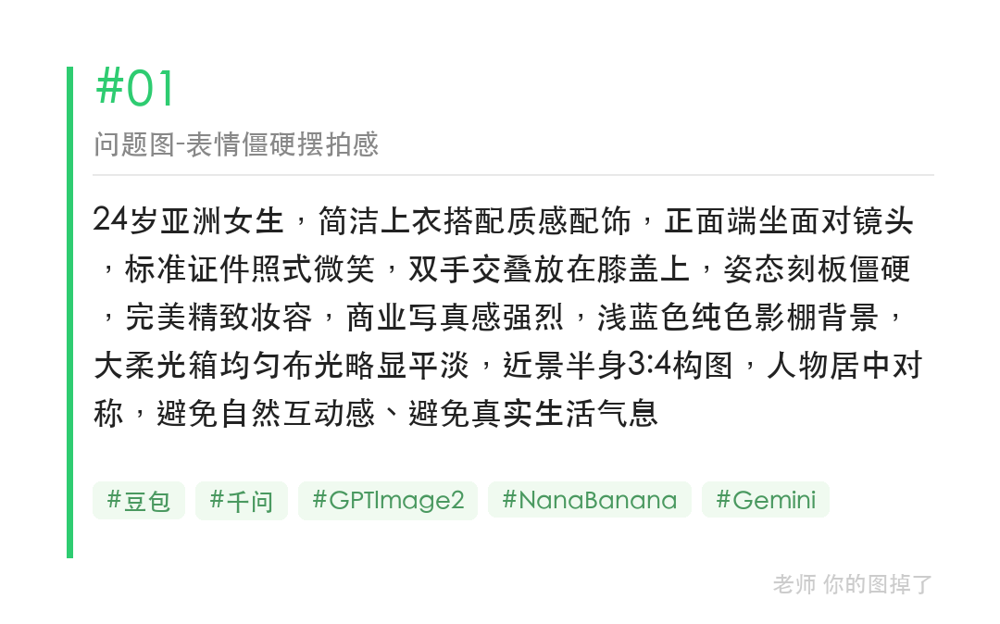
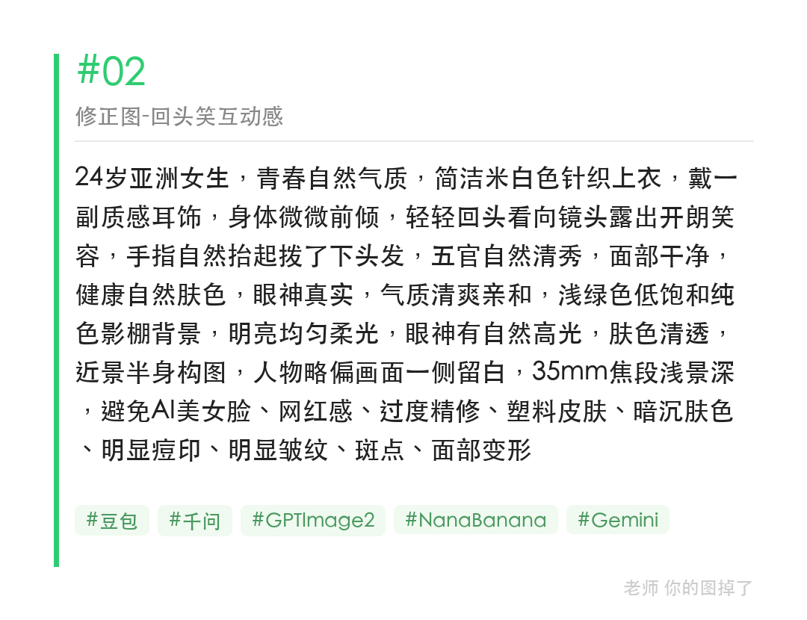

正面端坐、标准微笑的头像看着规整，却总缺一点亲和力。把姿态改成微侧回头、把表情改成自然笑容，画面呼吸感立刻不一样。

提示词：
24岁亚洲女生，青春自然气质，简洁米白色针织上衣，戴一副质感耳饰，身体微微前倾，轻轻回头看向镜头露出开朗笑容，手指自然抬起拨了下头发，五官自然清秀，面部干净，健康自然肤色，眼神真实，气质清爽亲和，浅绿色低饱和纯色影棚背景，明亮均匀柔光，眼神有自然高光，肤色清透，35mm焦段浅景深

#GPTImage2 #千问 #生图提示词 #Prompt #海马体写真 #活力社交头像

