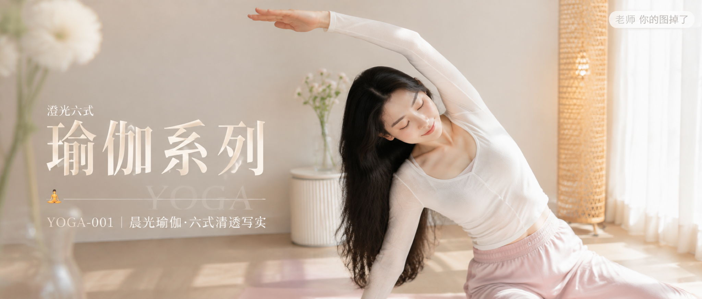

# YOGA-001-晨光瑜伽·六式清透写实 封面

## 封面提示词

明亮高质感的奶油白晨光瑜伽空间，成年东亚女性做站姿侧弯的舒展瞬间，正脸或三分之二侧脸清晰可见，面部占画面约三分之一，五官精致自然、面部立体清晰、皮肤光泽细腻、眼神有神灵动、妆感干净清透、气质清爽亲和，穿奶油白长袖运动上衣与浅樱花粉阔腿瑜伽裤，人物位于画面右侧偏前景，身体姿态自然优雅，左侧留出干净排版空间。前景为轻微虚化的白色窗纱与透明玻璃花瓶，中景人物与浅粉色瑜伽垫，后景是暖白墙、浅木地板和藤编灯，冷白窗光与柔和奶油金边缘光形成细腻冷暖对比，构图黄金比例、前景虚化背景、电影感光影、高清锐利、色彩层次丰富、视觉冲击力强、画面有张力、色调统一精致、商业海报级完成度，2.35:1 电影横构图，真实摄影质感。2K 超清输出，增加光线采样数，收敛噪点，减少随机颗粒、亮点、暗部噪声，最大程度保留面部、发丝、针织纹理、花瓶高光和木地板细节，同时去除噪点拟合。避免 AI 美女脸、网红感、过度精修、塑料皮肤、暗沉肤色、明显痘印、明显皱纹、斑点、面部变形、眼睛大小不一、手部畸形、文字乱码、脏噪点、低清晰度、强烈硬光、logo。

【文字排版-必须完整保留，不得省略或简化任何一项】画面左侧垂直居中偏下叠加文字排版：超大号衬线字体米白色主文案「瑜伽系列」，主文案正下方一条细横线左端带🧘横线中央有透明英文水印 YOGA，横线下方等宽白色字体副文案「YOGA-001 ｜ 晨光瑜伽·六式清透写实」；副文案上方以更小字号加入视觉概念名「澄光六式」；右上角浅色半透明圆角底衬配小号文字「老师 你的图掉了」（署名文字，必须出现，不可省略）；无整体蒙层，文字直接压图。【文字排版结束】

## 封面图片

