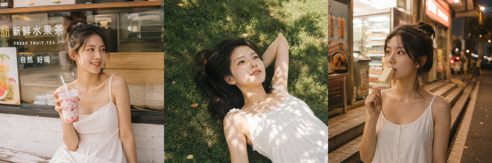

# 不用买胶卷，AI 直接生成夏日胶片感写真，三个场景存一下

夏天最适合出片的季节，胶片感又是今年最流行的写真风格——但买胶卷、找场地、等冲洗，成本高还不一定出片。

今天分享三个夏日场景，配合胶片感 AI 生图写法，在家就能生成效果很稳的写真图。

---

## 场景一：露天茶饮店

适合场景：夏日午后，奶茶店门口，等待感、随意感，最容易出片。

光线原理：下午两三点的侧面自然光，让皮肤有立体感，高光微泛正好是胶片的特质。

提示词：

夏日午后，24岁亚洲女生坐在露天茶饮店门口木椅上，手持一杯草莓奶茶用吸管轻轻搅动，身穿白色吊带连衣裙，头发半扎随风微散，眼神看向远处街道，表情松弛惬意。富士Fujifilm Pro 400H胶片直出风格，轻微颗粒感，暖黄色调，高光微泛，阴影偏青，日系胶片感。50mm定焦，自然光，低对比度。五官自然清秀，面部干净，健康自然肤色，干净自然肤质，眼神真实。避免AI美女脸、网红感、过度精修、塑料皮肤、暗沉肤色、明显痘印、明显皱纹、斑点、面部变形

---

## 场景二：阳光草地

适合场景：公园草坪，正午阳光直射，叶影斑驳，仰拍视角最容易出大片感。

光线原理：叶缝透光在面部形成自然光斑，是胶片感里最难复刻又最有氛围的打光方式。

提示词：

夏日正午，24岁亚洲女生躺在公园草地上，手臂枕于头下仰望天空，阳光透过叶缝洒在脸上形成光斑，身穿亚麻浅米色短袖衬衫和白色阔腿短裤，嘴角微微上扬，神情放空。柯达Kodak Portra 400胶片直出风格，轻微颗粒感，暖橘色调，阴影偏绿，高光偏黄，胶片感强。仰拍视角，85mm，浅景深，背景草地虚化。表情松弛，气质清爽亲和，面部干净，健康自然肤色。避免AI美女脸、网红感、过度精修、塑料皮肤、暗沉肤色、明显痘印、明显皱纹、斑点、面部变形

---

## 场景三：傍晚便利店门口

适合场景：傍晚，便利店门口，店内暖光从背后打出，搭配街道霓虹，是最有「日系感」的拍摄地点。

光线原理：逆光+店内暖光双光源，边缘光晕和轻微过曝是 CCD 感的核心。

提示词：

傍晚夏日，24岁亚洲女生站在便利店门口台阶上，右手拿着一根雪糕低头吃，身穿格纹马林鱼衬衫配白色短裤，背着米色帆布包，店内暖黄灯光从身后透出，街道霓虹灯在背景微微模糊。CCD相机直拍感，轻微过曝，颗粒噪点，暖色系滤镜，胶片感。35mm广角，平拍视角，街头抓拍构图。轮廓清晰，眼神真实，五官自然清秀，皮肤光泽自然。避免AI美女脸、网红感、过度精修、塑料皮肤、暗沉肤色、明显痘印、明显皱纹、斑点、面部变形

---

## 哪些词可以替换

**场景替换：**
- 露天茶饮店 → 咖啡馆门口 / 书店橱窗前 / 水果摊旁
- 草地仰拍 → 泳池边 / 沙滩 / 晒衣绳下
- 便利店 → 自动贩卖机前 / 夜晚路灯下 / 地铁出口

**胶片风格词替换（对应不同色调）：**
- `Fujifilm Pro 400H`（暖黄偏绿）→ `Fujifilm Superia 400`（冷调偏青）
- `Kodak Portra 400`（暖橘肤色友好）→ `Kodak Gold 200`（黄调复古）
- `CCD相机直拍感`（颗粒+过曝）→ `Lomo LC-A感`（暗角+漏光）

**道具替换：**
- 草莓奶茶 → 椰青 / 气泡水 / 柠檬茶
- 雪糕 → 棒冰 / 西瓜 / 便利店咖啡杯

---

## 适合哪些模型

这套写法在 GPT Image 2 和千问（Qwen-VL）上都测试可行。GPT Image 2 对胶片质感和色调词的理解更精准；豆包出图偏清晰平滑，建议加上「轻微颗粒感、胶片直出感」来强化质地。

---

这三个场景是夏天最容易复刻的，提示词直接复制可用。如果你有想看的夏日场景，评论区告诉我，下一期帮你把写法整理出来。

---

#GPTImage2 #千问 #豆包 #生图提示词 #Prompt #胶片感写真 #夏日写真 #AI写真
