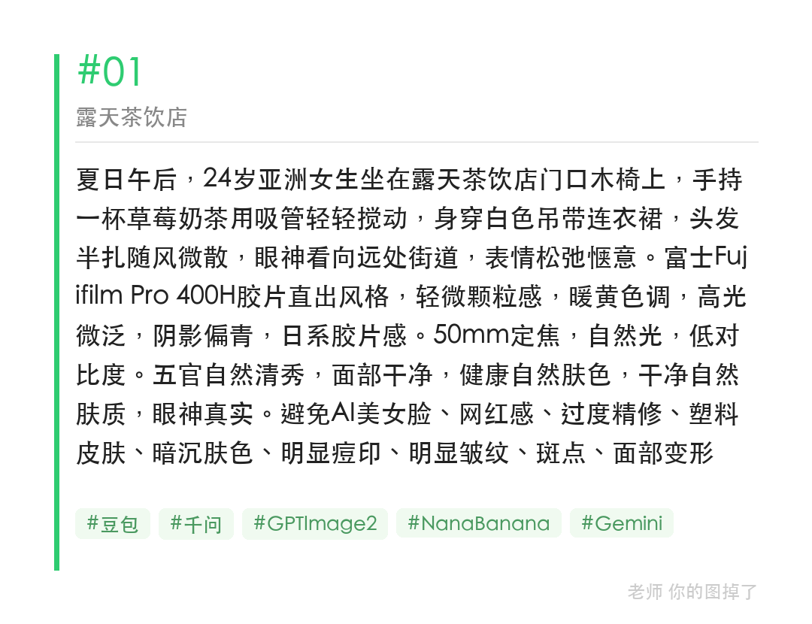
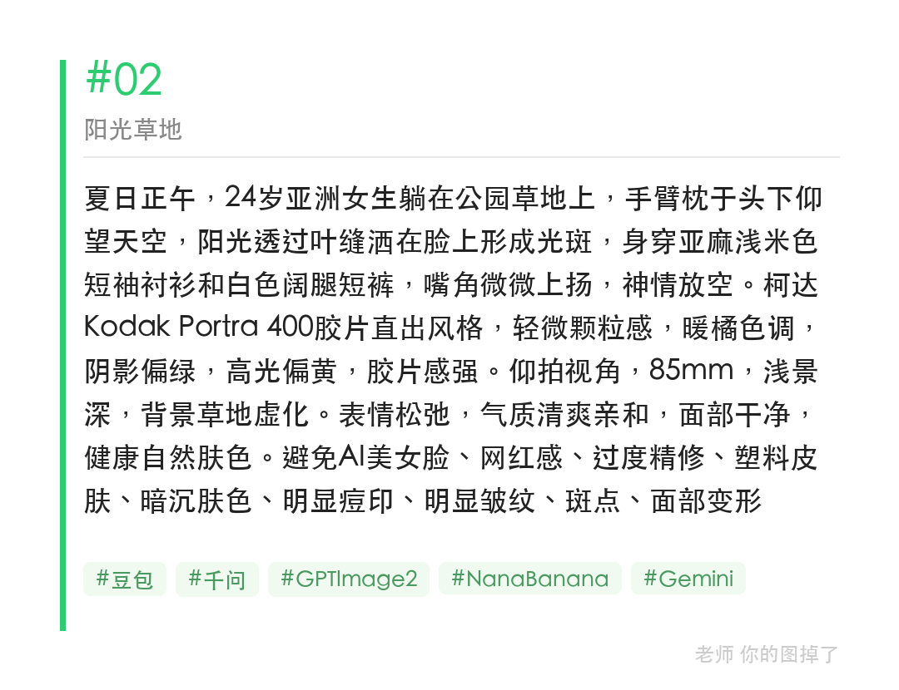
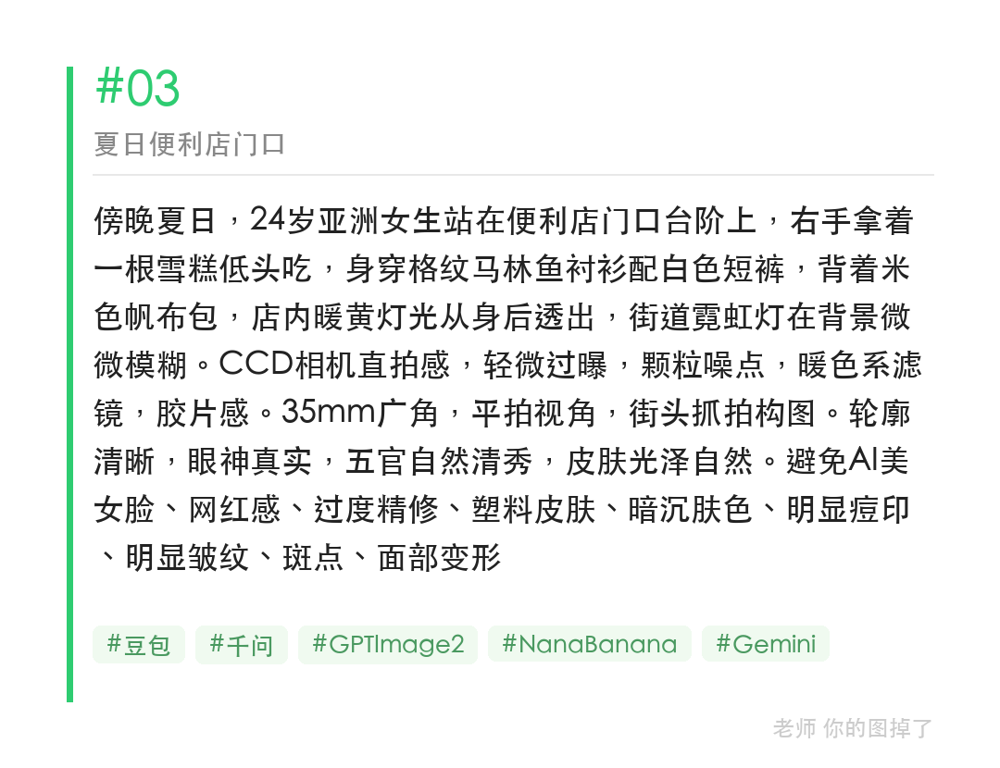

夏天三个最容易出胶片感的场景：露天茶饮店、草地仰躺、傍晚便利店门口。色调词用 Fujifilm Pro 400H 或 Kodak Portra 400，效果最稳。

提示词：
夏日午后，24岁亚洲女生坐在露天茶饮店门口，手持草莓奶茶，表情松弛惬意。Fujifilm Pro 400H胶片直出，暖黄色调，轻微颗粒感，50mm，低对比度。五官自然清秀，面部干净，健康自然肤色。

#GPTImage2 #千问 #生图提示词 #Prompt #胶片感写真 #夏日写真

