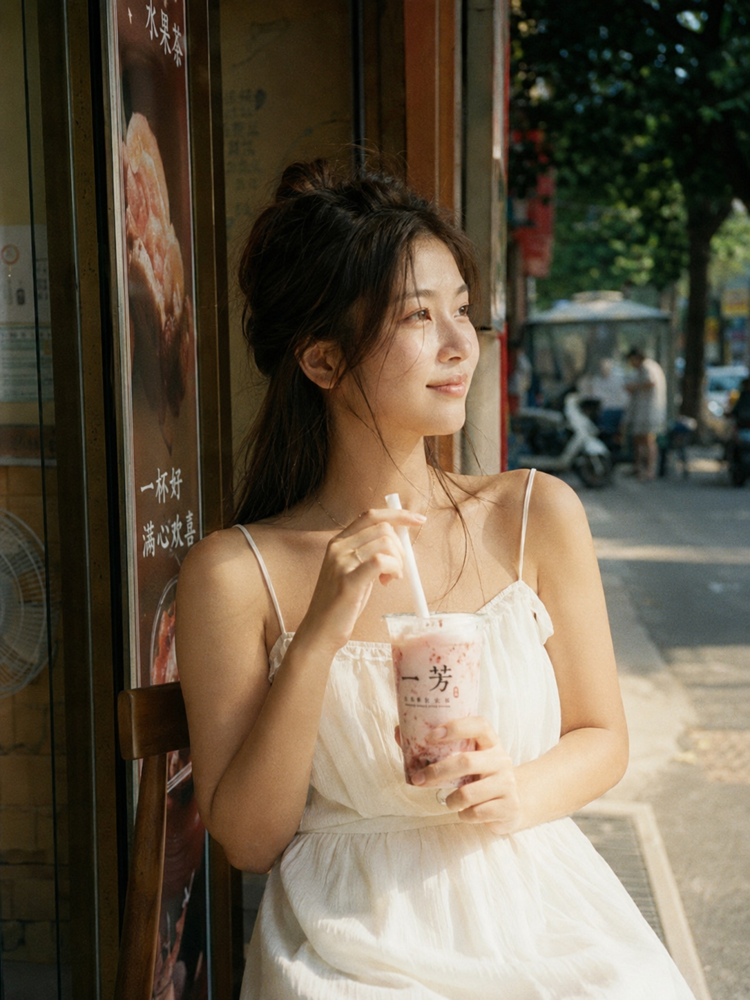
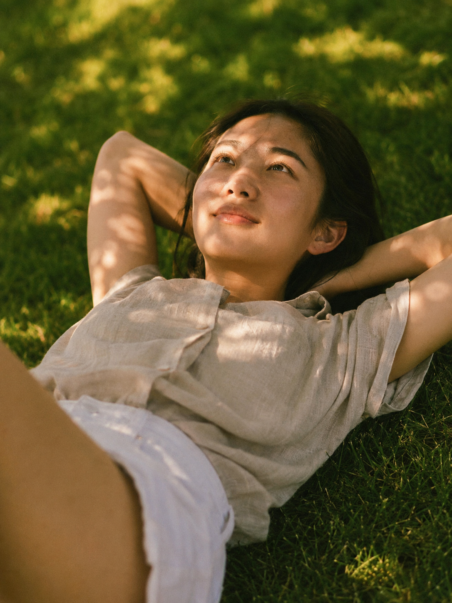
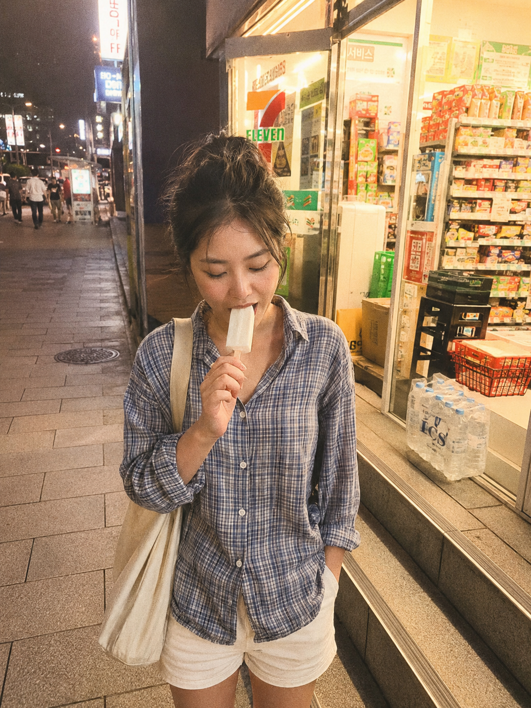

夏天想拍胶片感写真，不用买相机不用约摄影师，这三个场景+三套提示词，直接用 AI 生成，出图效果比你想的稳。

**为什么这三个场景容易出胶片感**

胶片感的核心是光线自然、颗粒存在感、色调偏移可控。以下三个夏日场景天然具备这些条件：露天茶饮店的侧面日光、草地仰拍的叶缝光斑、便利店门口的逆光+人造暖光，都是不需要布光就能出效果的场景。

**露天茶饮店**

午后两三点，光线从侧面打入，高光微泛，阴影偏青，是 Fujifilm Pro 400H 最典型的出片状态。

提示词：
夏日午后，24岁亚洲女生坐在露天茶饮店门口木椅上，手持一杯草莓奶茶用吸管轻轻搅动，身穿白色吊带连衣裙，头发半扎随风微散，眼神看向远处街道，表情松弛惬意。富士Fujifilm Pro 400H胶片直出风格，轻微颗粒感，暖黄色调，高光微泛，阴影偏青，日系胶片感。50mm定焦，自然光，低对比度。五官自然清秀，面部干净，健康自然肤色，干净自然肤质，眼神真实。避免AI美女脸、网红感、过度精修、塑料皮肤、暗沉肤色、明显痘印、明显皱纹、斑点、面部变形

**阳光草地**

仰拍视角让叶缝光斑直接落在脸上，是最难在棚内复刻的自然光效果，Kodak Portra 400 的暖橘阴影偏绿色调在这个场景里特别对。

提示词：
夏日正午，24岁亚洲女生躺在公园草地上，手臂枕于头下仰望天空，阳光透过叶缝洒在脸上形成光斑，身穿亚麻浅米色短袖衬衫和白色阔腿短裤，嘴角微微上扬，神情放空。柯达Kodak Portra 400胶片直出风格，轻微颗粒感，暖橘色调，阴影偏绿，高光偏黄，胶片感强。仰拍视角，85mm，浅景深，背景草地虚化。表情松弛，气质清爽亲和，面部干净，健康自然肤色。避免AI美女脸、网红感、过度精修、塑料皮肤、暗沉肤色、明显痘印、明显皱纹、斑点、面部变形

**傍晚便利店门口**

双光源（店内暖光+街道霓虹）在 CCD 质感下会产生轻微光晕和过曝，这正是日系街拍最迷人的地方。35mm 广角让背景霓虹自然进入画面。

提示词：
傍晚夏日，24岁亚洲女生站在便利店门口台阶上，右手拿着一根雪糕低头吃，身穿格纹马林鱼衬衫配白色短裤，背着米色帆布包，店内暖黄灯光从身后透出，街道霓虹灯在背景微微模糊。CCD相机直拍感，轻微过曝，颗粒噪点，暖色系滤镜，胶片感。35mm广角，平拍视角，街头抓拍构图。轮廓清晰，眼神真实，五官自然清秀，皮肤光泽自然。避免AI美女脸、网红感、过度精修、塑料皮肤、暗沉肤色、明显痘印、明显皱纹、斑点、面部变形

**关键参数说明**

- `Fujifilm Pro 400H / Kodak Portra 400 / CCD相机直拍感`：决定整体色调走向，是胶片感最核心的风格词
- `轻微颗粒感`：模拟胶片物理颗粒，去掉这个词 AI 会输出过于数码的质感
- `高光微泛 / 低对比度`：让亮部不死白，保留层次，是胶片区别于数码的关键
- `50mm / 85mm / 35mm`：焦段决定画面视角和景深，50mm最自然，85mm最适合人像，35mm适合带环境的街拍
- `仰拍视角 / 平拍视角`：机位影响人物比例和场景比重，仰拍让人显高、让天空和叶子进入画面

**可替换的元素**

- 胶片风格词：`Fujifilm Pro 400H` → `Fujifilm Superia 400`（偏冷青）/ `Kodak Gold 200`（黄调复古）/ `Lomo LC-A感`（暗角漏光）
- 场景：露天茶饮店 → 咖啡馆门口 / 书店橱窗前；草地 → 沙滩 / 泳池边；便利店 → 夜晚路灯下 / 地铁出口
- 道具：草莓奶茶 → 椰青 / 气泡水；雪糕 → 棒冰 / 西瓜
- 机位：平拍 → 低机位仰拍（让腿部线条更长）/ 高机位俯拍（适合草地场景）

#生图提示词 #GPTImage2 #千问 #豆包 #胶片感写真 #夏日写真
