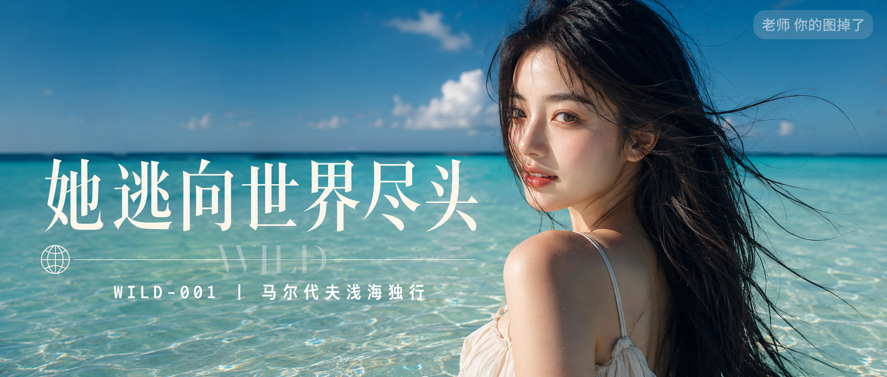

# WILD-001-马尔代夫浅海独行 封面

## 封面提示词

马尔代夫玻璃海近景旅行人像，24岁漂亮亚洲女生站在透明浅海中，清秀自然的东亚面孔，黑色长发被海风扬起，穿轻盈米白色吊带长裙，3/4侧脸回望镜头，人物半身位于画面右侧，面部占画面三分之一以上，眼神有神灵动，五官精致自然，面部立体清晰，皮肤光泽细腻，侧逆光打亮颧骨与发丝，背后蓝绿色海水与白沙形成强烈色彩记忆点，前景水光虚化，电影感光影，高清锐利，色彩层次丰富，视觉冲击力强，构图黄金比例，画面有张力，无游客无建筑，避免纯背影、纯侧影、远景小脸、眼睛半闭、嘴巴微张，避免 AI 美女脸、网红感、过度精修、塑料皮肤、暗沉肤色、明显痘印、明显皱纹、斑点、面部变形，2.35:1 电影横构图。

【文字排版-必须完整保留，不得省略或简化任何一项】画面左侧垂直居中偏下叠加文字排版：超大号衬线字体米白色主文案「她逃向世界尽头」，主文案正下方一条细横线左端带🌍横线中央有透明英文水印 WILD，横线下方等宽白色字体副文案「WILD-001 ｜ 马尔代夫浅海独行」；右上角浅色半透明圆角底衬配小号文字「老师 你的图掉了」（署名文字，必须出现，不可省略）；无整体蒙层，文字直接压图。【文字排版结束】

## 封面图片

