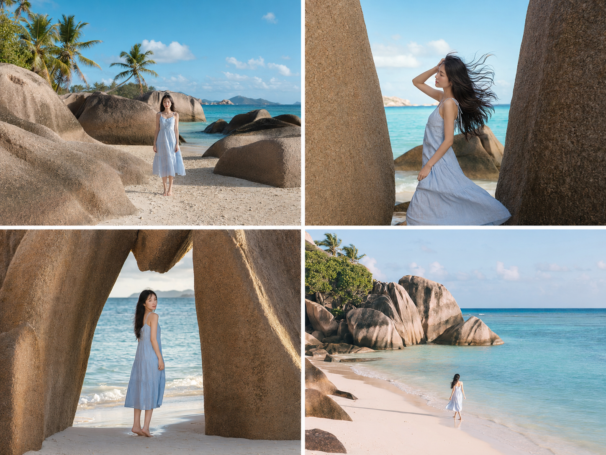
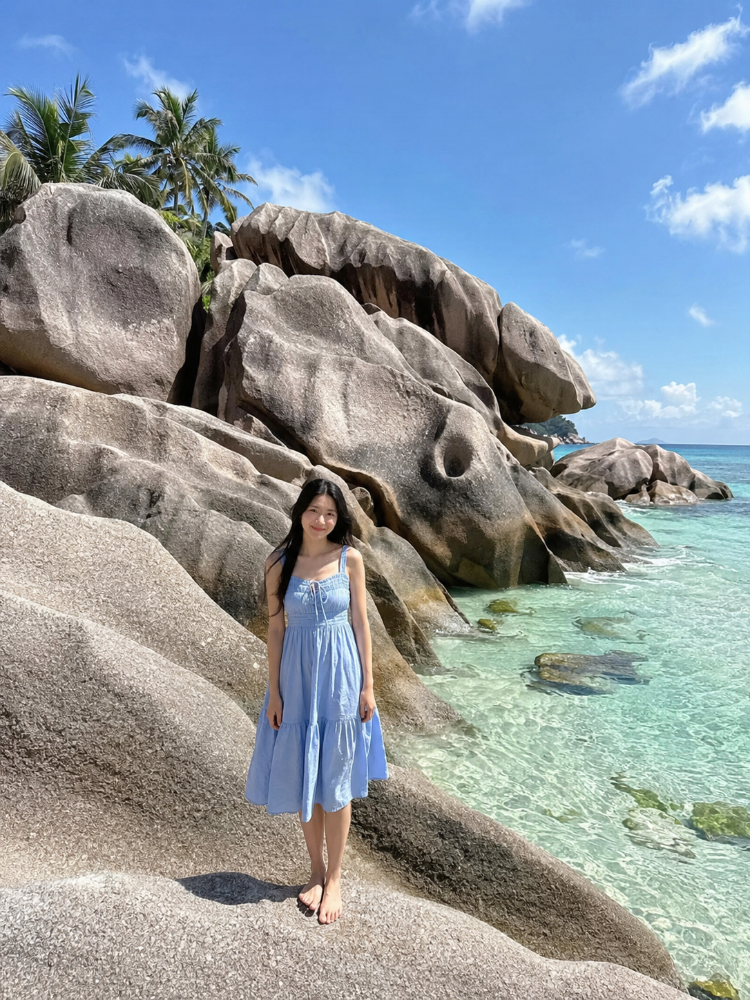
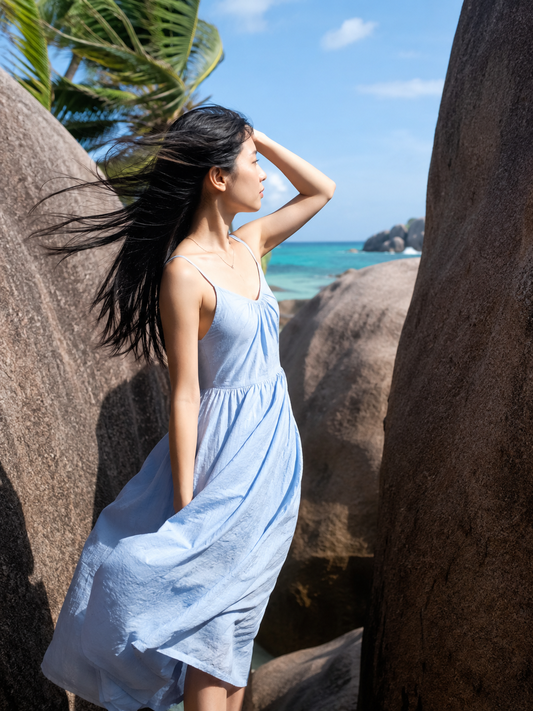
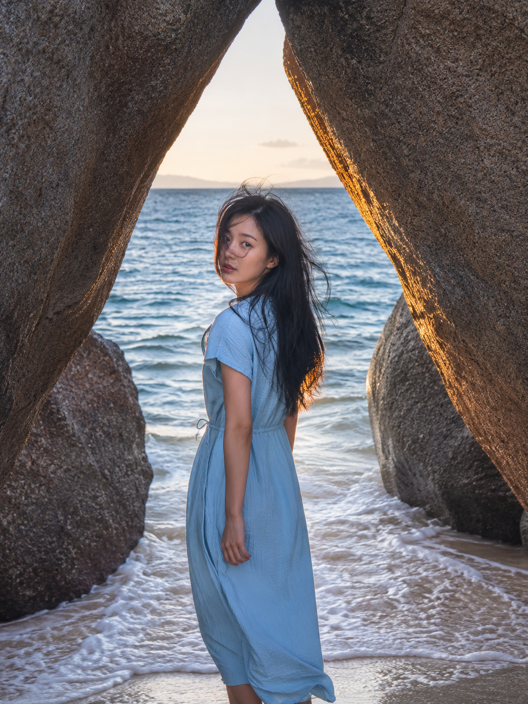

# 塞舌尔的花岗岩太抓人，这张图我改了三版才对

塞舌尔拉迪格岛的巨型花岗岩石群，是那种一眼就能认出来的地标——粉灰色巨石叠在白沙上，衬着碧蓝海水，随手一张照片都像明信片。正因为地标本身太抢镜，第一次尝试还原它时，反而把人物写没了。

第一稿的思路很直接：人物站在巨石群前，正面对镜头，把环境和人一起交代清楚。

24岁亚洲女生，黑色长直发，身形纤细健康，五官自然清秀，面部干净，健康自然肤色，站在塞舌尔拉迪格岛的巨型花岗岩石群之间，穿浅蓝色棉麻连衣裙，双臂自然垂放，正面朝向镜头，背景是层叠的粉灰色花岗岩巨石和碧蓝色海水，远处几株倾斜的棕榈树，正午顶光，广角环境人像，人物占画面比例较小，色彩明亮清透，纪实旅拍质感，表情松弛，眼神真实，气质清爽亲和，避免 AI 美女脸、网红感、过度精修、塑料皮肤、暗沉肤色、明显痘印、明显皱纹、斑点、面部变形

出图没问题，构图也稳，但看久了总觉得少了点什么——人物站得太正、太静，像导游让游客站定拍的纪念照，跟"她独自旅行"的松弛感对不上。问题不在巨石，也不在光线，而在人物的姿态和动势：正面直立传递不出海风和自由感，需要一个能带出动态的瞬间。

于是把姿态改成迎风侧身，加入海风吹动头发和裙摆的细节，让画面从"站定拍照"变成"抓拍瞬间"。

24岁亚洲女生，黑色长直发被海风大幅吹起，身形纤细健康，五官自然清秀，面部干净，健康自然肤色，侧身站在两块巨大花岗岩石之间的窄缝前，穿浅蓝色棉麻连衣裙下摆随风扬起，一只手撩起被吹乱的头发，视线望向海面并非镜头，背景碧蓝海水与粉灰色巨石形成强烈色彩对比，棕榈树叶在风中倾斜，午后侧光，自然抓拍瞬间感，轻微运动模糊在发丝和裙摆边缘，干净自然肤质，自然皮肤纹理，表情松弛，气质清爽亲和，避免 AI 美女脸、网红感、过度精修、塑料皮肤、暗沉肤色、明显痘印、明显皱纹、斑点、面部变形

这一版动态感明显好了很多，风吹头发和裙摆的瞬间也够真实。但还差最后一步——巨石本身最迷人的地方是那些天然形成的缝隙和拱形通道，前两版都只是"人站在巨石前"，没有真正利用巨石的结构。最终版把人物放进巨石缝隙的中心，让石缝本身变成天然取景框，同时把光线换成黄昏侧逆光，给巨石边缘镀一层暖金色。

24岁亚洲女生，黑色长直发凌乱地被海风吹向一侧，身形纤细健康，五官自然清秀，面部干净，健康自然肤色，站在一道花岗岩巨石形成的天然拱形缝隙中央，穿浅蓝色棉麻连衣裙，微微回头看向镜头方向，嘴角放松没有刻意笑容，脚下是白沙和浅浪，缝隙外透出大片碧蓝海水与远方水平线，黄昏柔和侧逆光把巨石边缘镀成暖金色，长焦压缩感环境人像，干净自然肤质，眼神真实，气质清爽亲和，轮廓清晰，皮肤光泽自然，避免 AI 美女脸、网红感、过度精修、塑料皮肤、暗沉肤色、明显痘印、明显皱纹、斑点、面部变形

三版放在一起看，差异其实就三处：姿态从直立变成动态侧身，最后又变成回眸；光线从正午顶光换成黄昏侧逆光；构图从"人在巨石前"变成"人在巨石中"。这三处改动看起来都不大，但叠加起来，画面从"到此一游"变成了"独自旅行的一个瞬间"。

同一套花岗岩和海水场景，其实还能往前延伸一步——把人物放到更远的海岸线上，让巨石变成背景的一部分，展示的是行走中的状态，而不是停下来的瞬间。这条思路留给下一站继续验证。

这次的经验可以直接套到别的地标场景：先别急着调光线和滤镜，如果画面还是"游客照感"，先看动作和构图有没有真正利用场景的独特结构；地标越有辨识度，越需要人物姿态给出对应的动态回应，否则人和景会互相抢戏。

---

如果你也在琢磨怎么让地标照片拍出旅行感而不是纪念照感，存一下这三版的对比，下次遇到类似的巨石、拱门或洞穴场景可以直接套用这个迭代思路。

---

## 往期回顾

- WILD-001 马尔代夫浅海独行

#GPTImage2 #千问 #豆包 #生图提示词 #Prompt #自然奇观环游 #塞舌尔巨石海滩
