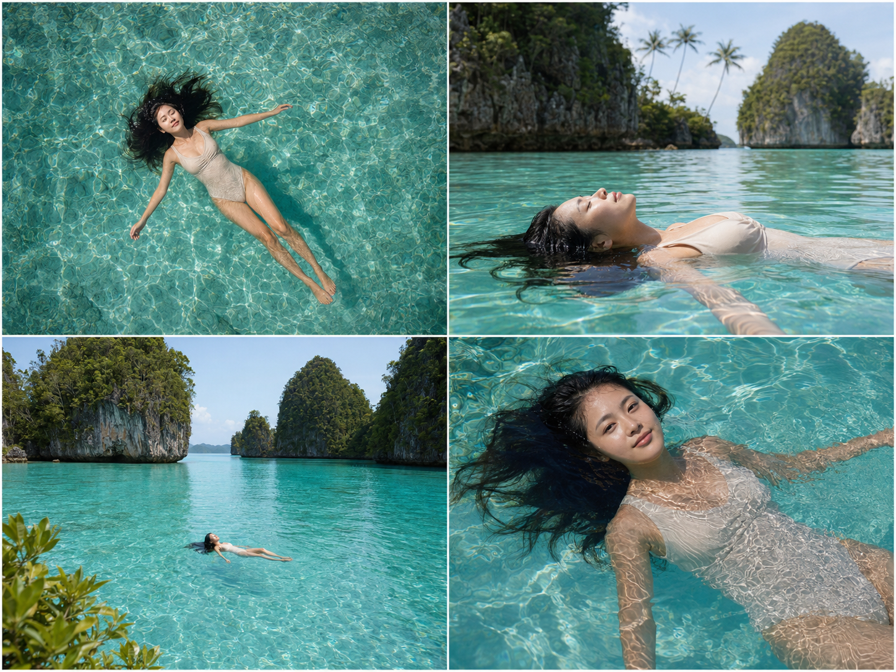
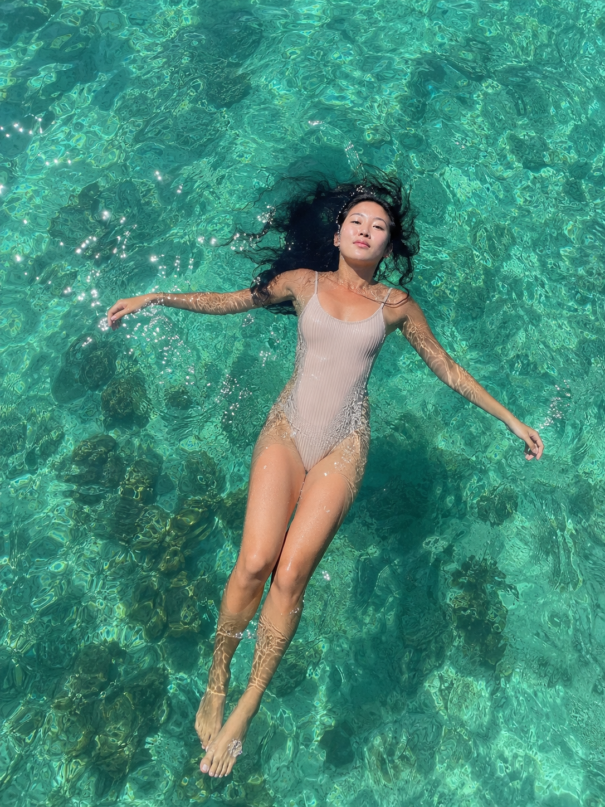
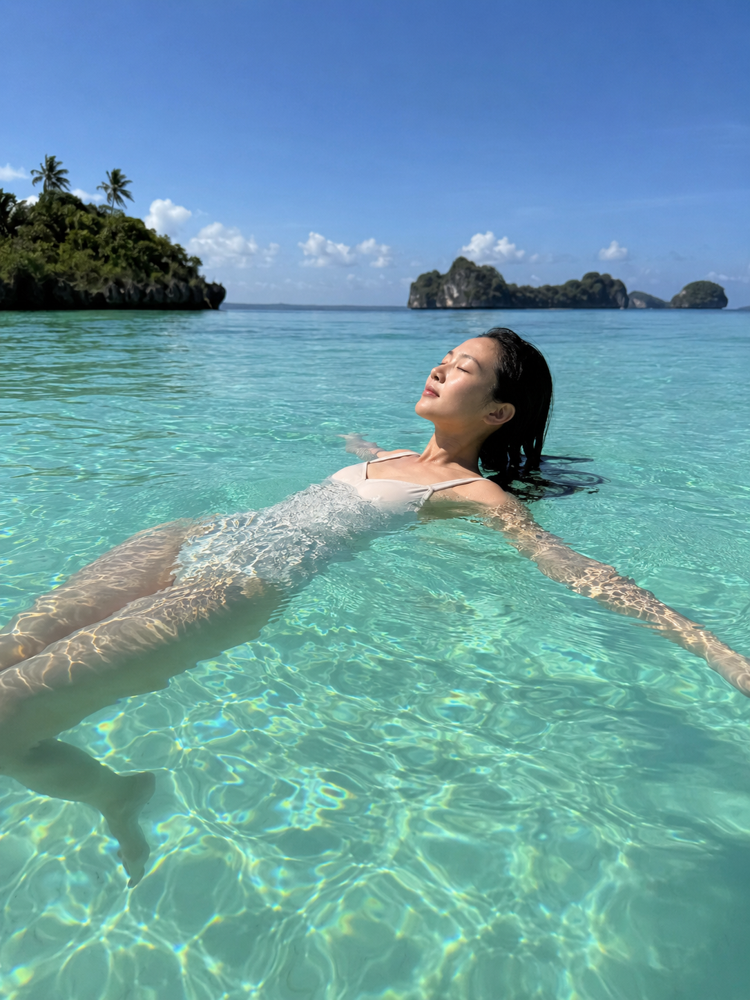
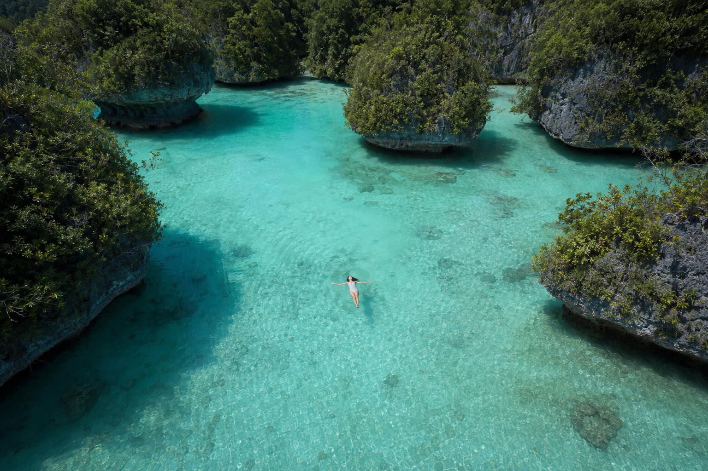

# 「漂浮感」这个词为什么让泻湖照片瞬间高级

今天讲一个词：「漂浮感」。

这个词为什么有效：漂浮状态下人体完全交给水面托住，四肢自然摊开、颈部放松、表情不需要刻意管理，这是最难摆拍出来的松弛状态——摆拍站姿总带着"配合镜头"的痕迹，而漂浮姿态天生就没有这种痕迹，画面会自动带出"卸下所有防备"的真实感。

什么时候不该用：如果场景本身水面浑浊、光线昏暗，或人物需要展示服装细节和全身比例，漂浮姿态会让画面失焦、细节丢失，这时候站姿或行走更合适。

---

**案例1：俯拍仰躺，把托浮感交给光线**

适合场景：需要展示水面清澈度和人物完全放松状态的封面级画面。

提示词：

24岁亚洲女生，黑色长发在水面散开，身形纤细健康，五官自然清秀，面部干净，健康自然肤色，仰躺漂浮在帕劳无人岛蓝绿色泻湖水面，双臂微张，身体完全放松，穿浅米色连体泳衣，俯拍视角，水面阳光波纹环绕身体，水下隐约可见珊瑚礁影子，正午高角度光线穿透清澈水面，色彩通透明亮，自然皮肤纹理，表情松弛，眼神望向天空，气质清爽亲和，避免 AI 美女脸、网红感、过度精修、塑料皮肤、暗沉肤色、明显痘印、明显皱纹、斑点、面部变形

---

**案例2：齐平水面侧漂，让视线沉进画面里**

适合场景：想传递"完全放空、忘记时间"这种情绪的场景。

提示词：

24岁亚洲女生，黑色长发湿润贴合漂散在水面，身形纤细健康，五官自然清秀，面部干净，健康自然肤色，侧身漂浮在帕劳无人岛泻湖中，双眼微闭，嘴角放松，穿浅米色连体泳衣，齐平水面视角拍摄，背景是石灰岩小岛与椰林剪影，午后柔和顺光，水面呈现蓝绿渐变色，干净自然肤质，皮肤光泽自然，表情松弛，气质清爽亲和，避免 AI 美女脸、网红感、过度精修、塑料皮肤、暗沉肤色、明显痘印、明显皱纹、斑点、面部变形

---

**案例3：远景漂浮，让人成为泻湖的一部分**

适合场景：想强调地貌尺度、人物只是自然一部分的旅行叙事画面。

提示词：

24岁亚洲女生，黑色长发散开于水面，身形纤细健康，五官自然清秀，面部干净，健康自然肤色，远景漂浮在帕劳无人岛蓝绿色泻湖中央，人物占画面比例较小，四周环绕着高耸的蘑菇状石灰岩小岛和茂密绿色植被，穿浅米色连体泳衣，航拍俯瞰广角构图，水面清澈见底露出浅色沙床，阳光均匀洒落，色调通透宁静，自然皮肤纹理，表情安宁，气质清爽亲和，避免 AI 美女脸、网红感、过度精修、塑料皮肤、暗沉肤色、明显痘印、明显皱纹、斑点、面部变形

---

可以和它搭配的词：

- `水面托住`：强化身体完全被水支撑的重量感
- `四肢舒展`：避免出现僵硬摆拍的手臂角度
- `波纹环绕`：让水面反光成为画面装饰而非干扰
- `俯瞰视角` / `齐平视角`：决定漂浮感是"被观察"还是"被代入"
- `阳光穿透水面`：给清澈泻湖加一层通透质感
- `完全放空` / `卸下防备`：控制表情不流于摆拍式微笑

---

结论：「漂浮感」最适合用在清澈浅水、光线充足、想表达"彻底放松"情绪的场景——泻湖、浅海、温泉都适用；但如果画面需要展示服装版型或站姿动态，就别用这个词，容易让主体失焦。

---

存一下这三张漂浮姿态的写法，下次遇到类似的清澈水域场景可以直接替换地点使用。

---

## 往期回顾

- WILD-001 马尔代夫浅海独行
- WILD-002 塞舌尔巨石海滩迎风

#GPTImage2 #千问 #豆包 #生图提示词 #Prompt #自然奇观环游 #帕劳泻湖漂浮
