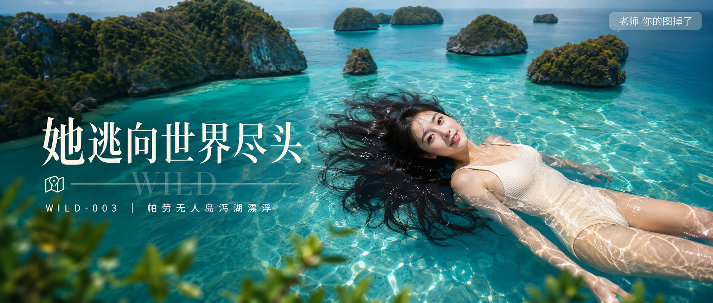

# WILD-003-帕劳无人岛泻湖漂浮 封面

## 封面提示词

24岁亚洲女生，年轻漂亮，仰躺漂浮在帕劳无人岛蓝绿色泻湖水面，俯拍3/4角度露出正脸，五官精致自然，面部立体清晰，皮肤白皙通透细腻有光泽，眼神有神灵动真实，妆感干净清透不厚重，轮廓清晰上镜，黑色长发在水面散开如画，穿浅米色连体泳衣，阳光直射水面形成粼粼波光包裹身体并打亮白皙肌肤，周围蘑菇状石灰岩小岛与翡翠色泻湖形成层次背景，电影感光影，色彩层次丰富，视觉冲击力强，构图黄金比例，前景虚化背景，2.35:1 电影横构图，避免 AI 美女脸、网红感、过度精修、塑料皮肤、暗沉肤色、明显痘印、明显皱纹、斑点、面部变形。

【文字排版-必须完整保留，不得省略或简化任何一项】画面左侧垂直居中偏下叠加文字排版：超大号衬线字体米白色主文案「她逃向世界尽头」，主文案正下方一条细横线左端带🗺横线中央有透明英文水印 WILD，横线下方等宽白色字体副文案「WILD-003 ｜ 帕劳无人岛泻湖漂浮」；右上角浅色半透明圆角底衬配小号文字「老师 你的图掉了」（署名文字，必须出现，不可省略）；无整体蒙层，文字直接压图。【文字排版结束】

## 封面图片

