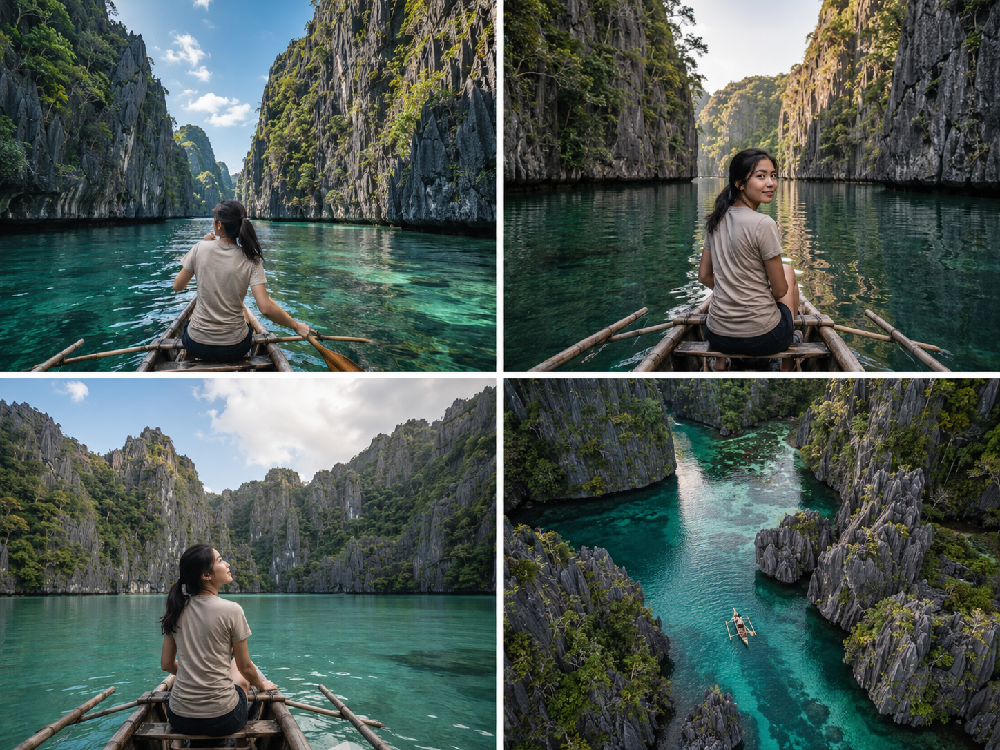

菲律宾爱妮岛的石灰岩峡湾自带电影级取景框，独木舟划入的三个阶段——入口、中段、泻湖，光线从顶光换到侧光再到黄昏，暗示旅程时长。

提示词：
独自坐在传统菲律宾独木舟上，双手持桨划向爱妮岛石灰岩峡湾入口，两侧高耸的灰白色石灰岩峭壁夹出狭窄水道，翡翠绿海水清澈见底，广角环境人像，人物占画面比例较小，探险纪实质感

#GPTImage2 #千问 #生图提示词 #Prompt #自然奇观环游 #爱妮岛石灰岩峡湾

