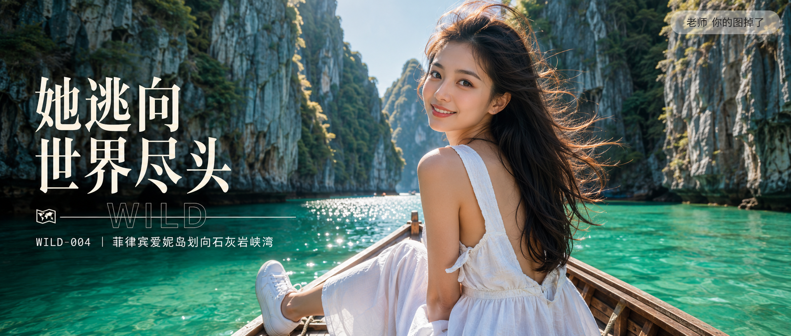

# WILD-004-菲律宾爱妮岛划向石灰岩峡湾 封面

## 封面提示词

24岁年轻漂亮亚洲女性坐在传统独木舟上，3/4侧脸回望镜头，五官精致姣好，面部立体清晰无瑕疵，肌肤光泽细腻紧致毫无瑕疵，眼神有神灵动，妆感干净清透，笑容自然甜美上镜，轮廓清晰精致，黑色长发被海风吹起，穿白色棉麻连衣长裙，脚踩白色帆布鞋，侧逆光打亮颧骨与发丝边缘，脸部占画面比例大且清晰突出，身后爱妮岛石灰岩峡湾峭壁高耸对称排列，翡翠绿海水与灰白岩壁形成强烈色彩层次，电影感光影，色彩层次丰富，视觉冲击力强，构图黄金比例，前景虚化背景，2.35:1 电影横构图，避免 AI 美女脸、网红感、过度精修、塑料皮肤、暗沉肤色、明显痘印、明显皱纹、斑点、面部变形、脸部模糊、面部占比过小。

【文字排版-必须完整保留，不得省略或简化任何一项】画面左侧垂直居中偏下叠加文字排版：超大号衬线字体米白色主文案「她逃向世界尽头」，主文案正下方一条细横线左端带🗺横线中央有透明英文水印 WILD，横线下方等宽白色字体副文案「WILD-004 ｜ 菲律宾爱妮岛划向石灰岩峡湾」；右上角浅色半透明圆角底衬配小号文字「老师 你的图掉了」（署名文字，必须出现，不可省略）；无整体蒙层，文字直接压图。【文字排版结束】

## 封面图片

