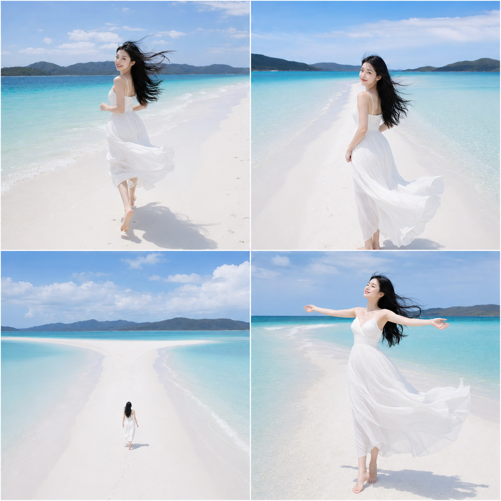
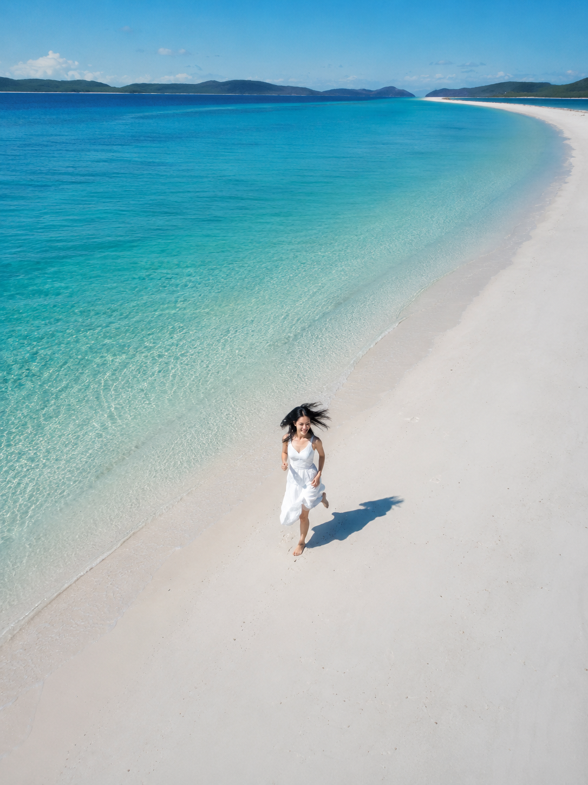
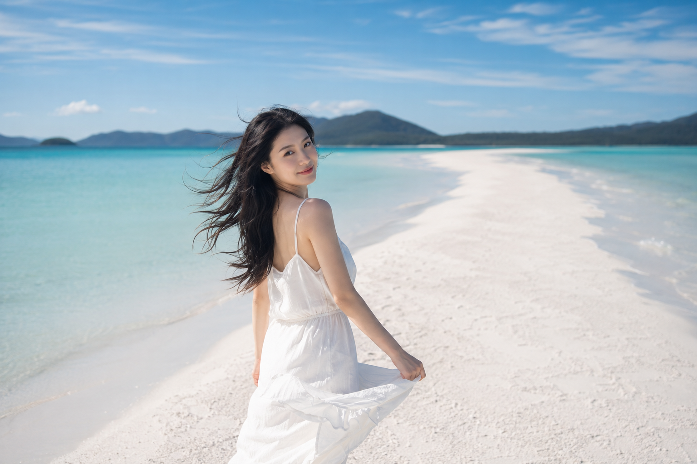
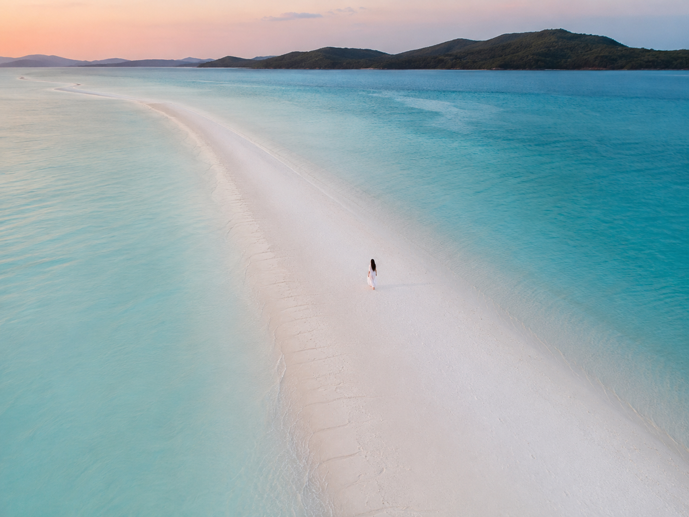

# 同一片白沙滩，为什么这张构图最抓眼？

**Q：为什么别人拍的沙滩照总感觉"平"，少了点故事感？**

问题往往出在构图上。大部分人习惯把海平线摆水平、人物摆正中间，画面稳是稳，但缺乏张力。澳大利亚白天堂沙滩有个天然优势——它的沙洲本身就是一条纤细蜿蜒的白色曲线，只要让这条线在画面里斜着走，构图立刻就有了方向感和延伸感。这就是今天要聊的**对角线构图**。

**Q：对角线构图到底是什么原理？**

简单说，就是让画面里最主要的线条元素（沙洲、海岸线、路径）从一个角斜切向另一个角，而不是水平或垂直摆放。人眼天生会顺着斜线移动视线，所以对角线构图会让画面"动起来"，比对称构图更有故事感和纵深感。它特别适合表现辽阔感和孤独感强的旷野场景。

24岁漂亮亚洲女生，五官自然清秀精致，皮肤白皙无瑕疵，肤色通透，干净自然肤质，黑色长发被风吹起，身穿白色长裙，赤脚在澳大利亚白天堂沙滩上奔跑，纯白硅沙沙洲从画面前景向右上角延伸成一条对角线，渐变蓝色海水占据画面另一侧，人物位于沙洲对角线的下三分之一处，广角航拍视角，晴天正午高对比光线，色彩清透明亮，表情松弛自然，眼神真实，气质清爽亲和，电影感构图，避免 AI 美女脸、网红感、过度精修、塑料皮肤、暗沉肤色、明显痘印、明显皱纹、斑点、面部变形

**Q：人物应该放在对角线的哪个位置？**

很多人第一次尝试对角线构图，会下意识把人物放在画面正中，结果线条被"打断"，反而更平。更好的做法是把人物放在对角线的**三分之一或交汇点**附近，让线条能在人物前后继续延伸，画面自然有呼吸感。

24岁漂亮亚洲女生，五官自然清秀精致，皮肤白皙无瑕疵，健康自然肤色，干净自然肤质，黑色长发飘动，身穿白色长裙裙摆被风扬起，站在白天堂沙滩狭长沙洲中段回眸侧身，沙洲的白色纹理线条从画面左下角斜向右上角贯穿整个构图，两侧蓝绿渐变海水对称分布，人物置于对角线交汇点，中焦镜头，浅景深，午后柔和阳光，表情松弛，眼神真实，气质清爽亲和，避免 AI 美女脸、网红感、过度精修、塑料皮肤、暗沉肤色、明显痘印、明显皱纹、斑点、面部变形

**Q：人物很小的时候，对角线构图还有用吗？**

有用，而且效果更明显。当人物占比很小时，对角线本身承担了大部分"讲故事"的任务——它替代了地平线，把画面从"风景照"变成"一段正在发生的旅程"。人物越小，线条的方向感就越重要。

24岁漂亮亚洲女生，身穿白色长裙，黑色长发，皮肤白皙无瑕疵，赤脚沿着白天堂沙滩纯白沙洲远处行走背影，沙洲对角线从画面右下角延伸至左上角地平线消失点，人物占画面比例很小，置于对角线上三分之一处，超广角航拍远景，蓝白渐变海水层次分明，傍晚柔光，色调统一，画面辽阔纯净，避免 AI 美女脸、网红感、过度精修、塑料皮肤、暗沉肤色、明显痘印、明显皱纹、斑点、面部变形

**Q：这种构图容易踩什么坑？**

两个最常见的问题：一是把对角线摆得太居中对称，反而变成了普通的水平构图；二是线条本身选得不够清晰，比如沙洲边缘和海水颜色太接近，斜线在画面里"隐形"了，读者根本看不出构图意图。选对角线元素时，一定要挑对比明显、边界清楚的自然线条。

**这种构图最打动人的地方，是它让"辽阔"变成了一种可以被视线追随的路径**——不是单纯的空旷，而是空旷里藏着一条会走向远方的路。这也是这一站旅程想传达的感觉：自由不是站在原地感叹，而是继续往前走。

---

如果你也想试试对角线构图，收藏这篇直接换成你自己的场景——海岸线、山脊、田埂都能用同一个原理。关注我，陪她继续走完这场逃向世界尽头的旅程，也欢迎评论区聊聊你最想拍的下一种构图。

---

## 往期回顾

- WILD-002 塞舌尔巨石海滩迎风
- WILD-003 帕劳无人岛泻湖漂浮
- WILD-004 菲律宾爱妮岛划向石灰岩峡湾

#GPTImage2 #千问 #豆包 #生图提示词 #Prompt #自然奇观环游 #白天堂沙滩
