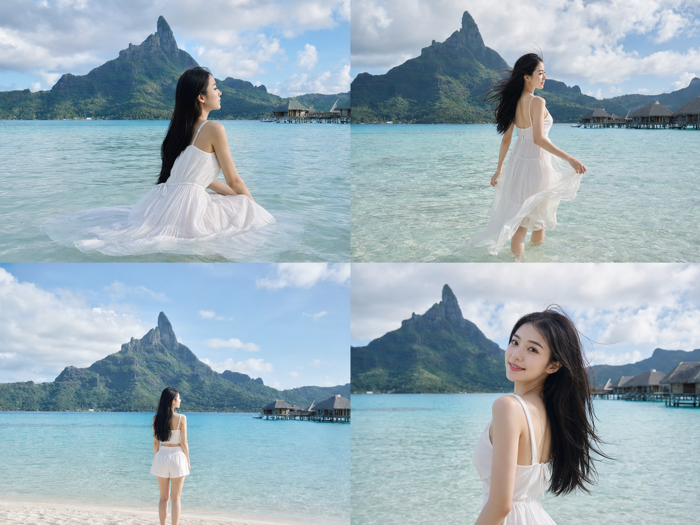
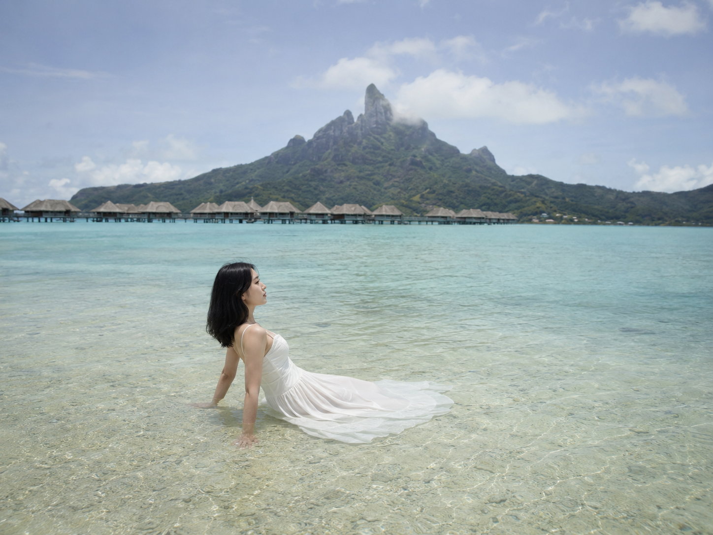
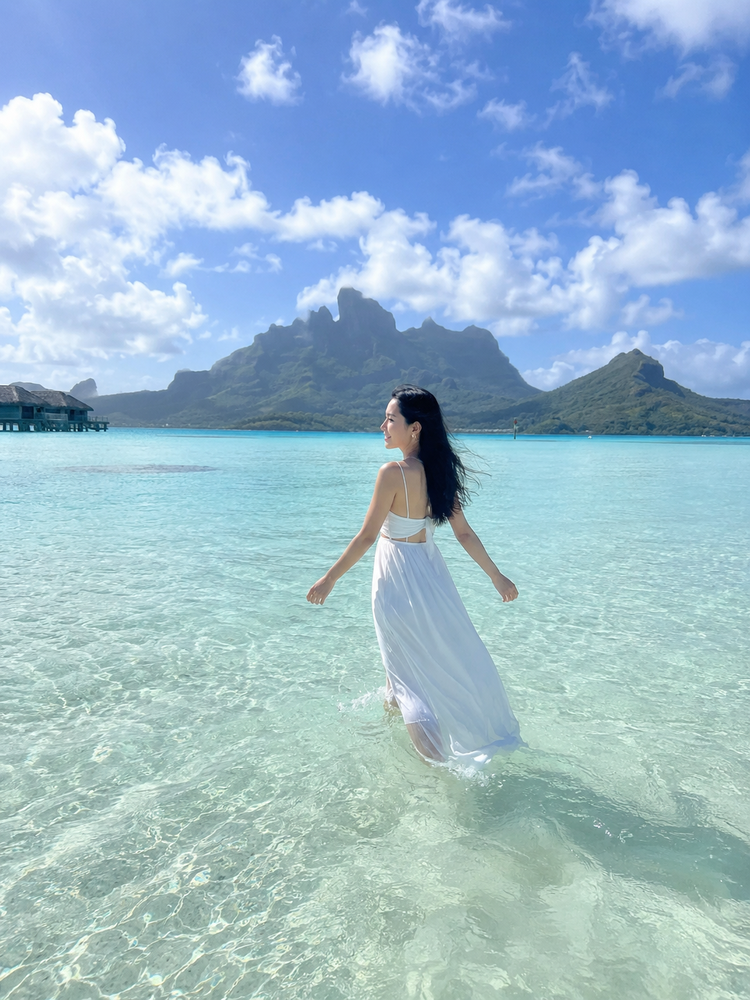
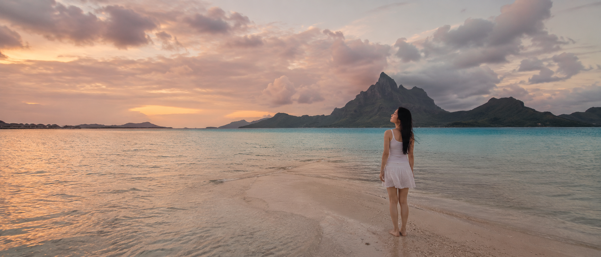

# 把女友放进波拉波拉潟湖，白裙穿搭这样选最出片

**今天的实验：** 同一片波拉波拉潟湖，同一套白色系穿搭基调，三种不同的呈现方式，看哪种最能拍出"世界尽头"的松弛感。

**变量说明：** 人物、场地（潟湖+奥特马努峰）、色调完全固定，只改变穿搭款式和身体姿态。

---

**#01 ｜ 白色棉麻吊带长裙 · 浅海坐姿**

24岁漂亮亚洲女生，五官自然清秀，面部干净，健康自然肤色，皮肤白皙无瑕疵、干净自然肤质，保留自然皮肤纹理，黑色长发披肩，身形纤细健康，坐在波拉波拉潟湖及膝浅水中，穿白色棉麻吊带连衣长裙，裙摆在水面轻轻散开，侧脸望向远处奥特马努峰，双手撑在身后沙地上，环境人像，人物占画面较小，广角远景，通透日光，浅蓝绿色潟湖水色，宁静松弛表情，电影感构图，避免 AI 美女脸、网红感、过度精修、塑料皮肤、暗沉肤色、明显痘印、明显皱纹、斑点、面部变形

> 特点：吊带长裙的垂坠感在坐姿时最明显，裙摆铺开在水面像自然延伸的花瓣，是三套穿搭里"静态感"最强的一套，适合想传达安静、不赶路的情绪。

---

**#02 ｜ 白色雪纺连衣长裙 · 涉水行走**

24岁漂亮亚洲女生，五官自然清秀，面部干净，气质清爽亲和，皮肤白皙无瑕疵、干净自然肤质，黑色长发随风轻扬，身形纤细健康，在波拉波拉浅海中缓慢涉水行走，穿白色雪纺连衣长裙，裙摆被海水打湿并随动作飘动，双臂微张保持平衡，背影转四分之三侧身，广角远景，奥特马努峰在画面远处若隐若现，正午柔和日光，水面反光清澈，自由自在的旅行感，避免 AI 美女脸、网红感、过度精修、塑料皮肤、暗沉肤色、明显痘印、明显皱纹、斑点、面部变形

> 特点：雪纺材质轻薄透光，被海水打湿后会贴合腿部线条又不失飘逸感，行走时裙摆的动态是三套里唯一能拍出"风感"的，适合想突出自由、在路上情绪的画面。

---

**#03 ｜ 白色棉质短裙 + 背心 · 远眺站立**

24岁漂亮亚洲女生，五官自然清秀，表情松弛，眼神真实，皮肤白皙无瑕疵、健康自然肤色、干净自然肤质，黑色长发披肩，身形纤细健康，站立在波拉波拉潟湖浅滩边缘，穿白色棉质短裙搭配简约背心，双手自然垂放，抬头远眺奥特马努峰方向，人物占画面较小，广角环境人像，背后是层次分明的碧蓝潟湖与远山剪影，傍晚柔和暖光洒在水面上，安静敬畏天地的情绪，电影感宽幅构图，避免 AI 美女脸、网红感、过度精修、塑料皮肤、暗沉肤色、明显痘印、明显皱纹、斑点、面部变形

> 特点：短裙+背心的组合最轻便利落，站姿挺拔时身形比例最好看，也是三套里唯一能兼顾"人物清晰度"和"环境辽阔感"的搭配，适合想让人物和远山同时成为焦点的画面。

---

**对比结论**

| 穿搭 | 姿态 | 最强情绪 | 适合场景 |
| --- | --- | --- | --- |
| 吊带长裙 | 浅海坐姿 | 安静、松弛 | 想突出"停下来"的瞬间 |
| 雪纺长裙 | 涉水行走 | 自由、飘逸 | 想突出"在路上"的状态 |
| 短裙+背心 | 远眺站立 | 辽阔、敬畏 | 想让人物和远山平分画面 |

三套穿搭都没有偏离白色系基调，唯一变化的是版型和姿态——这也是这个系列一直在验证的一件事：**同一种颜色基调，换一个姿势就能讲出完全不同的故事。** 如果只能选一套照抄，短裙+背心这套的适配度最高，坐姿和行走姿态对身体线条的要求更高，替换到自己的人设时需要多测几次。

---

如果你也想试试这套白色系穿搭三连拍，收藏这篇直接替换成自己想去的潟湖或海岛。关注我，陪她继续走完这场逃向世界尽头的旅程，也欢迎评论区聊聊你觉得哪套穿搭最出片。

---

## 往期回顾

- WILD-003 帕劳无人岛泻湖漂浮
- WILD-004 菲律宾爱妮岛划向石灰岩峡湾
- WILD-005 澳大利亚白天堂沙滩奔跑

#GPTImage2 #千问 #豆包 #生图提示词 #Prompt #自然奇观环游 #波拉波拉潟湖
