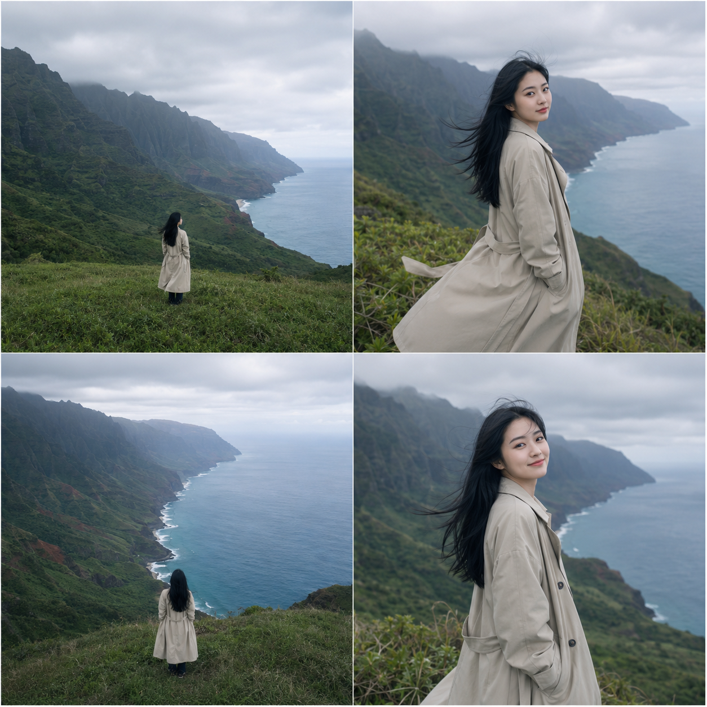
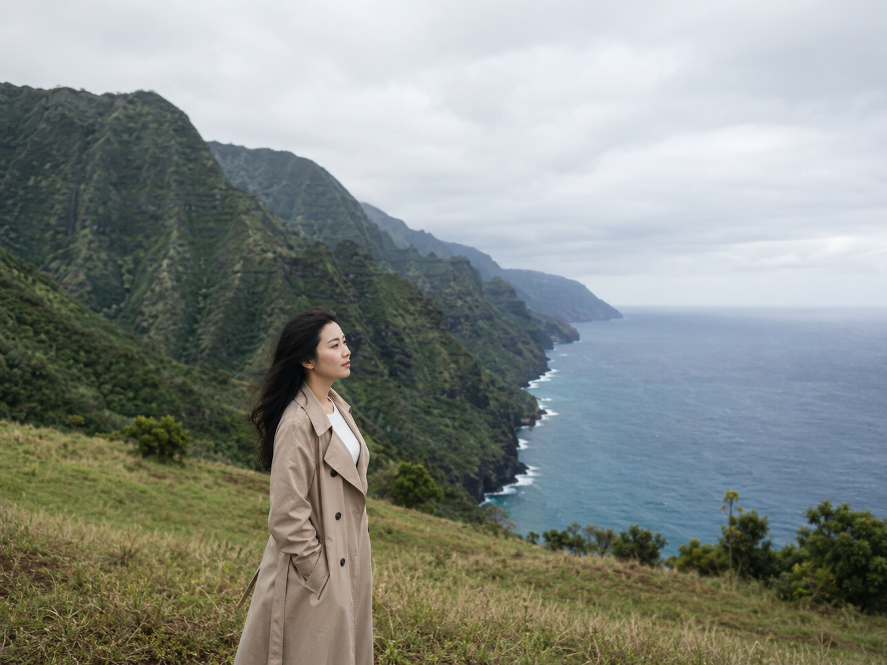
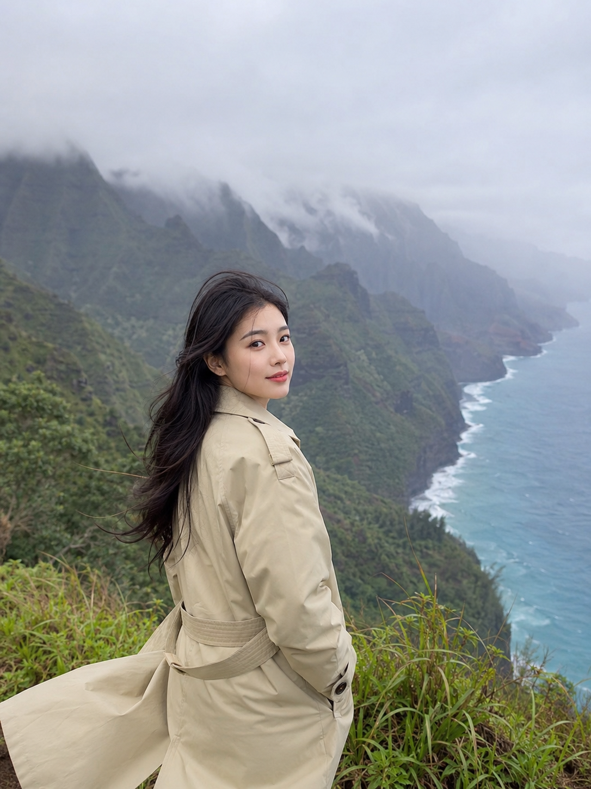
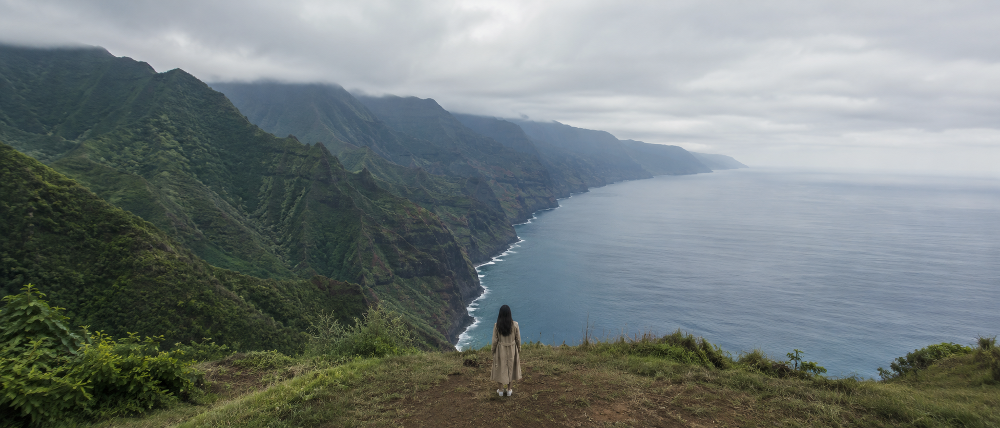

没等太阳出来就直接开拍了，阴天散射光反而让整片海崖的色彩更均匀干净。

提示词：
24岁漂亮亚洲女生，五官自然清秀，面部干净，健康自然肤色，皮肤白皙无瑕疵，黑色长发被海风吹起，站立在夏威夷纳帕利海岸边缘草坡上，穿浅卡其色风衣，正面望向层叠绿色海崖，广角远景，阴天柔和散射光，光线均匀无强烈阴影，太平洋深蓝海水，避免 AI 美女脸、网红感、过度精修、塑料皮肤、面部变形

#GPTImage2 #千问 #生图提示词 #Prompt #自然奇观环游 #纳帕利海岸

