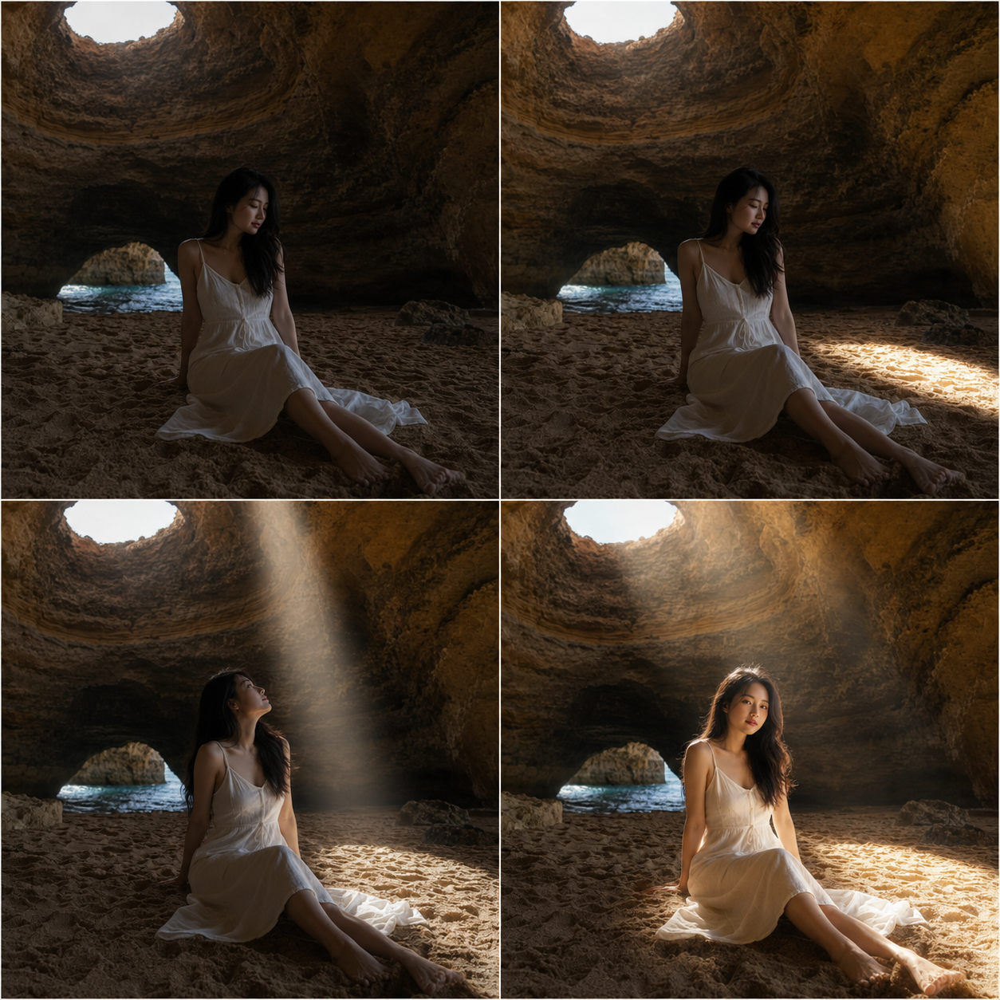
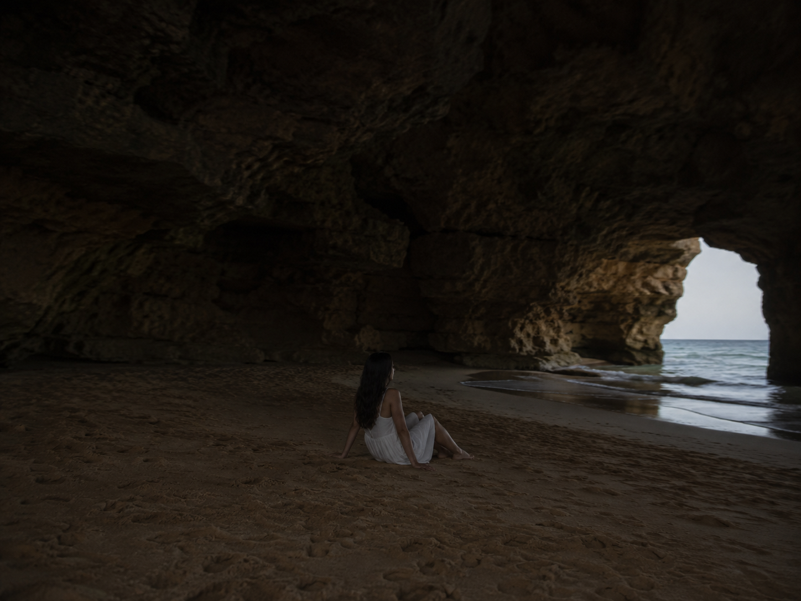
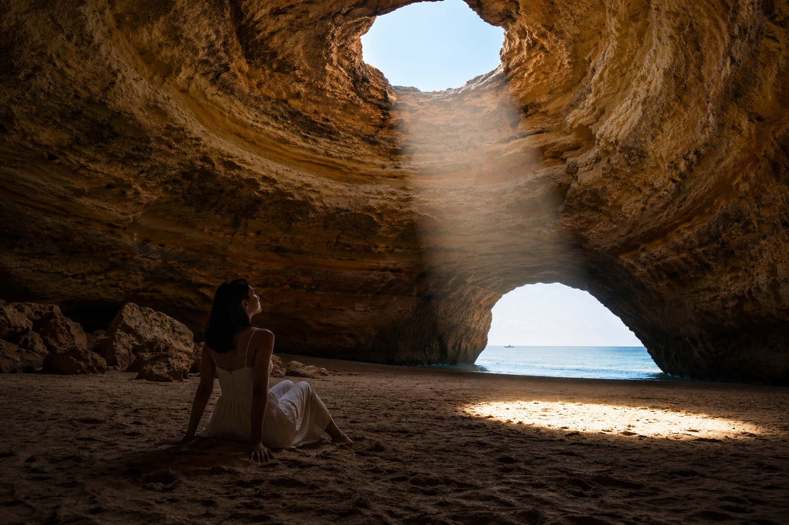
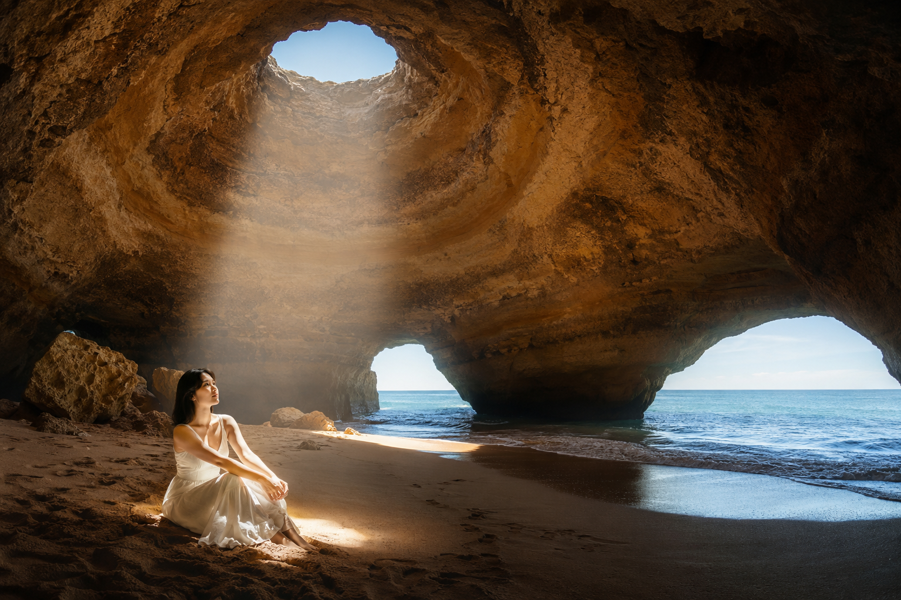

# 这张海蚀洞听浪照，改了 3 版光线才对

阿尔加维的海蚀洞天生就带一个天然天窗，阳光能直接从洞顶落下来。听起来是现成的绝佳布光条件，但第一版写出来的效果完全不是想象中的样子。

## Version 1：洞穴太暗，人物直接糊掉

第一版只写了"坐在海蚀洞里"，没有具体指定光线该怎么处理。结果整个洞穴内部一片昏暗，岩壁纹理看不清，人物脸部因为曝光不足几乎变成剪影，完全浪费了这个天然天窗的优势。

24岁漂亮亚洲女生，五官自然清秀，健康自然肤色，黑色长发披肩，身形纤细健康，坐在葡萄牙阿尔加维海蚀洞内的金色沙地上，穿白色亚麻连衣裙，环境人像，广角远景，洞穴内部整体光线昏暗，岩壁细节模糊，人物曝光不足面部看不清，色调发闷，避免面部变形

**问题所在：** 没有主动描述光源位置，AI 默认按洞穴的整体环境光处理，结果就是"暗"成了唯一的基调。

## Version 2：加了光束，但落错了地方

第二版加上了"一束阳光从天窗洒落"，这次岩壁纹理确实清晰了很多，光影层次也出来了。但光束落在了人物旁边的沙地上，人物本身还是待在阴影区域，反而和光束形成了割裂——像是拍到了一半忘了让主角站进光里。

24岁漂亮亚洲女生，五官自然清秀，面部干净，健康自然肤色，黑色长发披肩，身形纤细健康，坐在葡萄牙阿尔加维海蚀洞内的金色沙地上，穿白色亚麻连衣裙，抬头望向洞顶，一束阳光从天然天窗洒落在她身侧的沙地上，广角远景，金色岩壁纹理清晰可见，但人物本身仍处于阴影中显得偏暗，与光束形成较大反差，避免面部变形

**改对了什么：** 光束和岩壁质感有了。**没改对的地方：** 只写了"光束洒落"却没指定光束要落在人物身上，AI 会自己选一个视觉上合理但不一定是你想要的落点。

## Version 3：把光束精确"钉"在人物身上

最终版只多改了一句话：明确要求光束落在她的肩颈和脸侧，充当天然补光。这一次光线终于把人物和环境连成了一体——脸部因为侧光变得立体，洞口处的海浪光影也补足了背景层次。

24岁漂亮亚洲女生，五官自然清秀，面部干净，健康自然肤色，皮肤白皙无瑕疵、干净自然肤质，表情松弛，眼神真实，黑色长发披肩，身形纤细健康，坐在葡萄牙阿尔加维海蚀洞内的金色沙地上，穿白色亚麻连衣裙，一束阳光恰好从天然天窗洒落在她的肩颈和脸侧，形成柔和的自然补光，广角远景，金色岩壁纹理清晰，洞口处可见海浪拍打的光影，画面明暗层次丰富，电影感构图，避免 AI 美女脸、网红感、过度精修、塑料皮肤、暗沉肤色、明显痘印、明显皱纹、斑点、面部变形

## 三次改动对比

| 版本 | 加了什么 | 效果 |
| --- | --- | --- |
| V1 | 只写场景，没写光源 | 整体昏暗，细节丢失 |
| V2 | 加了"光束从天窗洒落" | 岩壁有层次，但光没打在人身上 |
| V3 | 明确"光束落在肩颈和脸侧" | 人物和环境同时被照亮，明暗层次丰富 |

**这个方法可以套用的场景：** 任何带有"天然光源缺口"的封闭空间——山洞、树荫、廊道、窗边——写光线时不要停在"有一束光"，一定要指明光束具体落在人物的哪个部位。AI 会尽力满足这个更精确的指令，而不是自己找一个"看起来合理"的位置替你决定。

---

如果你也想试试这套光束定位写法，收藏这篇直接换成你自己的场景。关注我，陪她继续走完这场逃向世界尽头的旅程，也欢迎评论区聊聊你踩过哪些类似的光线坑。

---

## 往期回顾

- WILD-005 澳大利亚白天堂沙滩奔跑
- WILD-006 波拉波拉潟湖回望群山
- WILD-007 夏威夷纳帕利海岸悬崖远眺

#GPTImage2 #千问 #豆包 #生图提示词 #Prompt #自然奇观环游 #阿尔加维海蚀洞
