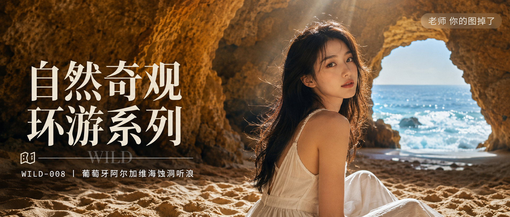

# WILD-008-葡萄牙阿尔加维海蚀洞听浪 封面

## 封面提示词

24岁漂亮亚洲女生3/4侧脸特写，五官精致自然，面部立体清晰，皮肤光泽细腻、白皙无瑕疵，眼神有神灵动，妆感干净清透，轮廓清晰上镜，黑色长发披肩，坐在葡萄牙阿尔加维海蚀洞内金色沙地上，穿白色亚麻连衣裙，一束阳光从天然天窗洒落，侧逆光打亮颧骨和发丝轮廓，身后洞口透出蓝色海浪光影，色调统一为暖金与冷蓝对比，电影感光影，高清锐利，构图黄金比例，前景虚化沙地纹理，画面有张力，2.35:1 电影横构图。避免 AI 美女脸、网红感、过度精修、塑料皮肤、暗沉肤色、明显痘印、明显皱纹、斑点、面部变形。【文字排版-必须完整保留，不得省略或简化任何一项】画面左侧垂直居中偏下叠加文字排版：超大号衬线字体米白色主文案「自然奇观环游系列」，主文案正下方一条细横线左端带🗺图标横线中央有透明英文水印 WILD，横线下方等宽白色字体副文案「WILD-008 ｜ 葡萄牙阿尔加维海蚀洞听浪」；右上角浅色半透明圆角底衬配小号文字「老师 你的图掉了」（署名文字，必须出现，不可省略）；无整体蒙层，文字直接压图。【文字排版结束】

## 封面图片

