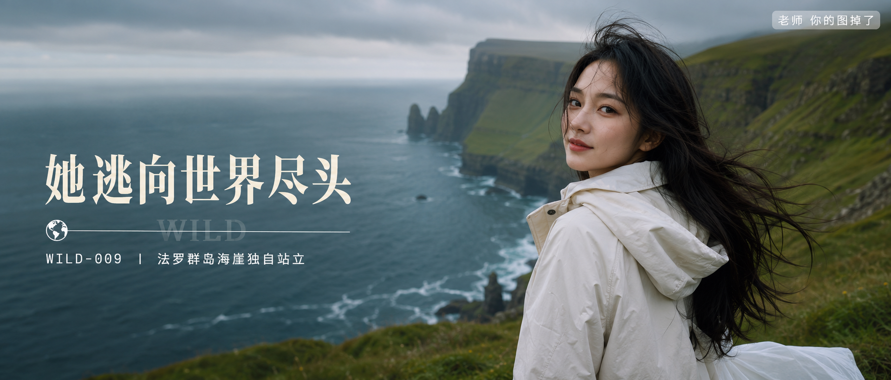

# WILD-009-法罗群岛海崖独自站立 封面

## 封面提示词

法罗群岛绿色海崖与北大西洋海雾背景前，24岁亚洲女生站在安全草坡上做3/4侧脸半身回望，米白色防风外套与白色长裙形成干净亮点，海风吹起黑色长发，面部占画面三分之一以上，柔光环绕面部，侧逆光打亮颧骨，五官精致自然、面部立体清晰、皮肤光泽细腻、眼神有神灵动、轮廓清晰上镜，阴天电影感光影，高清锐利，色彩层次丰富，构图黄金比例，前景虚化背景，画面有张力，视觉冲击力强，旅行大片质感，2.35:1 电影横构图，避免城市建筑、游客、人群、危险悬崖边缘、纯背影、纯远景、看不清五官，避免 AI 美女脸、网红感、过度精修、塑料皮肤、暗沉肤色、明显痘印、明显皱纹、斑点、面部变形。

【文字排版-必须完整保留，不得省略或简化任何一项】画面左侧垂直居中偏下叠加文字排版：超大号衬线字体米白色主文案「她逃向世界尽头」，主文案正下方一条细横线左端带🌍横线中央有透明英文水印 WILD，横线下方等宽白色字体副文案「WILD-009 ｜ 法罗群岛海崖独自站立」；右上角浅色半透明圆角底衬配小号文字「老师 你的图掉了」（署名文字，必须出现，不可省略）；无整体蒙层，文字直接压图。【文字排版结束】

## 封面图片

