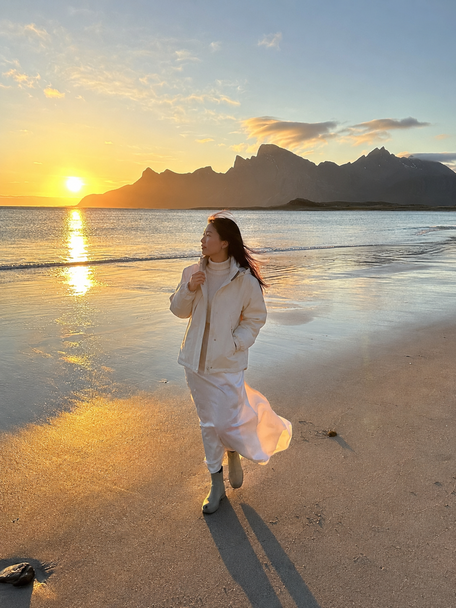
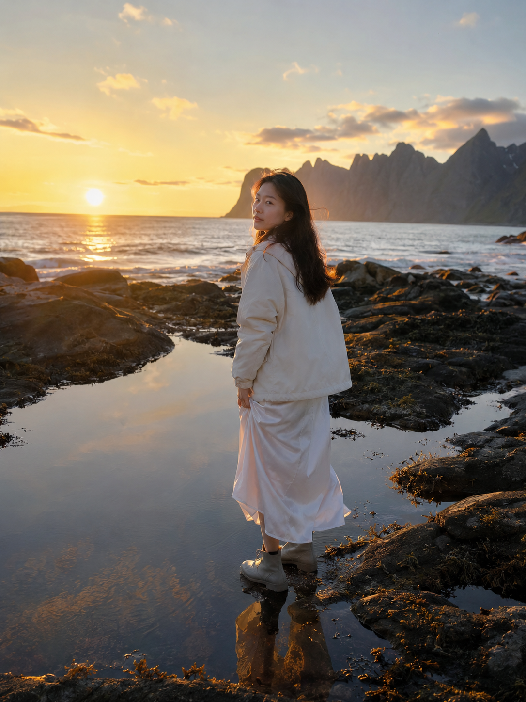
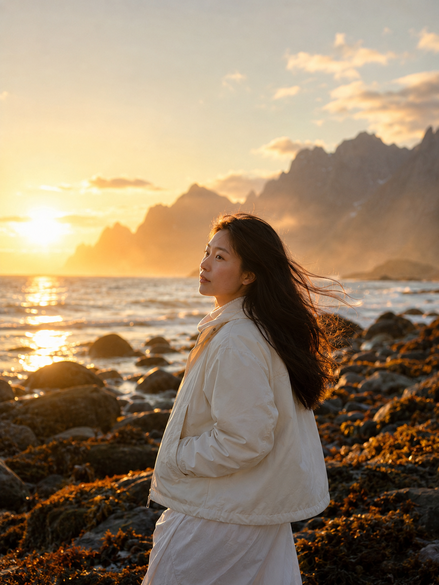

# 罗弗敦午夜太阳太出片了，这套白色系穿搭让海滩旅行照更有电影感

**今天的实验：** 在罗弗敦凉意很重的午夜海滩，怎么保留白色系的轻盈，又不让人物看起来像在硬凹夏日长裙照？

**核心变量：** 人物和穿搭全部固定，只改动作、机位、焦段与环境前景，看同一套衣服能不能同时接住广角大景和人物特写。

---

**穿搭配方**

- 上装：象牙白防风短外套，避免宽大外套把人物压进背景。
- 内搭：奶油色高领针织，用不同深浅的白增加层次。
- 下装：白色垂坠及踝长裙，让风成为画面里的动态线条。
- 鞋子：浅灰防水短靴，能走湿沙和礁石，也不会破坏浅色整体感。

这套组合的关键不是「全身都白」，而是同色系材质分层：防风外套有挺度，针织内搭有细密纹理，长裙负责流动感。冷蓝海面遇上奶油白服装，人物会比纯白衣裙更有层次，也更接近真实北境旅行。

**适合季节：** 更适合罗弗敦夏季有午夜太阳的时段，但即使是夏天也要保留防风外层；「有阳光」不等于「可以穿得单薄」。

---

**#01 ｜ 岸线迎风**

挪威罗弗敦群岛的午夜海滩，金色低角度太阳贴近地平线，远处是锯齿状北境山峰和平静海面，没有城市建筑和游客。24岁漂亮亚洲女生，清秀自然的东亚面孔，黑色长发，身形纤细健康，穿象牙白防风短外套、奶油色高领针织内搭、白色垂坠及踝长裙和浅灰防水短靴，同一套确定穿搭。她沿湿润岸线迎风缓慢行走，一手轻扶外套领口，裙摆和发丝被海风向后吹起，视线望向海面，姿态自然松弛。35mm广角环境人像，略低机位的全身抓拍，人物占画面约三分之一，湿沙反射金色天光，长影延伸，电影感逆光，自然胶片颗粒，广阔而安静。五官自然清秀，面部干净，皮肤白皙无瑕疵，肤色通透，干净自然肤质，保留自然皮肤纹理，表情松弛，眼神真实。避免 AI 美女脸、网红感、过度精修、塑料皮肤、暗沉肤色、明显痘印、明显皱纹、斑点、面部变形

> 测试结论：35mm 能同时交代人物、湿沙反光和北境山峰，短外套又不会截断长裙的纵向线条，最适合做旅行开场图。

---

**#02 ｜ 潮池回望**

挪威罗弗敦群岛的午夜海滩，金色低角度太阳贴近地平线，黑色礁石间的浅潮池倒映暖金天空，远处是锯齿状北境山峰，没有城市建筑和游客。24岁漂亮亚洲女生，清秀自然的东亚面孔，黑色长发，身形纤细健康，穿象牙白防风短外套、奶油色高领针织内搭、白色垂坠及踝长裙和浅灰防水短靴，同一套确定穿搭。她站在潮池边缘，身体朝向海面，听见身后动静后从肩头自然回望镜头，一手收起裙摆避开海水，表情安静。50mm标准镜头，眼平高度的中近景三分之四侧脸，人物与潮池倒影同时入画，浅景深，柔和侧逆光勾亮面部轮廓，冷蓝海水与金色天光形成克制对比，旅行电影静帧质感。五官自然清秀，面部干净，皮肤白皙无瑕疵，肤色通透，干净自然肤质，保留自然皮肤纹理，皮肤光泽自然，眼神真实。避免 AI 美女脸、网红感、过度精修、塑料皮肤、暗沉肤色、明显痘印、明显皱纹、斑点、面部变形

> 测试结论：50mm 把环境收紧了一些，奶油色针织与象牙白外套的质感更容易被看见；加上潮池倒影，不需要额外道具也有双层画面。

---

**#03 ｜ 岩滩停步**

挪威罗弗敦群岛的午夜海滩，金色低角度太阳悬在海面上方，前景有海草与圆润岩石，远处北境山峰被薄雾柔化，没有城市建筑和游客。24岁漂亮亚洲女生，清秀自然的东亚面孔，黑色长发，身形纤细健康，穿象牙白防风短外套、奶油色高领针织内搭、白色垂坠及踝长裙和浅灰防水短靴，同一套确定穿搭。她在岩滩上停步，侧身面向镜头，双手自然放进外套口袋，头发被风吹向一侧，目光越过镜头望向远方。85mm中长焦，略高机位的半身与环境压缩构图，前景岩石轻微虚化，背景山峰和金色海面层层叠合，柔光环绕面部，暖色镜头光晕，克制的北欧电影色调，安静而有力量。五官自然清秀，面部干净，皮肤白皙无瑕疵，肤色通透，干净自然肤质，保留自然皮肤纹理，气质清爽亲和，轮廓清晰。避免 AI 美女脸、网红感、过度精修、塑料皮肤、暗沉肤色、明显痘印、明显皱纹、斑点、面部变形

> 测试结论：85mm 将山、海和人物压在更紧密的层次里，适合当组图的收束画面。短外套的挺括轮廓会比单穿长裙更抗风，也更符合北境的真实气候。

---

**换季替换建议**

- 风更大：把短外套换成浅灰白中长款防风大衣，其他单品不变。
- 温度更低：在长裙下加白色保暖打底，将短靴换成防水中筒靴。
- 阳光偏弱：内搭从奶油色换成更明亮的暖白，但不要同时把外套和长裙都改成刺眼纯白。
- 想更利落：保留白色系，将长裙换成垂坠宽腿长裤，动作改为顶风行走。

最稳的复用原则是：每次只换一个大单品，其他颜色和材质关系保持不动。这样才能判断出图差异究竟来自穿搭，还是镜头和环境。

---

收藏这期，下次生成凉风、海岸或草原旅行照时，可以直接套用这个「防风外套＋针织内搭＋长裙」的白色系结构。关注我，陪她继续逃向世界尽头；你还想看哪个自然奇观里的旅行穿搭，欢迎在评论里留下下一站。

---

## 往期回顾

- WILD-007 夏威夷纳帕利海岸悬崖远眺
- WILD-008 葡萄牙阿尔加维海蚀洞听浪
- WILD-009 法罗群岛海崖独自站立

#GPTImage2 #千问 #豆包 #生图提示词 #Prompt #自然奇观环游 #罗弗敦午夜太阳
