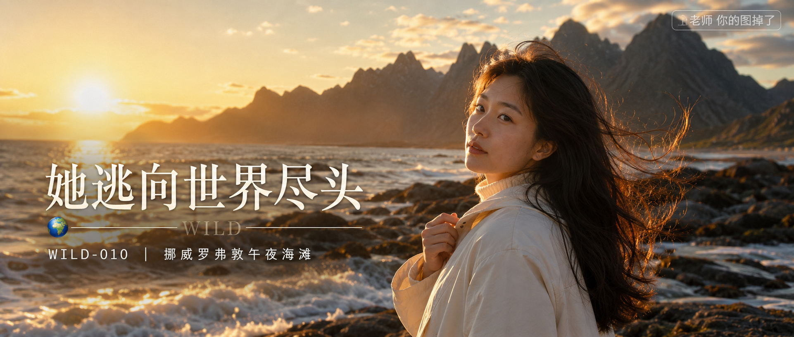

# WILD-010-挪威罗弗敦午夜海滩 封面

## 封面提示词

挪威罗弗敦午夜太阳下的北境海滩，24岁漂亮亚洲女生穿象牙白防风外套与白色长裙，正面偏 3/4 侧脸近景，面部占画面三分之一以上，海风扬起黑色长发，她轻扶外套领口，眼神有神灵动地看向镜头，表情安静坚定，背后金色太阳贴近海平线，山峰剪影与海面形成强烈冷暖对比，侧逆光打亮颧骨和发丝，前景虚化的浪花增加空间层次，五官精致自然，面部立体清晰，皮肤白皙无瑕疵且光泽细腻，妆感干净清透，保留自然皮肤纹理，电影感光影，高清锐利，色彩层次丰富，视觉冲击力强，构图黄金比例，画面有张力，旅行电影海报质感，2.35:1 电影横构图。避免 AI 美女脸、网红感、过度精修、塑料皮肤、暗沉肤色、明显痘印、明显皱纹、斑点、面部变形、纯背影、五官模糊。【文字排版-必须完整保留，不得省略或简化任何一项】画面左侧垂直居中偏下叠加文字排版：超大号衬线字体米白色主文案「她逃向世界尽头」，主文案正下方一条细横线左端带🌍横线中央有透明英文水印 WILD，横线下方等宽白色字体副文案「WILD-010 ｜ 挪威罗弗敦午夜海滩」；右上角浅色半透明圆角底衬配小号文字「老师 你的图掉了」（署名文字，必须出现，不可省略）；无整体蒙层，文字直接压图。【文字排版结束】

## 封面图片

