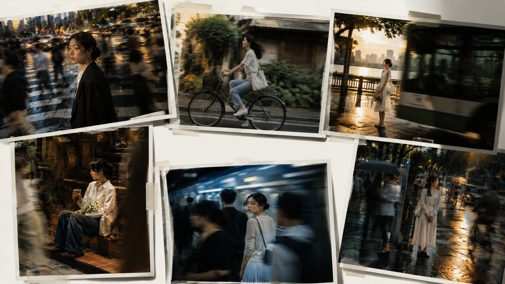
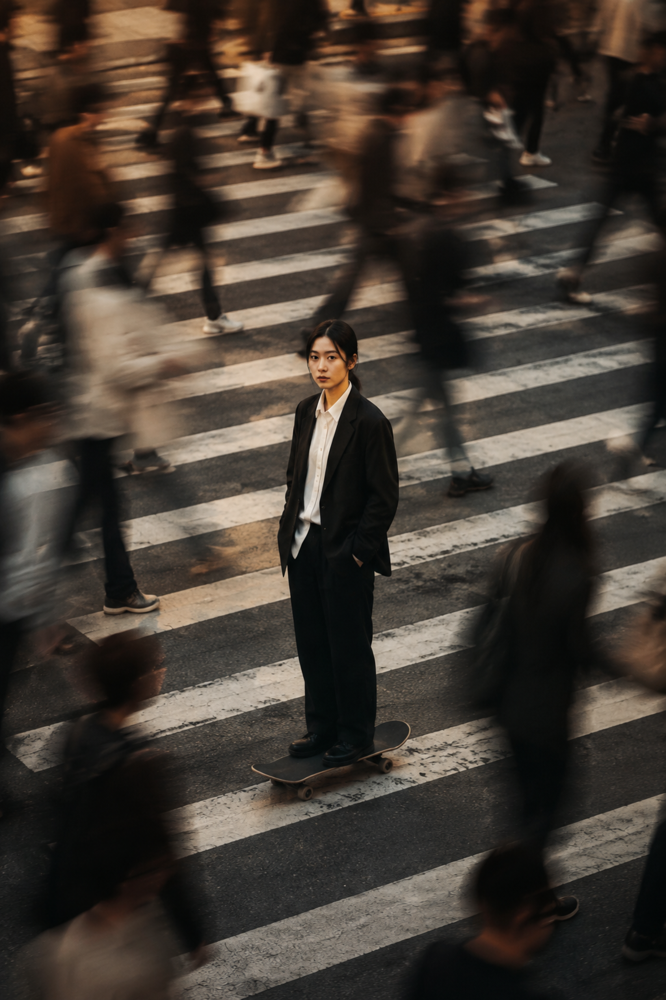
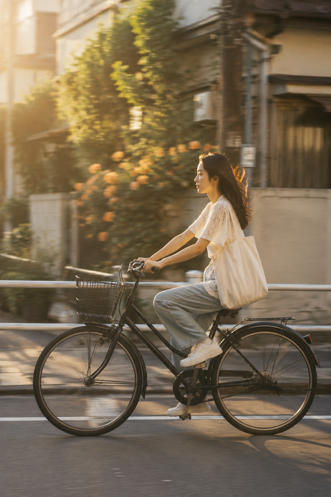
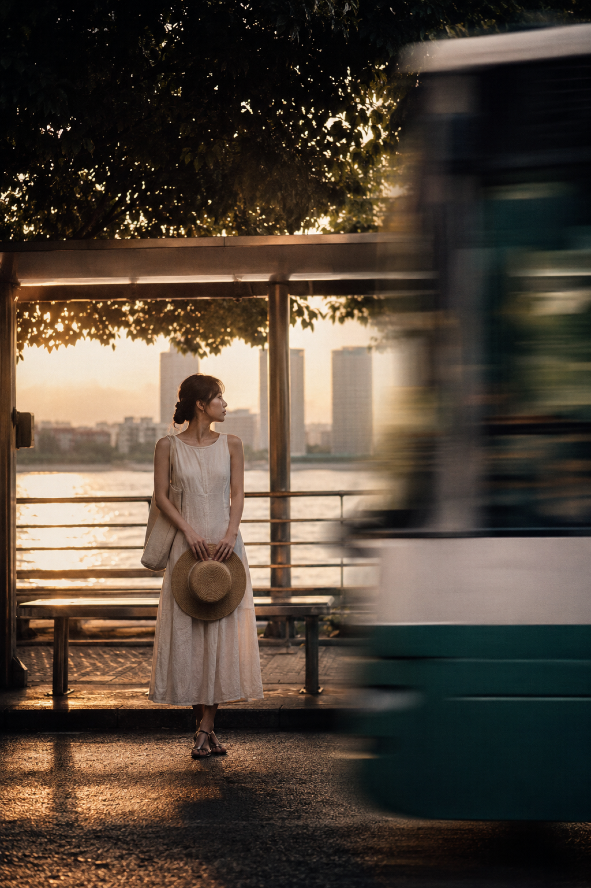
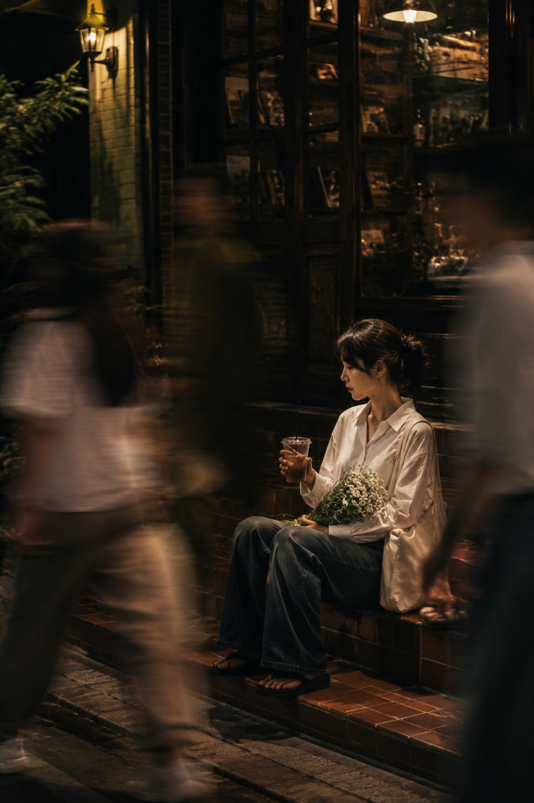
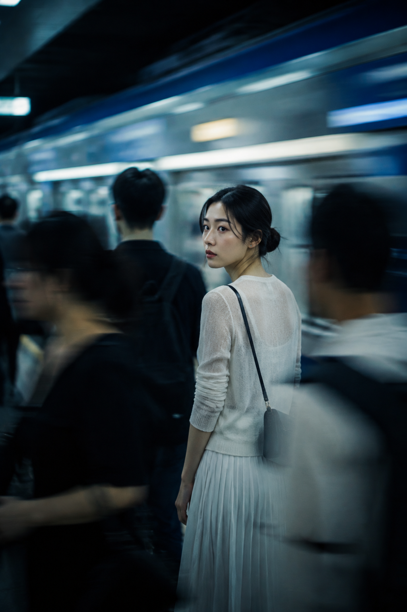
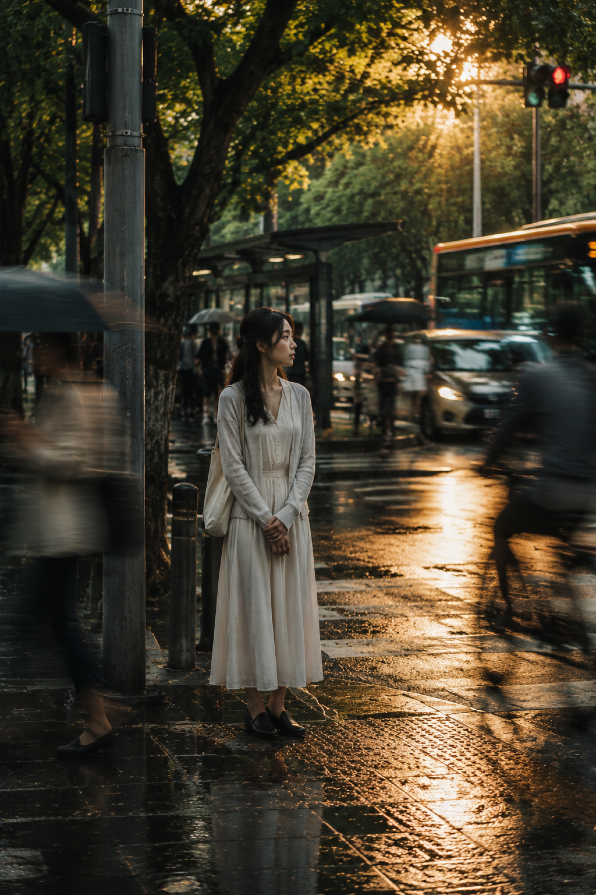

# 街头六境实拍感：人潮越快，画面越要留一处清醒，六种构图都能套

街头抓拍的核心是主体静止、环境流动。六个瞬间只换地点与光线，统一保留清晰人物、可控拖影和明亮细节。

**#01 斑马线｜唯一原版**

先锁定“谁必须清晰”，再安排“谁可以流动”，真实感会比堆叠风格词更稳定。

竖版 2:3，城市街头纪实电影摄影，傍晚金色时刻的宽阔十字路口，一位 24 岁成年东亚女生站在斑马线中央偏下位置，黑色低盘发，五官自然清秀，面部干净，健康自然肤色，穿宽松黑色西装外套、白衬衫、黑色长裤与黑色皮鞋，脚下踩一块普通滑板，双手自然插袋，平静直视镜头，人物本人清晰锐利、姿态稳定。她四周是大量匆匆穿行的上班族与行人，全部形成明显运动模糊与拖影，前景和边缘路人半遮挡掠过，营造整座城市都在赶路、只有她保持自己的节奏的氛围。高机位轻俯拍构图，白色斑马线形成强烈几何引导线，背景是深灰路面与模糊人潮。整体色调为琥珀金、旧灰、炭黑、奶白，低饱和、低对比、轻微欠曝，带细腻可控胶片质感、轻微扫描感、柔和暗角与旧电影静帧感，真实抓拍，慢速快门，主体清晰、周围人群虚化，安静、克制、笃定。2K 超高清，至少 64 次光线采样，高质量路径追踪，收敛噪点，减少随机颗粒、亮点和暗部噪声，最大程度保留原图细节与真实皮肤纹理，提升照片清晰度。不要海报排版，不要文字，不要水印，不要 logo，不要 AI 美女脸，不要过度磨皮，不要夸张摆拍，不要错误手部，避免 AI 美女脸、网红感、过度精修、塑料皮肤、暗沉肤色、明显痘印、明显皱纹、斑点、面部变形。

**#02 老街骑行｜把速度留在背景**

跟拍只让背景横向拖影，脸和上半身保持锐利，速度就会变成真实摄影语言。

**#03 河岸公交站｜前景遮挡增加偶然性**

公交车遮住部分画面，人物仍在视觉中心；遮挡越有层次，街拍越不像摆拍。

**#04 夜色台阶｜暗但不脏**

暖色路灯轻补面部，深青阴影留在背景，既保住表情，也保留夜色重量。

**#05 蓝调站台｜让列车动、人物停**

列车横向拖影制造压迫感，回望的脸负责叙事；跟 AI 明确这两个速度层次，比只写“电影感”更有效。

**#06 雨后街口｜三层空间**

湿地反光、树叶漏光、伞面虚影组成前中后景，人物只需自然等灯，留白反而更耐看。

跟 AI 沟通可以只补三句：“脸和手保持锐利”、“路人只做前景拖影”、“亮点收敛，暗部不要脏噪点”。每次只改一个变量，六种场景都能稳定复现。

---

你更想把哪一种城市流动放进自己的故事里？

---

## 往期回顾

- 晨光瑜伽六境：同一套写法让动作、气质和光线都出片
- 柳岸清晖六景：古风人像如何用6个动作拍出真实感
- 桃园绮梦六景：一套明亮自然光写法拍出仙气古风人像

#GPTImage2 #千问 #豆包 #生图提示词 #Prompt #街头抓拍 #清醒独行者
