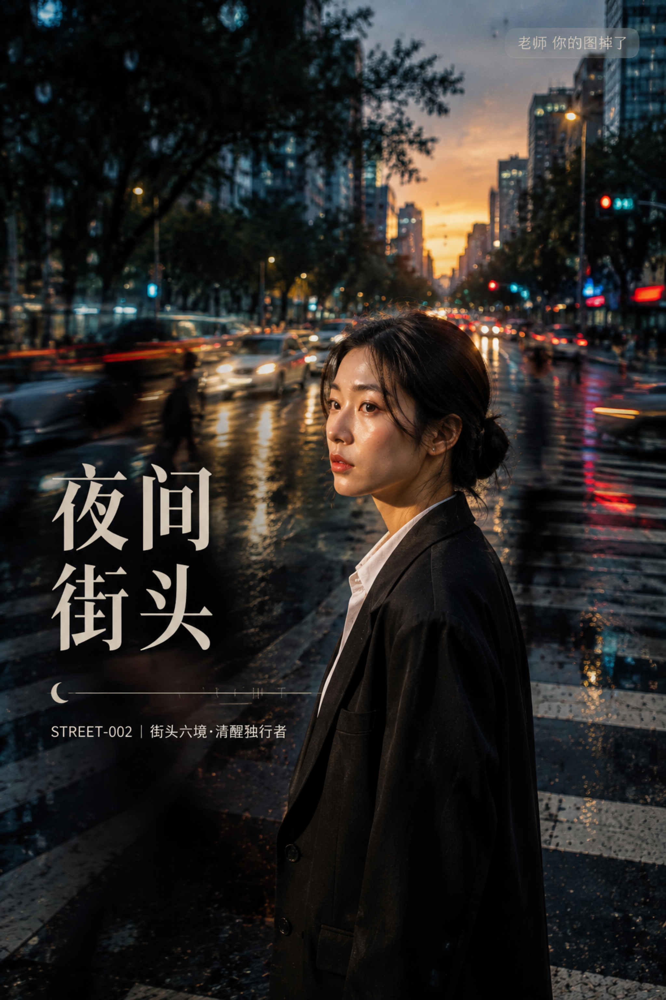

# STREET-002-街头六境·清醒独行者 封面

## 封面提示词

以“流光清醒六境”为视觉母题的城市街头纪实电影海报，黄金时刻与蓝调阴影交叠的宽阔十字路口，一位成年东亚女生三分之四侧脸近半身站在斑马线前景，黑色低盘发，五官精致自然、面部立体清晰、皮肤光泽细腻、眼神有神灵动，穿挺括黑色西装外套与白衬衫，身后是被慢速快门拉成流线的明亮车流与行人，前景有透明雨滴和斑马线几何反光，暖金面部补光对比深青蓝背景，主体占画面约三分之一，构图黄金比例，前景虚化背景，电影感光影，高清锐利，色彩层次丰富，视觉冲击力强，色调统一精致，画面有张力，商业海报级完成度，2K 超高清，至少 96 次光线采样，高质量路径追踪，收敛噪点，减少随机颗粒、亮点和暗部噪声，保留真实皮肤纹理与街道细节，避免 AI 美女脸、网红感、过度精修、塑料皮肤、暗沉肤色、明显痘印、明显皱纹、斑点、面部变形。

【文字排版-必须完整保留，不得省略或简化任何一项】画面左侧垂直居中偏下叠加文字排版：超大号衬线字体米白色主文案「夜间街头」，主文案正下方一条细横线左端带🌙横线中央有透明英文水印 NIGHT，横线下方等宽白色字体副文案「STREET-002 ｜ 街头六境·清醒独行者」；右上角浅色半透明圆角底衬配小号文字「老师 你的图掉了」（署名文字，必须出现，不可省略）；无整体蒙层，文字直接压图。【文字排版结束】

## 封面图片

